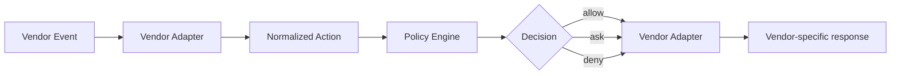
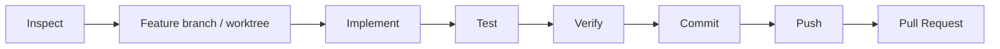

# AGENTS.md

## Purpose

This repository defines a vendor-neutral reference architecture and implementation for secure autonomous software-engineering agents. Changes should preserve the central security model: the LLM is not a security boundary. Policy, sandboxing, workload isolation, network controls, IAM/SCM authorization, and deterministic completion checks must remain independent enforcement layers.

## Read first

Before making non-trivial changes, read:

1. [README.md](README.md) or [README.ja.md](README.ja.md)
2. [Architecture](docs/01-architecture.md) ([日本語](docs/ja/01-architecture.md))
3. [Design Principles](docs/02-design-principles.md) ([日本語](docs/ja/02-design-principles.md))
4. [Security Model](docs/03-security-model.md) ([日本語](docs/ja/03-security-model.md))
5. [Adoption Guide](docs/04-adoption-guide.md) ([日本語](docs/ja/04-adoption-guide.md))
6. [Product Mapping](docs/05-product-mapping.md) ([日本語](docs/ja/05-product-mapping.md))
7. [Vendor Harnesses](docs/06-vendor-harnesses.md) ([日本語](docs/ja/06-vendor-harnesses.md))
8. [Implementation Decision Log](docs/decision-log.md) ([日本語](docs/ja/decision-log.md))
9. [DL-011: Sandbox-first Credential Isolation](docs/decisions/DL-011-sandbox-first-credential-isolation.md) ([日本語](docs/ja/decisions/DL-011-sandbox-first-credential-isolation.md))

## Core invariants

Do not weaken these invariants without an explicit architectural decision:

- Prompt instructions, `AGENTS.md`, `CLAUDE.md`, Skills, or model reasoning are behavioral controls, not security boundaries.
- Hooks provide semantic/lifecycle policy but are not the sole enforcement mechanism for critical security invariants.
- The OS sandbox constrains filesystem/network capability independently of model behavior.
- Container/Pod isolation protects the host and other workloads independently of the agent sandbox.
- IAM, SCM rulesets, branch protection, and server-side authorization are authoritative for external systems.
- Autonomous agents must use least-privilege, preferably short-lived credentials.
- The agent may possess GitHub capability but must not possess reusable GitHub credentials as readable filesystem, environment, process, CLI, or broker-output data.
- Prefer native sandbox credential masking/mediation. Use the SCM broker only when the vendor sandbox cannot preserve credential confidentiality while keeping required SCM functionality.
- Direct mutation of protected/default branches must not be part of the normal autonomous path.
- Production-impacting operations require an explicitly designed authorization path; do not add broad production credentials to coding-agent workers.
- MCP and other external tools are part of the security boundary and require server-side authorization.
- Completion is determined by machine-verifiable predicates, not by the model saying that work is complete.
- Autonomous loops must have bounded retries, time, tool calls, and/or cost.

## Architecture conventions

Keep vendor-specific behavior behind adapters. The preferred flow is:



Do not put Claude Code, Codex, or Devin-specific semantics into the central policy engine unless they represent a genuinely vendor-neutral concept.

Separate the control plane from the execution plane. Durable task state, policy decisions, approvals, budgets, and completion state belong outside model context.

## Repository structure

- [`docs/`](docs/) — English architecture/design/security/adoption documentation
- [`docs/ja/`](docs/ja/) — Japanese documentation corresponding to `docs/`
- [`docs/decisions/`](docs/decisions/) — focused implementation decision records
- [`reference/hooks/`](reference/hooks/) — policy engine and vendor adapter examples
- [`reference/harness/`](reference/harness/) — runnable vendor adapters
- [`reference/scm_broker/`](reference/scm_broker/) — narrow SCM broker fallback for vendors without native credential masking
- [`reference/shims/`](reference/shims/) — agent-facing `git` / `gh` shims for brokered remote operations
- [`reference/policies/`](reference/policies/) — policy examples
- [`reference/scripts/`](reference/scripts/) — deterministic lifecycle/completion utilities
- [`reference/kubernetes/`](reference/kubernetes/) — workload, credential-isolation, and network-isolation examples

When changing an English architecture document, update the corresponding Japanese document in the same change where practical. Keep terminology and architectural meaning aligned; the Japanese version does not need to be a literal translation.

## Development rules

- Prefer Python standard library for the small reference policy implementation unless an external dependency provides clear architectural value.
- Keep policy decisions deterministic and testable.
- Prefer structured data over parsing free-form model prose.
- Deny rules must take precedence over approval/allow rules when multiple rules can match.
- Security-critical errors should fail closed wherever the surrounding product/runtime permits it.
- Never embed real secrets, tokens, account identifiers, private endpoints, or production credentials in examples or tests.
- Never add a design that returns a real SCM credential to the agent process merely to preserve CLI compatibility.
- Kubernetes examples must remain non-privileged and must not introduce `hostPath`, host networking, runtime sockets, or broad default egress without explicit security documentation.
- Avoid introducing a generic privileged shell/MCP/SCM API path as a shortcut around policy.

## Testing

For changes to the harness, run:

```bash
python -m pytest reference/hooks/tests reference/harness/tests reference/scm_broker/tests -q
```

Add or update tests for policy behavior. At minimum, preserve coverage for:

- safe read-only Git operations;
- force-push denial;
- protected/default-branch push denial;
- approval-required operations;
- unknown-operation default behavior;
- rejection of generic `gh api` / auth-token extraction paths;
- rejection of arbitrary broker execution and workspace escape.

If a change modifies a security invariant, add a regression test when the invariant is machine-testable.

## Decision log requirement

Record implementation decisions in the [Implementation Decision Log](docs/decision-log.md), or in a focused record under [`docs/decisions/`](docs/decisions/) when the decision needs substantial detail.

Add or update a decision record whenever a change:

- selects one architectural alternative over another;
- works around a current vendor limitation, bug, or missing capability;
- changes a trust boundary, failure mode, approval path, or security invariant;
- deliberately restricts functionality because the current vendor cannot enforce it safely; or
- can likely be simplified or improved when Claude Code, Codex, Devin CLI, Kubernetes, GitHub, or another dependency is upgraded.

For vendor-dependent or temporary choices, explicitly record the current limitation, the chosen workaround, and the upgrade/revisit trigger. Do not silently remove historical decisions; mark them superseded and point to the replacement decision.

## Documentation expectations

Architecture documentation should distinguish clearly between:

- behavioral guidance;
- semantic policy;
- static permissions;
- OS capability isolation;
- workload isolation;
- external authorization;
- observability/audit.

Do not describe a prompt, hook, deny-list, or model instruction as a complete security control when a lower-level enforcement boundary is required.

Product-specific statements about Claude Code, Codex, or Devin CLI can change over time. Verify current upstream documentation before making claims about hook schemas, sandbox behavior, credential masking, permission semantics, network filtering, or enterprise enforcement. Keep vendor adapters versionable and avoid assuming identical semantics across products.

## Git workflow

For non-trivial implementation work, prefer:



Do not force-push or directly push implementation changes to a protected default branch as part of autonomous operation. Do not merge a PR unless the task explicitly authorizes merge and repository policy permits it.

## Definition of done

A change is complete only when all applicable conditions are true:

- implementation/documentation matches the requested scope;
- relevant tests pass;
- security invariants remain intact;
- English/Japanese documentation is synchronized when applicable;
- Git state contains only intended changes;
- no credentials or sensitive artifacts were introduced;
- any vendor-specific behavior added or changed is documented with its assumptions and revisit trigger.
