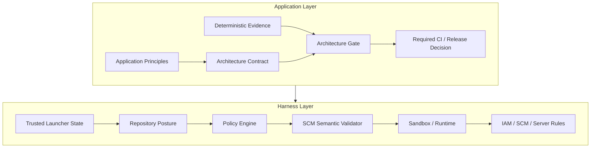

# AGENTS.md

## Purpose

This repository defines a vendor-neutral reference architecture and implementation for secure autonomous software-engineering agents, plus an Application Layer that turns application-specific architecture principles into deterministic, machine-verifiable gates. Preserve the central security model: the LLM is not a security boundary, and non-deterministic review is not an authoritative merge/release gate.

## Read first

Before making non-trivial changes, read:

1. [README.md](README.md) or [README.ja.md](README.ja.md)
2. [Architecture](docs/01-architecture.md) ([日本語](docs/ja/01-architecture.md))
3. [Design Principles](docs/02-design-principles.md) ([日本語](docs/ja/02-design-principles.md))
4. [Security Model](docs/03-security-model.md) ([日本語](docs/ja/03-security-model.md))
5. [Adoption Guide](docs/04-adoption-guide.md) ([日本語](docs/ja/04-adoption-guide.md))
6. [Product Mapping](docs/05-product-mapping.md) ([日本語](docs/ja/05-product-mapping.md))
7. [Vendor Harnesses](docs/06-vendor-harnesses.md) ([日本語](docs/ja/06-vendor-harnesses.md))
8. [Application Architecture](docs/07-application-architecture.md) ([日本語](docs/ja/07-application-architecture.md))
9. [Application Design Principles](docs/08-application-design-principles.md) ([日本語](docs/ja/08-application-design-principles.md))
10. [Implementation Decision Log](docs/decision-log.md) ([日本語](docs/ja/decision-log.md))
11. [DL-014: Deterministic application architecture contracts](docs/decisions/DL-014-application-architecture-contracts.md)

## Core harness invariants

Do not weaken these invariants without an explicit architectural decision:

- Prompt instructions, `AGENTS.md`, `CLAUDE.md`, Skills, or model reasoning are behavioral controls, not security boundaries.
- Hooks provide semantic/lifecycle policy but are not the sole enforcement mechanism for critical security invariants.
- Trusted launcher/orchestrator state establishes expected repository identity; repository-local config cannot authoritatively redefine task identity.
- Missing trusted repository identity is `UNKNOWN`; repository mismatch is `BLOCKED`.
- Repository-local posture mode cannot weaken the trusted minimum posture mode; the default minimum is `restricted`.
- `RESTRICTED` preserves local development but denies remote SCM mutation; `BLOCKED` denies mutation.
- Autonomous remote publication uses canonical command shapes and semantic validation, not arbitrary shell/refspec parsing.
- Compound shell syntax is outside the autonomous allowlist even when its first command is read-only.
- Sandbox, container/Pod isolation, IAM/SCM authorization and server-side rules remain independent enforcement layers.
- Default deployment is one Pod / one agent container unless a concrete threat model justifies more components.
- Credential compromise is considered possible; compromise must not imply unrestricted repository or organization authority.
- Completion is determined by machine-verifiable predicates, not by model claims.
- Autonomous loops must have bounded retries, time, tool calls and/or cost.

## Application-layer invariants

- Keep Application Layer policy distinct from Harness Layer security/capability policy.
- A written architecture principle is not enforced until it has a deterministic predicate over reproducible evidence.
- LLM/human architecture reviews may discover risks, propose invariants, explain failures or propose waivers; they do not produce authoritative gate pass/fail.
- Architecture contracts, gate implementation, evidence collectors, CI wiring and waivers are control-plane artifacts.
- Gate configuration/evaluator errors fail closed.
- Waivers are explicit, scoped to a check, owned, reasoned and expiring.
- Prefer structured evidence such as dependency graphs, schemas and test reports over text heuristics when such evidence exists.
- Required CI is the authoritative merge-time architecture gate; local execution is fast feedback.
- Keep gates composable by invariant class rather than building one monolithic universal checker.

## Architecture conventions



Do not put vendor-specific semantics into the central policy engine unless they represent a genuinely vendor-neutral concept. Keep authoritative task state and gate evidence outside model context.

## Repository structure

- [`docs/`](docs/) — English architecture/design/security/application documentation
- [`docs/ja/`](docs/ja/) — Japanese counterparts
- [`docs/decisions/`](docs/decisions/) — detailed implementation decisions
- [`reference/hooks/`](reference/hooks/) — harness policy engine
- [`reference/harness/`](reference/harness/) — vendor adapters and SCM semantic validation
- [`reference/posture/`](reference/posture/) — repository posture checker and state cache
- [`reference/application_gate/`](reference/application_gate/) — deterministic Application Architecture Gate
- [`.agent-harness/application-architecture.json`](.agent-harness/application-architecture.json) — versioned Application Architecture Contract
- [`reference/policies/`](reference/policies/) — semantic and repository-security policy examples
- [`reference/launcher/`](reference/launcher/) — optional preflight utilities
- [`reference/scripts/`](reference/scripts/) — deterministic lifecycle/completion utilities
- [`reference/kubernetes/`](reference/kubernetes/) — workload/network isolation examples

When changing an English architecture document, update the corresponding Japanese document in the same change where practical.

## Development rules

- Prefer Python standard library for the small reference implementation unless an external dependency has clear architectural value.
- Keep policy, posture and architecture-gate decisions deterministic and testable.
- Prefer structured data over parsing free-form model prose.
- If a required operation can be expressed as a narrow canonical command/argv contract, prefer that over increasingly complex shell regex parsing.
- Deny rules take precedence over ask/allow rules.
- Security-critical and gate-infrastructure errors fail closed wherever the runtime permits it.
- Never embed real secrets, tokens, account identifiers, private endpoints or production credentials in examples/tests.
- Protect `.agent-harness/`, vendor hook config, harness, posture, application gate, policy and CI files as control-plane artifacts.
- Do not add a non-deterministic check type such as `llm_review` to the deterministic architecture gate.

## Testing

For changes, run:

```bash
python -m pytest reference/hooks/tests reference/harness/tests reference/posture/tests reference/application_gate/tests -q
python reference/application_gate/gate.py
```

Preserve regression coverage for harness security invariants and for architecture-gate config validation, path escape prevention, deterministic pass/fail, explicit waivers, waiver expiry and rejection of unsupported/non-deterministic check types.

## Decision log requirement

Record decisions in [Implementation Decision Log](docs/decision-log.md) or under [`docs/decisions/`](docs/decisions/). Add/update a decision whenever a change selects an architecture alternative, changes a trust boundary/failure/approval/security invariant, or changes how an Application Principle becomes an enforced deterministic gate.

## Definition of done

A change is complete only when implementation/documentation matches scope, relevant tests pass, the deterministic Application Architecture Gate passes where applicable, security invariants remain intact, English/Japanese docs are synchronized where applicable, no credentials/sensitive artifacts were introduced, and policy/architecture decisions are documented.
