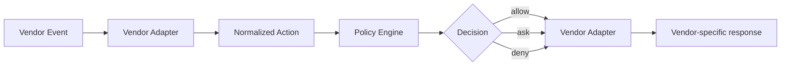
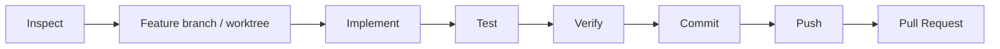

# AGENTS.md

## Purpose

This repository defines a vendor-neutral architecture and Go production implementation for secure autonomous software-engineering agents. Changes should preserve the central security model: the LLM is not a security boundary. Policy, sandboxing, workload isolation, network controls, IAM and source code management authorization, and deterministic completion checks must remain independent enforcement layers.

The production implementation is Go only. The former Python implementation is retired and must not be reintroduced as a reference, compatibility target, or differential-regression target. Historical findings discovered during the Python work may be retained only after being generalized into guarantee contracts, Go tests, evidence, or decision history.

## Read first

Before making non-trivial changes, read:

1. [README.md](README.md) or [README.ja.md](README.ja.md)
2. [Production Implementation Policy](docs/implementation/go/production-implementation-policy.ja.md)
3. [Agent Harness Tool Specification](docs/spec/agent-harness-spec.ja.md)
4. [Architecture](docs/01-architecture.md) ([日本語](docs/ja/01-architecture.md))
5. [Design Principles](docs/02-design-principles.md) ([日本語](docs/ja/02-design-principles.md))
6. [Security Model](docs/03-security-model.md) ([日本語](docs/ja/03-security-model.md))
7. [Adoption Guide](docs/04-adoption-guide.md) ([日本語](docs/ja/04-adoption-guide.md))
8. [Product Mapping](docs/05-product-mapping.md) ([日本語](docs/ja/05-product-mapping.md))

## Core invariants

Do not weaken these invariants without an explicit architectural decision:

- Prompt instructions, `AGENTS.md`, `CLAUDE.md`, Skills, or model reasoning are behavioral controls, not security boundaries.
- Hooks provide semantic/lifecycle policy but are not the sole enforcement mechanism for critical security invariants.
- The OS sandbox constrains filesystem/network capability independently of model behavior.
- Container/Pod isolation protects the host and other workloads independently of the agent sandbox.
- IAM, source code management rulesets, branch protection, and server-side authorization are authoritative for external systems.
- Autonomous agents must use least-privilege, preferably short-lived credentials.
- Direct mutation of protected/default branches must not be part of the normal autonomous path.
- Production-impacting operations require an explicitly designed authorization path; do not add broad production credentials to coding-agent workers.
- MCP and other external tools are part of the security boundary and require server-side authorization.
- Deterministic completion conditions are enforced by the harness; semantic task completion remains an agent evaluation over evidence and task requirements.
- Autonomous loops must have bounded retries, time, tool calls, and/or cost.

## Architecture conventions

Keep vendor-specific behavior behind adapters. The preferred flow is:



Do not put Claude Code, Codex, or Devin-specific semantics into the central policy engine unless they represent a genuinely vendor-neutral concept.

Separate the control plane from the execution plane. Durable task state, policy decisions, approvals, budgets, and completion state belong outside model context.

S1-S6 are Assurance Slices, not implementation packages or runtime phases. Keep Tool Architecture responsibilities and Assurance Slice review boundaries distinct.

## Repository structure

- [`internal/`](internal/) — Go production implementation
- [`docs/spec/`](docs/spec/) — implementation-independent tool specification and glossary
- [`docs/implementation/go/`](docs/implementation/go/) — Go realization notes and production implementation policy
- [`docs/review/slices/`](docs/review/slices/) — Assurance Slice review records
- [`docs/`](docs/) — English architecture/design/security/adoption documentation
- [`docs/ja/`](docs/ja/) — Japanese documentation corresponding to `docs/`
- [`reference/policies/`](reference/policies/) — policy examples
- [`reference/scripts/`](reference/scripts/) — external deterministic lifecycle/completion mechanisms
- [`reference/kubernetes/`](reference/kubernetes/) — workload and network-isolation examples

When changing an English architecture document, update the corresponding Japanese document in the same change where practical. Keep terminology and architectural meaning aligned; the Japanese version does not need to be a literal translation.

## Development rules

- Implement production runtime behavior in Go.
- Do not add Python runtime/reference implementations or Python-vs-Go differential tests.
- Keep policy decisions deterministic and testable.
- Prefer structured data over parsing free-form model prose.
- Deny rules must take precedence over approval/allow rules when multiple rules can match.
- Security-critical errors should fail closed wherever the surrounding product/runtime permits it.
- Never embed real secrets, tokens, account identifiers, private endpoints, or production credentials in examples or tests.
- Kubernetes examples must remain non-privileged and must not introduce `hostPath`, host networking, runtime sockets, or broad default egress without explicit security documentation.
- Avoid introducing a generic privileged shell/MCP path as a shortcut around policy.
- When a historical finding is useful, encode the generalized invariant/failure mode in Go tests or documentation rather than preserving the old implementation.

## Testing

For production implementation changes, run the full Go assurance suite:

```bash
go test ./...
go test -race ./...
go vet ./...
go build ./...
```

CI must retain independent Linux and macOS evidence. Where distribution behavior changes, also verify the distribution candidate, `agent-harness version`, SHA-256 manifest, and artifact upload.

Add or update deterministic regression tests for every machine-testable security invariant or failure mode touched by the change.

Do not make Python tests or Python/Go output equivalence a completion condition.

## Documentation expectations

Architecture documentation should distinguish clearly between:

- behavioral guidance;
- semantic policy;
- static permissions;
- OS capability isolation;
- workload isolation;
- external authorization;
- observability/audit.

Do not describe a prompt, hook, deny-list, or model instruction as a complete security control when a lower-level enforcement boundary is required.

Product-specific statements about Claude Code, Codex, or Devin CLI can change over time. Verify current upstream documentation before making claims about hook schemas, sandbox behavior, permission semantics, network filtering, or enterprise enforcement. Keep vendor adapters versionable and avoid assuming identical semantics across products.

## RAEM / evolution workflow

Conformance is evaluated against the implementation-independent Tool Specification / Guarantee Contract and Go evidence, not against another implementation.

When implementation work exposes a mismatch, classify it before changing behavior:

1. specification deficiency;
2. implementation error;
3. new requirement;
4. external assurance responsibility.

If the model or specification is incomplete, evolve it deliberately, then update the Go implementation and deterministic assurance. Do not silently make implementation behavior normative.

## Git workflow

For non-trivial implementation work, prefer:



Do not force-push or directly push implementation changes to a protected default branch as part of autonomous operation. Do not merge a PR unless the task explicitly authorizes merge and repository policy permits it.

## Definition of done

A change is complete only when all applicable conditions are true:

- implementation/documentation matches the requested scope;
- relevant Go tests and assurance checks pass;
- security invariants remain intact;
- English/Japanese documentation is synchronized when applicable;
- Git state contains only intended changes;
- no credentials or sensitive artifacts were introduced;
- any vendor-specific behavior added or changed is documented with its assumptions;
- any new finding has been classified as implementation error, specification/model gap, new requirement, or external assurance responsibility.
