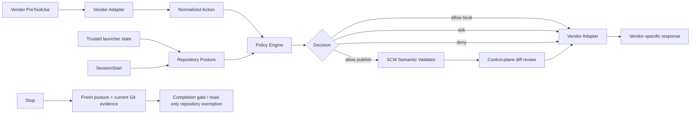
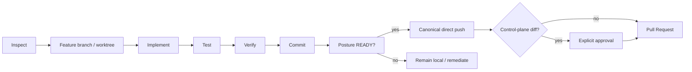

# AGENTS.md

## Purpose

This repository defines a vendor-neutral reference architecture and implementation for secure autonomous software-engineering agents. Preserve the central security model: the LLM is not a security boundary. Trusted task identity, repository posture checks, policy, sandboxing, workload isolation, IAM/SCM authorization, server-side rules and deterministic completion checks remain independent layers.

## Read first

Before making non-trivial changes, read:

1. [README.md](README.md) or [README.ja.md](README.ja.md)
2. [Architecture](docs/01-architecture.md) ([日本語](docs/ja/01-architecture.md))
3. [Design Principles](docs/02-design-principles.md) ([日本語](docs/ja/02-design-principles.md))
4. [Security Model](docs/03-security-model.md) ([日本語](docs/ja/03-security-model.md))
5. [Adoption Guide](docs/04-adoption-guide.md) ([日本語](docs/ja/04-adoption-guide.md))
6. [Product Mapping](docs/05-product-mapping.md) ([日本語](docs/ja/05-product-mapping.md))
7. [Vendor Harnesses](docs/06-vendor-harnesses.md) ([日本語](docs/ja/06-vendor-harnesses.md))
8. [Implementation Decision Log](docs/decision-log.md) ([日本語](docs/ja/decision-log.md))
9. [DL-011: Sandbox-first credential exposure reduction](docs/decisions/DL-011-sandbox-first-credential-isolation.md)
10. [DL-012: SessionStart repository posture](docs/decisions/DL-012-sessionstart-repository-posture.md)
11. [DL-013: Canonical SCM publication](docs/decisions/DL-013-canonical-scm-publication.md)
12. [DL-015: Trusted harness boundary](docs/decisions/DL-015-trusted-harness-boundary.md)
13. [DL-016: Semantic policy is not complete mediation](docs/decisions/DL-016-semantic-policy-is-not-complete-mediation.md)
14. [DL-017: Authority state precedes approval](docs/decisions/DL-017-authority-state-precedes-approval.md)
15. [DL-018: Monotonic posture policy composition](docs/decisions/DL-018-monotonic-posture-policy-composition.md)
16. [DL-019: Control-plane publication review](docs/decisions/DL-019-control-plane-publication-review.md)
17. [DL-020: Authoritative-state completion assurance](docs/decisions/DL-020-session-aware-completion-assurance.md)

## Core invariants

Do not weaken these invariants without an explicit architectural decision:

- Prompt instructions, `AGENTS.md`, `CLAUDE.md`, Skills, or model reasoning are behavioral controls, not security boundaries.
- Hooks provide semantic/lifecycle policy but are not the sole enforcement mechanism for critical security invariants.
- Production policy/assurance implementation must execute from a trusted root outside the agent-mutable workspace; repository copies are reference/development artifacts, not the production trust anchor.
- Semantic hooks govern agent-issued actions visible at the hook boundary; they do not claim complete mediation of arbitrary nested processes or side effects launched by an allowed command.
- Trusted launcher/orchestrator state establishes expected repository identity; repository-local config cannot authoritatively redefine task identity.
- Missing trusted repository identity is `UNKNOWN`; repository mismatch is `BLOCKED`.
- Trusted posture policy establishes the lower bound. Repository-local `.agent-harness/security.json` may strengthen mode/requirements or shorten TTL, but cannot weaken trusted requirements or lengthen the trusted TTL.
- `AGENT_HARNESS_MINIMUM_POSTURE_MODE` is trusted launcher authority and may explicitly choose the trusted baseline mode for an interactive session; repository-local policy is applied only after that trusted choice and cannot weaken it.
- Repository security posture is checked at SessionStart for early context and is freshly re-evaluated before mutation enforcement. A writable session cache is not an authority source.
- `pass`, `fail`, and `unknown` are distinct posture results; unavailable metadata must not silently become `pass`.
- Missing repository posture overlay leaves the trusted baseline unchanged; invalid trusted or repository posture policy fails closed to `BLOCKED`.
- `RESTRICTED` preserves local development but denies remote SCM mutation; `BLOCKED` denies mutation and cannot be weakened by an ordinary or trusted external approval path.
- Direct autonomous remote publication visible to the harness uses canonical command shapes and semantic validation, not arbitrary shell/refspec parsing.
- Critical external-system invariants remain enforced by least-privilege IAM/SCM authority and server-side policy even if local semantic policy is bypassed by nested code.
- Compound shell syntax is outside the autonomous allowlist even when its first command is read-only. Remote SCM mutation inside a compound command must still be recognized for repository-authority enforcement.
- Control-plane changes are reviewed from publication evidence, not solely from the edit primitive. Canonical push/PR creation must require explicit approval when the branch diff contains protected control-plane paths.
- The OS sandbox reduces filesystem/process/network capability and credential exposure independently of model behavior.
- Container/Pod isolation protects the host and resources independently of the agent sandbox.
- Default deployment is one Pod / one agent container; do not add broker/sidecar/shim infrastructure without a concrete threat model and Decision Log entry.
- IAM, SCM rulesets, branch protection, and server-side authorization are authoritative for external systems.
- Autonomous agents use least-privilege, preferably short-lived and repository-scoped credentials.
- Credential compromise is considered possible; compromise must not imply unrestricted repository or organization authority.
- Direct mutation of protected/default branches must not be part of the normal autonomous path.
- Production-impacting operations require an explicitly designed authorization path.
- MCP and other external tools are part of the security boundary and require server-side authorization.
- Completion is determined by machine-verifiable predicates, not by model claims or writable session snapshots. Only a clean checked default branch whose local `HEAD` equals `origin/<checked-default-branch>` receives the read-only repository exemption; every other or unverifiable state runs the full delivery completion gate.
- Writable local state or caches may support context/performance but must not become authoritative evidence for mutation, approval, publication, or completion decisions when repository code can modify that state under the same operating-system identity.
- Autonomous loops must have bounded retries, time, tool calls, and/or cost.

## Architecture conventions

Keep vendor-specific behavior behind adapters. The preferred flow is:



Do not put vendor-specific semantics into the central policy engine unless they represent a genuinely vendor-neutral concept. Keep authoritative task state outside model context and outside mutable repository-controlled state.

## Repository structure

- [`docs/`](docs/) — English architecture/design/security/adoption documentation
- [`docs/ja/`](docs/ja/) — Japanese counterparts
- [`docs/decisions/`](docs/decisions/) — detailed implementation decisions
- [`reference/hooks/`](reference/hooks/) — policy engine
- [`reference/harness/`](reference/harness/) — runnable vendor adapters, SCM semantic validation, and deterministic completion assurance
- [`reference/posture/`](reference/posture/) — repository security posture checker and non-authoritative session cache
- [`reference/policies/`](reference/policies/) — semantic and repository-security policy examples
- [`reference/launcher/`](reference/launcher/) — trusted hook wrapper and optional preflight utilities
- [`reference/scripts/`](reference/scripts/) — deterministic lifecycle/completion utilities
- [`reference/kubernetes/`](reference/kubernetes/) — simple workload/network isolation examples

When changing an English architecture document, update the corresponding Japanese document in the same change where practical.

## Development rules

- Prefer Python standard library for the small reference implementation unless an external dependency has clear architectural value.
- Keep policy and posture decisions deterministic and testable.
- Prefer structured data over parsing free-form model prose.
- Python production modules, top-level functions, classes, and methods in the reference implementation must have `docstring`s. A useful docstring explains the callable or type contract rather than merely restating its name. Security-sensitive code must document relevant assumptions, authority/trust boundaries, failure semantics, or the scope of the guarantee when those details affect correct review. Descriptively named test functions do not require individual docstrings.
- If a required operation can be expressed as a narrow canonical command/argv contract, prefer that over increasingly complex shell regex parsing.
- Treat `&&`, `||`, `;`, pipes, redirection, newlines and command substitution as outside autonomous command allowlists unless a dedicated parser/validator explicitly owns the semantics.
- Direct autonomous Git publication visible at the hook boundary is limited to `git push` and `git push --set-upstream origin HEAD`; validate repository, current branch, default branch, `origin` and upstream before allowing it.
- `git push --set-upstream origin HEAD` is only for first publication when no upstream exists; subsequent publication uses `git push` with upstream `origin/<current-branch>`.
- Autonomous `gh pr create` must not override repository, head branch or base branch and must be bound to the checked repository, current non-default branch, and published upstream `origin/<current-branch>`.
- Deny force push variants, including valued `--force-with-lease=<ref>` forms.
- Treat protected control-plane files as publication-review artifacts. Edit-time path classification is defense in depth; publication-time diff evidence is the path-independent approval boundary.
- Do not interpret an allowed test/build/tool invocation as proof that every nested subprocess or network side effect was mediated by hooks.
- For invariants that must survive nested code execution, refine enforcement to sandbox/workload capability controls, IAM/SCM scope, network policy where required, and authoritative server-side rules.
- Do not treat a writable cache, snapshot, marker file, or other state controlled by repository code as independent assurance evidence. Re-evaluate from trusted implementation and authoritative/current external or Git evidence when the decision affects mutation, approval, publication, or completion.
- Deny rules take precedence over ask/allow rules. Repository authority states such as `BLOCKED` and `RESTRICTED` take precedence over approval decisions.
- Security-critical errors fail closed wherever the runtime permits it.
- Never embed real secrets, tokens, account identifiers, private endpoints, or production credentials in examples/tests.
- Deny obvious credential extraction (`gh auth token`, direct reads of known credential stores) as defense in depth, but rely on IAM/SCM scope and server-side rules for compromise containment.
- Keep Kubernetes examples non-privileged and avoid `hostPath`, host networking, runtime sockets, and unnecessary extra containers.
- Do not introduce a generic privileged shell/MCP/SCM proxy as a shortcut around policy or solely to emulate complete mediation.
- Protect `.agent-harness/`, vendor hook config, harness, posture, policy, launcher, assurance scripts, deployment references and CI files as control-plane artifacts; production trust must still come from the trusted harness root rather than mutable repository copies.

## Testing

For harness changes, run:

```bash
python -m pytest reference/hooks/tests reference/harness/tests reference/posture/tests -q
```

Preserve regression coverage for safe read-only Git, all force-push forms including valued force-with-lease, approval-required actions, credential extraction denial, trusted harness root resolution, trusted/repository posture-policy composition, trusted launcher mode override, repository-local weakening attempts, repository posture state derivation, missing/mismatched trusted repository identity, mutation-time posture re-evaluation despite writable cache contents, `RESTRICTED` remote-mutation denial including compound commands, `BLOCKED` mutation denial and approval precedence, compound-shell bypass attempts, non-canonical direct push/refspec rejection, default-branch direct push rejection, origin/upstream mismatch, first-publication semantics, control-plane publication diff approval, PR repository/head/base override rejection, PR current-Git-state binding, authoritative-state read-only completion, changed/unverifiable-state delivery completion, and required production-code docstrings.

## Decision log requirement

Record decisions in [Implementation Decision Log](docs/decision-log.md) or a focused record under [`docs/decisions/`](docs/decisions/). Add/update a decision whenever a change selects an architectural alternative, works around a vendor limitation, changes a trust boundary/failure mode/approval path/security invariant, or may be simplified after a future tool upgrade.

For temporary/vendor-dependent choices, record the limitation, workaround, and revisit trigger. Do not silently erase history; mark superseded decisions or explain the replaced default.

## Documentation expectations

Distinguish trusted task identity, trusted posture baseline, repository posture overlay, posture detection, behavioral guidance, semantic policy, static permissions, SCM semantic validation, publication evidence, OS capability isolation, workload isolation, IAM/SCM containment, server-side enforcement, completion evidence, and observability. Do not describe a prompt, hook, deny-list, sandbox, credential secrecy assumption, mutable cache, or direct-command validator as a complete or independent security control when repository code can modify its evidence or a lower-level authority boundary exists.

Japanese documentation must be written as Japanese documentation, not English terminology embedded in Japanese prose. Translate conceptual terms, headings, explanatory labels, and ordinary technical nouns into established Japanese terminology wherever a natural Japanese term exists. Keep the original spelling only when it is an identifier or proper name whose spelling is operationally significant, such as code symbols, environment variables, command names/options, file paths, protocol/product names, API fields, or values that must match an implementation. When an English term is useful for disambiguation, introduce it parenthetically on first use rather than repeatedly mixing English terminology into the Japanese text.

Product-specific claims change over time. Verify upstream documentation before changing hook schemas, SessionStart behavior, sandbox/network behavior, permission semantics, or credential-masking guidance.

## Git workflow



Do not force-push or directly push to a protected default branch. Do not merge a PR unless the task explicitly authorizes merge and repository policy permits it.

## Definition of done

A change is complete only when implementation/documentation matches scope, relevant tests pass, security invariants remain intact, required production-code docstrings describe review-relevant contracts, English/Japanese docs are synchronized where applicable, Git state contains only intended changes, no credentials/sensitive artifacts were introduced, and vendor-sensitive decisions have assumptions/revisit triggers documented.
