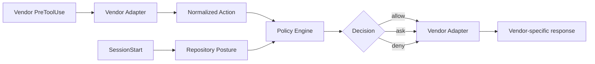
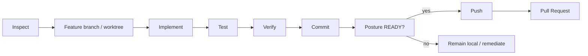

# AGENTS.md

## Purpose

This repository defines a vendor-neutral reference architecture and implementation for secure autonomous software-engineering agents. Preserve the central security model: the LLM is not a security boundary. Repository posture checks, policy, sandboxing, workload isolation, IAM/SCM authorization, server-side rules and deterministic completion checks remain independent layers.

## Read first

Before making non-trivial changes, read:

1. [README.md](README.md) or [README.ja.md](README.ja.md)
2. [Architecture](docs/01-architecture.md) ([日本語](docs/ja/01-architecture.md))
3. [Design Principles](docs/02-design-principles.md) ([日本語](docs/ja/02-design-principles.md))
4. [Security Model](docs/03-security-model.md) ([日本語](docs/ja/03-security-model.md))
5. [Adoption Guide](docs/04-adoption-guide.md) ([日本語](docs/ja/04-adoption-guide.md))
6. [Product Mapping](docs/05-product-mapping.md) ([日本語](docs/ja/05-product-mapping.md))
7. [Vendor Harnesses](docs/06-vendor-harnesses.md) ([日本語](docs/ja/06-vendor-harnesses.md))
8. [Implementation Decision Log](docs/decision-log.md) ([日本語](docs/ja/decision-log.md))
9. [DL-011: Sandbox-first credential exposure reduction](docs/decisions/DL-011-sandbox-first-credential-isolation.md)
10. [DL-012: SessionStart repository posture](docs/decisions/DL-012-sessionstart-repository-posture.md)

## Core invariants

Do not weaken these invariants without an explicit architectural decision:

- Prompt instructions, `AGENTS.md`, `CLAUDE.md`, Skills, or model reasoning are behavioral controls, not security boundaries.
- Hooks provide semantic/lifecycle policy but are not the sole enforcement mechanism for critical security invariants.
- Repository security posture is checked at SessionStart and revalidated before stale remote trust-boundary operations.
- `pass`, `fail`, and `unknown` are distinct posture results; unavailable metadata must not silently become `pass`.
- Missing posture configuration uses built-in `restricted` defaults; invalid explicit policy fails closed to `BLOCKED`.
- `RESTRICTED` preserves local development but denies remote SCM mutation; `BLOCKED` denies mutation.
- The OS sandbox reduces filesystem/process/network capability and credential exposure independently of model behavior.
- Container/Pod isolation protects the host and resources independently of the agent sandbox.
- Default deployment is one Pod / one agent container; do not add broker/sidecar/shim infrastructure without a concrete threat model and Decision Log entry.
- IAM, SCM rulesets, branch protection, and server-side authorization are authoritative for external systems.
- Autonomous agents use least-privilege, preferably short-lived and repository-scoped credentials.
- Credential compromise is considered possible; compromise must not imply unrestricted repository or organization authority.
- Direct mutation of protected/default branches must not be part of the normal autonomous path.
- Production-impacting operations require an explicitly designed authorization path.
- MCP and other external tools are part of the security boundary and require server-side authorization.
- Completion is determined by machine-verifiable predicates, not by model claims.
- Autonomous loops must have bounded retries, time, tool calls, and/or cost.

## Architecture conventions

Keep vendor-specific behavior behind adapters. The preferred flow is:



Do not put vendor-specific semantics into the central policy engine unless they represent a genuinely vendor-neutral concept. Keep authoritative task state outside model context.

## Repository structure

- [`docs/`](docs/) — English architecture/design/security/adoption documentation
- [`docs/ja/`](docs/ja/) — Japanese counterparts
- [`docs/decisions/`](docs/decisions/) — detailed implementation decisions
- [`reference/hooks/`](reference/hooks/) — policy engine
- [`reference/harness/`](reference/harness/) — runnable vendor adapters
- [`reference/posture/`](reference/posture/) — repository security posture checker and state cache
- [`reference/policies/`](reference/policies/) — semantic and repository-security policy examples
- [`reference/launcher/`](reference/launcher/) — optional preflight utilities
- [`reference/scripts/`](reference/scripts/) — deterministic lifecycle/completion utilities
- [`reference/kubernetes/`](reference/kubernetes/) — simple workload/network isolation examples

When changing an English architecture document, update the corresponding Japanese document in the same change where practical.

## Development rules

- Prefer Python standard library for the small reference implementation unless an external dependency has clear architectural value.
- Keep policy and posture decisions deterministic and testable.
- Prefer structured data over parsing free-form model prose.
- Deny rules take precedence over ask/allow rules.
- Security-critical errors fail closed wherever the runtime permits it.
- Never embed real secrets, tokens, account identifiers, private endpoints, or production credentials in examples/tests.
- Deny obvious credential extraction (`gh auth token`, direct reads of known credential stores) as defense in depth, but rely on IAM/SCM scope and server-side rules for compromise containment.
- Keep Kubernetes examples non-privileged and avoid `hostPath`, host networking, runtime sockets, and unnecessary extra containers.
- Do not introduce a generic privileged shell/MCP/SCM proxy as a shortcut around policy.
- Protect `.agent-harness/`, vendor hook config, harness, posture, policy and CI files as control-plane artifacts.

## Testing

For harness changes, run:

```bash
python -m pytest reference/hooks/tests reference/harness/tests reference/posture/tests -q
```

Preserve coverage for safe read-only Git, force-push denial, protected-branch denial, approval-required actions, credential extraction denial, control-plane file protection, repository posture state derivation, `RESTRICTED` remote-mutation denial, and `BLOCKED` mutation denial.

## Decision log requirement

Record decisions in [Implementation Decision Log](docs/decision-log.md) or a focused record under [`docs/decisions/`](docs/decisions/). Add/update a decision whenever a change selects an architectural alternative, works around a vendor limitation, changes a trust boundary/failure mode/approval path/security invariant, or may be simplified after a future tool upgrade.

For temporary/vendor-dependent choices, record the limitation, workaround, and revisit trigger. Do not silently erase history; mark superseded decisions or explain the replaced default.

## Documentation expectations

Distinguish behavioral guidance, repository posture detection, semantic policy, static permissions, OS capability isolation, workload isolation, IAM/SCM containment, server-side enforcement, and observability. Do not describe a prompt, hook, deny-list, sandbox, or credential secrecy assumption as a complete security control when a lower-level authority boundary is required.

Product-specific claims change over time. Verify upstream documentation before changing hook schemas, SessionStart behavior, sandbox/network behavior, permission semantics, or credential-masking guidance.

## Git workflow



Do not force-push or directly push to a protected default branch. Do not merge a PR unless the task explicitly authorizes merge and repository policy permits it.

## Definition of done

A change is complete only when implementation/documentation matches scope, relevant tests pass, security invariants remain intact, English/Japanese docs are synchronized where applicable, Git state contains only intended changes, no credentials/sensitive artifacts were introduced, and vendor-sensitive decisions have assumptions/revisit triggers documented.
