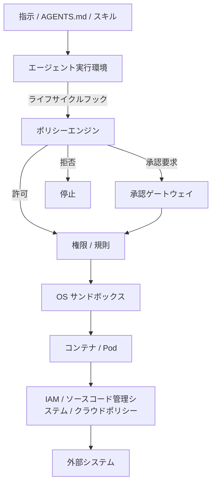
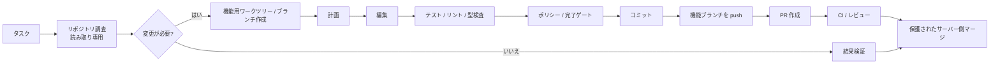

[English](README.md) | [日本語](README.ja.md)

# Agent Harness 日本語版

Claude Code / OpenAI Codex / Devin CLI などの自律型ソフトウェア開発エージェントを、安全かつ再利用可能な形で運用するための、ベンダー非依存アーキテクチャと **Go による本番実装**です。

このリポジトリの中心的な考え方は、**LLM 自体をセキュリティ境界として扱わない**ことです。自律実行は、独立したポリシー、OS サンドボックス、Pod/コンテナ分離、外部 IAM、ネットワーク制御、機械検証可能な完了条件によって制約されるべきです。

本番実装は Go に一本化しています。旧 Python 実装は廃止し、参照実装 / 互換性 / 差分回帰の適合対象には含めません。Python 実装で得た有効な発見は、保証契約、Go テスト、根拠、判断履歴へ一般化された知識としてのみ保持します。

## 基本アーキテクチャ

各レイヤーの責務は明確に分離します。

| レイヤー | 主な責務 |
|---|---|
| 指示 / スキル | 望ましい振る舞い、作業手順、設計方針 |
| フック / ポリシーエンジン | 文脈依存・ライフサイクル依存のポリシー判断 |
| 権限 / 規則 | コマンド、ツール、パスの静的分類 |
| サンドボックス | ファイルシステム・ネットワークの能力境界 |
| コンテナ / Pod | プロセス、ホスト、リソースの隔離 |
| IAM / ソースコード管理システムのポリシー | 外部システムに対する権限と被害範囲の制御 |
| 完了ゲート | 機械検証可能な「完了」の定義 |
| テレメトリー | 監査、障害解析、ポリシーチューニング |

## 標準的な自律実行フロー

通常業務は可能な限り人間の確認なしで完結させます。人間の承認は、静的ポリシーやサンドボックスだけでは安全に境界づけられない操作に限定します。

## バイナリリリース

GitHub の draft release には、Linux / macOS の amd64 / arm64 向け
`agent-harness` アーカイブと、SHA-256 manifest `checksums.txt` が添付されます。
導入前にダウンロードしたアーカイブを対応する manifest entry と照合し、導入後は
`agent-harness version` でリリースバージョン、ソースコミット、ビルド日時、Go version、
対象 platform を確認してください。

リリースは保護ブランチの運用と分離せず、次の順序で進みます。

1. `main` にマージされた Conventional Commits を Release Please がリリース PR に集約する。
2. `GITHUB_TOKEN` で作成した PR からworkflowが再帰的に起動されないGitHubの制約を補うため、生成PRのheadに対して通常CIを明示的にdispatchする。
3. 全チェックを通過したリリース PR のマージによって version tag と draft GitHub release を作成する。
4. GoReleaser が Go の全保証 suite を実行し、全対象向けアーカイブと checksum manifest を draft に添付する。
5. maintainer が draft の内容を確認し、明示的に公開する。

Pull request の CI でも GoReleaser snapshot を生成して artifact として保存するため、
packaging 設定、埋め込み build identity、checksum manifest はリリース用 commit が
`main` に入る前に検証されます。maintainer は GoReleaser v2 を使って
`make release-check` または `make release-snapshot` をローカル実行できます。

## リポジトリ構成

- [Agent Harness ツール仕様書（骨格）](docs/spec/agent-harness-spec.ja.md) — 実装言語・保証スライスから独立した契約と未決事項
- [Agent Harness 用語集](docs/spec/agent-harness-glossary.ja.md) — 仕様・実装・保証で共有する用語の定義
- [Go 本番実装方針](docs/implementation/go/production-implementation-policy.ja.md) — Go を唯一の本番実装とする方針
- [Go 実装ノート](docs/implementation/go/implementation-notes.ja.md) — 信頼された実行環境 / ポリシー強制の実験的具体化と根拠
- [Go リポジトリ変更権限 / 状態 実装ノート](docs/implementation/go/repository-authority-posture.ja.md) — リポジトリ権限の具体化、S2 の根拠、Python 比較、未決事項
- [Go 公開保護 実装ノート](docs/implementation/go/publication-guard.ja.md) — 公開意味論の具体化、S3 の根拠、Python 比較、未決事項
- [Go ベンダー統合 / 配備 実装ノート](docs/implementation/go/vendor-integration-deployment.ja.md) — ベンダー写像、build identity、binary release の信頼境界
- [アーキテクチャ](docs/ja/01-architecture.md) ([English](docs/01-architecture.md))
- [設計原則](docs/ja/02-design-principles.md) ([English](docs/02-design-principles.md))
- [セキュリティモデル](docs/ja/03-security-model.md) ([English](docs/03-security-model.md))
- [導入ガイド](docs/ja/04-adoption-guide.md) ([English](docs/04-adoption-guide.md))
- [製品マッピング](docs/ja/05-product-mapping.md) ([English](docs/05-product-mapping.md))
- [`AGENTS.md`](AGENTS.md) — コーディングエージェント向け開発指示
- [`internal/`](internal/) — Go による本番実装
- [`policy.example.json`](reference/policies/policy.example.json) — ポリシー例
- [`completion_gate.sh`](reference/scripts/completion_gate.sh) — 完了条件検証の外部機構例
- [`agent-pod.yaml`](reference/kubernetes/agent-pod.yaml) — 強化済み Pod の例
- [`network-policy.yaml`](reference/kubernetes/network-policy.yaml) — 既定拒否の NetworkPolicy 例

## 非目標

このプロジェクトは、プロンプト、[AGENTS.md](AGENTS.md)、CLAUDE.md、スキル、モデルの推論そのものをセキュリティ機構にすることを目的としていません。これらは有効な行動制御ですが、秘密情報、本番環境、保護ブランチを守るための最終的な強制境界ではありません。

## 基本原則

> 安全な操作は自律実行しやすくし、危険な操作は技術的に不可能にするか、明示的な承認を必要とする。
