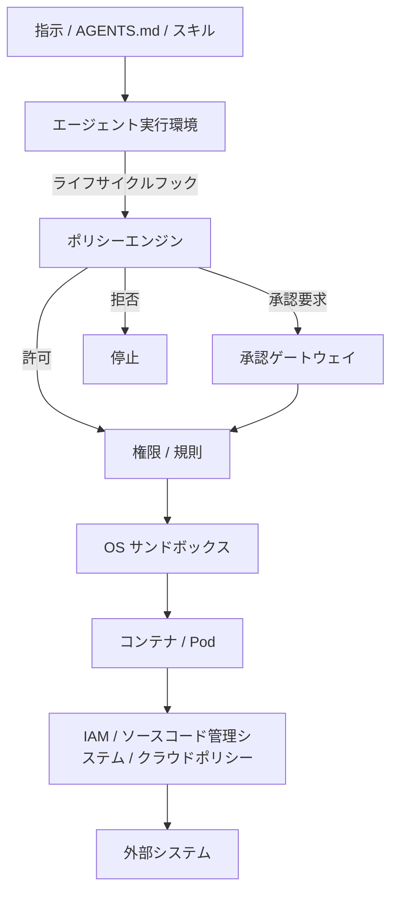
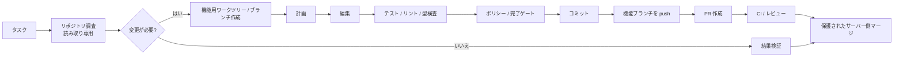

[English](README.md) | [日本語](README.ja.md)

# Agent Harness 日本語版

Claude Code / OpenAI Codex / Devin CLI などの自律型ソフトウェア開発エージェントを、安全かつ再利用可能な形で運用するための、ベンダー非依存のリファレンスアーキテクチャと実装例です。

このリポジトリの中心的な考え方は、**LLM 自体をセキュリティ境界として扱わない**ことです。自律実行は、独立したポリシー、OS サンドボックス、Pod/コンテナ分離、外部 IAM、ネットワーク制御、機械検証可能な完了条件によって制約されるべきです。

## 基本アーキテクチャ

各レイヤーの責務は明確に分離します。

| レイヤー | 主な責務 |
|---|---|
| 指示 / スキル | 望ましい振る舞い、作業手順、設計方針 |
| フック / ポリシーエンジン | 文脈依存・ライフサイクル依存のポリシー判断 |
| 権限 / 規則 | コマンド、ツール、パスの静的分類 |
| サンドボックス | ファイルシステム・ネットワークの能力境界 |
| コンテナ / Pod | プロセス、ホスト、リソースの隔離 |
| IAM / ソースコード管理システムのポリシー | 外部システムに対する権限と被害範囲の制御 |
| 完了ゲート | 機械検証可能な「完了」の定義 |
| テレメトリー | 監査、障害解析、ポリシーチューニング |

## 標準的な自律実行フロー

通常業務は可能な限り人間の確認なしで完結させます。人間の承認は、静的ポリシーやサンドボックスだけでは安全に境界づけられない操作に限定します。

## リポジトリ構成

- [Agent Harness ツール仕様書（骨格）](docs/spec/agent-harness-spec.ja.md) — 実装言語・保証スライスから独立した契約と未決事項
- [Agent Harness 用語集](docs/spec/agent-harness-glossary.ja.md) — 仕様・実装・保証で共有する用語の定義
- [Go 実装ノート](docs/implementation/go/implementation-notes.ja.md) — Trusted Runtime / Policy Enforcement の実験的具体化と根拠
- [アーキテクチャ](docs/ja/01-architecture.md) ([English](docs/01-architecture.md))
- [設計原則](docs/ja/02-design-principles.md) ([English](docs/02-design-principles.md))
- [セキュリティモデル](docs/ja/03-security-model.md) ([English](docs/03-security-model.md))
- [導入ガイド](docs/ja/04-adoption-guide.md) ([English](docs/04-adoption-guide.md))
- [製品マッピング](docs/ja/05-product-mapping.md) ([English](docs/05-product-mapping.md))
- [`AGENTS.md`](AGENTS.md) — コーディングエージェント向け開発指示
- [`policy_engine.py`](reference/hooks/policy_engine.py) — ベンダー非依存のポリシーエンジン
- [`pre_tool_use_adapter.py`](reference/hooks/pre_tool_use_adapter.py) — フックアダプター例
- [`policy.example.json`](reference/policies/policy.example.json) — ポリシー例
- [`completion_gate.sh`](reference/scripts/completion_gate.sh) — 完了条件検証
- [`agent-pod.yaml`](reference/kubernetes/agent-pod.yaml) — 強化済み Pod の例
- [`network-policy.yaml`](reference/kubernetes/network-policy.yaml) — 既定拒否の NetworkPolicy 例

## 非目標

このプロジェクトは、プロンプト、[AGENTS.md](AGENTS.md)、CLAUDE.md、スキル、モデルの推論そのものをセキュリティ機構にすることを目的としていません。これらは有効な行動制御ですが、秘密情報、本番環境、保護ブランチを守るための最終的な強制境界ではありません。

## 基本原則

> 安全な操作は自律実行しやすくし、危険な操作は技術的に不可能にするか、明示的な承認を必要とする。
