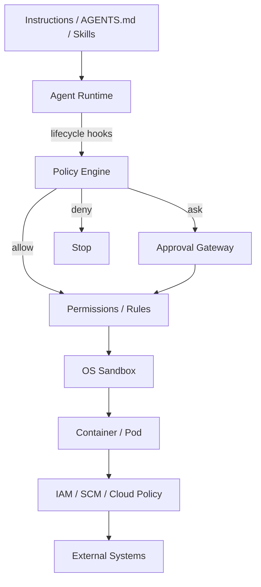
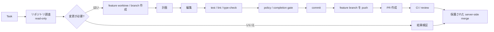

[English](README.md) | [日本語](README.ja.md)

# Agent Harness 日本語版

Claude Code / OpenAI Codex / Devin CLI などの自律型ソフトウェア開発エージェントを、安全かつ再利用可能な形で運用するための、ベンダー非依存のリファレンスアーキテクチャと実装例です。

このリポジトリの中心的な考え方は、**LLM 自体をセキュリティ境界として扱わない**ことです。自律実行は、独立したポリシー、OS サンドボックス、Pod/コンテナ分離、外部 IAM、ネットワーク制御、機械検証可能な完了条件によって制約されるべきです。

## 基本アーキテクチャ

各レイヤーの責務は明確に分離します。

| レイヤー | 主な責務 |
|---|---|
| Instructions / Skills | 望ましい振る舞い、作業手順、設計方針 |
| Hooks / Policy Engine | 文脈依存・ライフサイクル依存のポリシー判断 |
| Permissions / Rules | コマンド、ツール、パスの静的分類 |
| Sandbox | ファイルシステム・ネットワークの能力境界 |
| Container / Pod | プロセス、ホスト、リソースの隔離 |
| IAM / SCM Policy | 外部システムに対する権限と被害範囲の制御 |
| Completion Gate | 機械検証可能な「完了」の定義 |
| Telemetry | 監査、障害解析、ポリシーチューニング |

## 標準的な自律実行フロー

通常業務は可能な限り人間の確認なしで完結させます。人間の承認は、静的ポリシーやサンドボックスだけでは安全に境界づけられない操作に限定します。

## リポジトリ構成

- [アーキテクチャ](docs/ja/01-architecture.md) ([English](docs/01-architecture.md))
- [設計原則](docs/ja/02-design-principles.md) ([English](docs/02-design-principles.md))
- [セキュリティモデル](docs/ja/03-security-model.md) ([English](docs/03-security-model.md))
- [導入ガイド](docs/ja/04-adoption-guide.md) ([English](docs/04-adoption-guide.md))
- [製品マッピング](docs/ja/05-product-mapping.md) ([English](docs/05-product-mapping.md))
- [Vendor Harness 実装](docs/ja/06-vendor-harnesses.md) ([English](docs/06-vendor-harnesses.md)) — Claude Code / Codex / Devin CLI 向け実装
- [実装 Decision Log](docs/ja/decision-log.md) ([English](docs/decision-log.md)) — 設計判断、Vendor 制約、将来の再評価条件
- [DL-011: Sandbox-first Credential Isolation](docs/ja/decisions/DL-011-sandbox-first-credential-isolation.md) ([English](docs/decisions/DL-011-sandbox-first-credential-isolation.md)) — GitHub capability を維持しつつ reusable credential を Agent へ露出しない設計
- [`AGENTS.md`](AGENTS.md) — Coding Agent 向け開発指示
- [`reference/harness/`](reference/harness/) — Vendor Adapter
- [`reference/scm_broker/`](reference/scm_broker/) — native credential masking が不足する Vendor 向け Broker fallback
- [`reference/shims/`](reference/shims/) — Broker 経由 remote operation 用 `git` / `gh` shim
- [`policy_engine.py`](reference/hooks/policy_engine.py) — ベンダー非依存 Policy Engine
- [`policy.example.json`](reference/policies/policy.example.json) — ポリシー例
- [`completion_gate.sh`](reference/scripts/completion_gate.sh) — 完了条件検証
- [`agent-pod.yaml`](reference/kubernetes/agent-pod.yaml) — Hardening 済み Pod 例
- [`agent-with-scm-broker.yaml`](reference/kubernetes/agent-with-scm-broker.yaml) — Sandbox-first Credential Isolation 配備例
- [`network-policy.yaml`](reference/kubernetes/network-policy.yaml) — default-deny NetworkPolicy 例

## 非目標

このプロジェクトは、Prompt、[AGENTS.md](AGENTS.md)、CLAUDE.md、Skills、モデルの推論そのものをセキュリティ機構にすることを目的としていません。これらは有効な行動制御ですが、秘密情報、production 環境、protected branch を守るための最終的な強制境界ではありません。

## 基本原則

> 安全な操作は自律実行しやすくし、危険な操作は技術的に不可能にするか、明示的な承認を必要とする。
