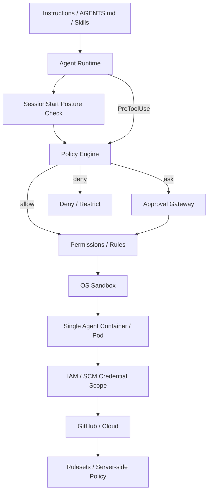
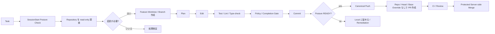

[English](README.md) | [日本語](README.ja.md)

# Agent Harness 日本語版

Claude Code / OpenAI Codex / Devin CLI などの自律型ソフトウェア開発エージェントを、安全かつ再利用可能な形で運用するための Vendor-neutral Reference Architecture と実装例です。

中心的な考え方は **LLM 自体を Security Boundary として扱わない**ことです。自律実行は、Lifecycle Policy、Repository Posture Check、OS Sandbox、Workload Isolation、外部 IAM / SCM Authority、Server-side Repository Rule、Machine-verifiable Completion Gate によって独立して制約します。

## 基本アーキテクチャ



各レイヤーの責務を明確に分離します。

| レイヤー | 主な責務 |
|---|---|
| Instructions / Skills | 望ましい振る舞い、作業手順、設計方針 |
| Trusted Launcher State | Authoritative な Task Identity と Minimum Posture を供給 |
| SessionStart Posture Check | 作業開始前に Repository / Security Configuration Drift を検出 |
| Hooks / Policy Engine | Semantic / Lifecycle Policy |
| Permissions / Rules | Command / Tool / Path の静的分類 |
| Sandbox | Filesystem / Process / Network capability と Credential Exposure を低減 |
| Container / Pod | Host / Resource Isolation。Baseline は 1 Pod / 1 Container |
| IAM / SCM Policy | Short-lived / Least-privilege で Credential Compromise の blast radius を制限 |
| GitHub Rulesets | Branch / PR / CI の Authoritative Enforcement |
| Completion Gate | Machine-verifiable な完了条件 |
| Telemetry | Audit / Incident Analysis / Policy Tuning |

## Repository Posture State

`SessionStart` で実際の Repository を Trusted Launcher State と照合し、GitHub-side Control（Required PR、Force Push Prevention、Required Status Checks 等）を確認します。各 Check は `pass` / `fail` / `unknown`、Session は次の3状態です。

- `READY` — 通常 Policy を適用
- `RESTRICTED` — Local Development は許可するが Remote SCM Mutation は deny
- `BLOCKED` — Mutation を deny

Trusted Launcher は `AGENT_HARNESS_EXPECTED_REPOSITORY=owner/repository` を設定します。未設定の場合 Repository Identity は `UNKNOWN` となり、Default Minimum の `restricted` により Remote Publish は許可されません。Repository-local の `mode: warn` だけではこの Minimum を弱められず、Interactive 用に弱める場合だけ Trusted Launcher が `AGENT_HARNESS_MINIMUM_POSTURE_MODE` を明示的に変更します。

`.agent-harness/security.json` がない場合は built-in `restricted` default を利用します。明示的な設定が invalid な場合は `BLOCKED` です。Remote Trust Boundary を越える前には Cache が stale なら Posture を再確認します。

## Canonical Autonomous Publication

Arbitrary Shell / Refspec の解釈を避けるため、Autonomous な Git Publish は次の2形式に限定します。

```bash
git push
git push --set-upstream origin HEAD
```

その後 Semantic Validator が `READY` Posture、Checked Repository、Current Non-default Branch、`origin`、Expected Upstream を確認します。Arbitrary Remote、Destination Refspec、Tag、Delete / Force、Config Override は Autonomous Allowlist 外です。`gh pr create` では Repository / Head Branch / Base Branch の Override を禁止します。`&&`、Pipe、Redirection、Newline、Command Substitution 等の Compound Shell Syntax も Autonomous Allowlist 外です。

## 標準的な自律実行フロー



## リポジトリ構成

- [アーキテクチャ](docs/ja/01-architecture.md) ([English](docs/01-architecture.md))
- [設計原則](docs/ja/02-design-principles.md) ([English](docs/02-design-principles.md))
- [セキュリティモデル](docs/ja/03-security-model.md) ([English](docs/03-security-model.md))
- [導入ガイド](docs/ja/04-adoption-guide.md) ([English](docs/04-adoption-guide.md))
- [製品マッピング](docs/ja/05-product-mapping.md) ([English](docs/05-product-mapping.md))
- [Vendor Harness 実装](docs/ja/06-vendor-harnesses.md) ([English](docs/06-vendor-harnesses.md))
- [実装 Decision Log](docs/ja/decision-log.md) ([English](docs/decision-log.md))
- [DL-011: Sandbox-first Credential Exposure Reduction](docs/ja/decisions/DL-011-sandbox-first-credential-isolation.md)
- [DL-012: SessionStart Repository Posture](docs/ja/decisions/DL-012-sessionstart-repository-posture.md)
- [DL-013: Canonical SCM Publication](docs/ja/decisions/DL-013-canonical-scm-publication.md)
- [`reference/harness/`](reference/harness/) — Vendor Adapter / Semantic Publish Validation
- [`reference/posture/`](reference/posture/) — Repository Posture Checker / Cache
- [`policy.example.json`](reference/policies/policy.example.json) — Semantic Policy
- [`repository-security.example.json`](reference/policies/repository-security.example.json) — Repository Posture Profile
- [`preflight.py`](reference/launcher/preflight.py) — Launcher / CI 向け Preflight
- [`agent-pod.yaml`](reference/kubernetes/agent-pod.yaml) — 1 Container の Hardened Pod Baseline

## Credential の責務分離

Baseline では Credential を隠すだけの目的で SCM Broker / Sidecar を追加しません。Sandbox / Local Policy は Exposure を低減し、Short-lived / Repository-scoped Credential と Least-privilege GitHub App / IAM が Compromise を封じ込め、GitHub Ruleset が Protected Branch の Invariant を Server-side で維持します。

## 基本原則

> 安全な操作は自律実行しやすくし、危険な環境は早期検出し、重要な Authority Boundary は Model と Credential の双方から独立させる。
