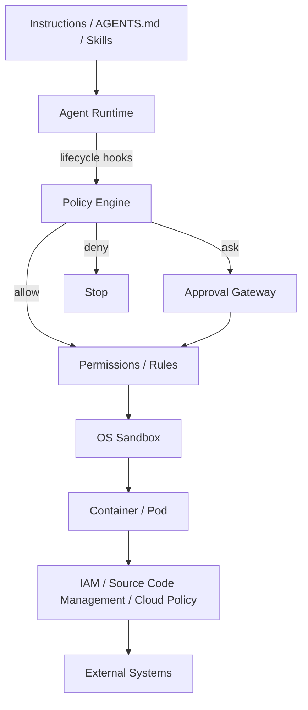
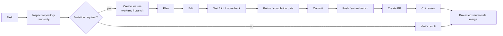

[English](README.md) | [日本語](README.ja.md)

# Agent Harness

Vendor-neutral reference architecture and implementation for secure, autonomous software-engineering agents.

This repository turns the operational lessons from Claude Code, OpenAI Codex, and Devin CLI into a reusable agent harness. The core premise is that an LLM is not a security boundary: autonomous execution must be constrained by independent policy, OS isolation, workload isolation, external authorization, and machine-verifiable completion gates.

## Architecture

The layers have deliberately different responsibilities:

| Layer | Responsibility |
|---|---|
| Instructions / Skills | Desired behavior, workflow and architecture guidance |
| Hooks / Policy Engine | Semantic and lifecycle policy |
| Permissions / Rules | Static command, tool and path classification |
| Sandbox | Filesystem and network capability boundary |
| Container / Pod | Process, host and resource isolation |
| IAM / source code management policy | External authority and blast-radius containment |
| Completion Gate | Machine-verifiable definition of done |
| Telemetry | Audit, incident analysis and policy tuning |

## Standard autonomous flow

The agent should normally be able to perform routine work without human interaction. Human approval is reserved for operations whose risk cannot be bounded safely by static policy or sandboxing.

## Repository layout

- [Agent Harness Tool Specification (Japanese draft)](docs/spec/agent-harness-spec.ja.md) — contracts and open questions independent of implementation language and assurance slices
- [Agent Harness Glossary (Japanese)](docs/spec/agent-harness-glossary.ja.md) — shared terminology for the specification, implementations, and assurance work
- [Go implementation notes (Japanese)](docs/implementation/go/implementation-notes.ja.md) — experimental Trusted Runtime / Policy Enforcement realization and evidence
- [Go Repository Authority / Posture notes (Japanese)](docs/implementation/go/repository-authority-posture.ja.md) — repository authority realization, S2 evidence, Python comparison, and open questions
- [Go Publication Guard notes (Japanese)](docs/implementation/go/publication-guard.ja.md) — publication semantics, S3 evidence, Python comparison, and open questions
- [Architecture](docs/01-architecture.md) ([日本語](docs/ja/01-architecture.md)) — logical and deployment architecture
- [Design Principles](docs/02-design-principles.md) ([日本語](docs/ja/02-design-principles.md)) — design principles and responsibility boundaries
- [Security Model](docs/03-security-model.md) ([日本語](docs/ja/03-security-model.md)) — threat model and defense-in-depth controls
- [Adoption Guide](docs/04-adoption-guide.md) ([日本語](docs/ja/04-adoption-guide.md)) — staged adoption guide
- [Product Mapping](docs/05-product-mapping.md) ([日本語](docs/ja/05-product-mapping.md)) — Claude Code / Codex / Devin CLI mapping
- [`AGENTS.md`](AGENTS.md) — development instructions for coding agents
- [`policy_engine.py`](reference/hooks/policy_engine.py) — vendor-neutral policy engine
- [`pre_tool_use_adapter.py`](reference/hooks/pre_tool_use_adapter.py) — hook adapter example
- [`policy.example.json`](reference/policies/policy.example.json) — example policy
- [`completion_gate.sh`](reference/scripts/completion_gate.sh) — deterministic completion check
- [`agent-pod.yaml`](reference/kubernetes/agent-pod.yaml) — hardened Pod example
- [`network-policy.yaml`](reference/kubernetes/network-policy.yaml) — default-deny network example

## Non-goals

This project does not attempt to make prompts, [AGENTS.md](AGENTS.md), CLAUDE.md, Skills, or model reasoning into a security mechanism. Those are useful behavioral controls but are not trusted enforcement boundaries.

## Guiding rule

> Make safe actions easy and autonomous; make dangerous actions technically impossible or explicitly approved.
