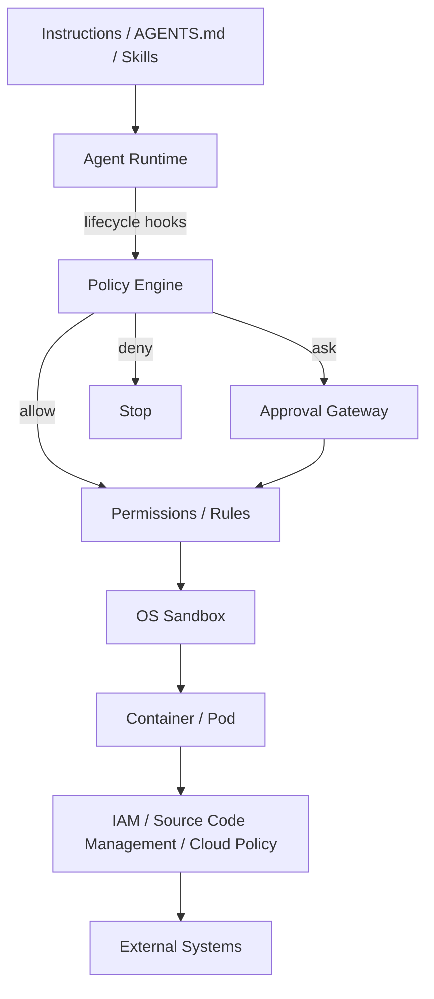
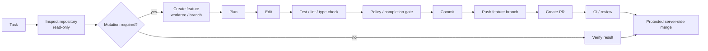

[English](README.md) | [日本語](README.ja.md)

# Agent Harness

Vendor-neutral architecture and **Go production implementation** for secure, autonomous software-engineering agents.

This repository turns operational lessons from Claude Code, OpenAI Codex, and Devin CLI into a reusable agent harness. The core premise is that an LLM is not a security boundary: autonomous execution must be constrained by independent policy, OS isolation, workload isolation, external authorization, and machine-verifiable completion gates.

The production implementation is Go only. The former Python implementation is retired and is not maintained as a reference, compatibility target, or differential-regression target. Useful findings discovered during the Python work are retained only after being generalized into guarantee contracts, Go tests, evidence, or decision history.

## Architecture

The layers have deliberately different responsibilities:

| Layer | Responsibility |
|---|---|
| Instructions / Skills | Desired behavior, workflow and architecture guidance |
| Hooks / Policy Engine | Semantic and lifecycle policy |
| Permissions / Rules | Static command, tool and path classification |
| Sandbox | Filesystem and network capability boundary |
| Container / Pod | Process, host and resource isolation |
| IAM / source code management policy | External authority and blast-radius containment |
| Completion Gate | Machine-verifiable definition of done |
| Telemetry | Audit, incident analysis and policy tuning |

## Standard autonomous flow

The agent should normally be able to perform routine work without human interaction. Human approval is reserved for operations whose risk cannot be bounded safely by static policy or sandboxing.

## Binary releases

Draft GitHub releases contain `agent-harness` archives for Linux and macOS on
amd64 and arm64, plus a SHA-256 manifest named `checksums.txt`. Verify the
downloaded archive against its matching manifest entry before installation,
then run `agent-harness version` to inspect the embedded release version,
source commit, build date, Go version and target platform.

The release workflow follows the repository's protected-branch model:

1. Conventional commits merged to `main` are collected into an automated Release Please PR.
2. The release workflow explicitly dispatches the normal CI workflow for the generated PR head, because GitHub does not recursively trigger workflows for PRs created with `GITHUB_TOKEN`.
3. Merging the fully checked release PR creates a version tag and a draft GitHub release.
4. GoReleaser runs the complete Go assurance suite, builds all supported targets and attaches the archives and checksum manifest.
5. A maintainer reviews the draft and publishes it explicitly.

Pull requests also build a GoReleaser snapshot and upload it as a CI artifact,
so the packaging configuration, embedded build identity and checksum manifest
are verified before a release commit reaches `main`. Maintainers can run
`make release-check` or `make release-snapshot` locally with GoReleaser v2.

## Repository layout

- [Agent Harness Tool Specification (Japanese draft)](docs/spec/agent-harness-spec.ja.md) — contracts and open questions independent of implementation language and assurance slices
- [Agent Harness Glossary (Japanese)](docs/spec/agent-harness-glossary.ja.md) — shared terminology for specification, implementation, and assurance work
- [Go-only production implementation policy (Japanese)](docs/implementation/go/production-implementation-policy.ja.md) — policy making Go the sole production implementation
- [Go implementation notes (Japanese)](docs/implementation/go/implementation-notes.ja.md) — Trusted Runtime / Policy Enforcement realization and evidence
- [Go Repository Authority / Posture notes (Japanese)](docs/implementation/go/repository-authority-posture.ja.md) — repository authority realization, S2 evidence, known findings, and open questions
- [Go Publication Guard notes (Japanese)](docs/implementation/go/publication-guard.ja.md) — publication semantics, S3 evidence, known findings, and open questions
- [Go vendor integration / deployment notes (Japanese)](docs/implementation/go/vendor-integration-deployment.ja.md) — vendor mappings, build identity, and binary release trust boundaries
- [Architecture](docs/01-architecture.md) ([日本語](docs/ja/01-architecture.md)) — logical and deployment architecture
- [Design Principles](docs/02-design-principles.md) ([日本語](docs/ja/02-design-principles.md)) — design principles and responsibility boundaries
- [Security Model](docs/03-security-model.md) ([日本語](docs/ja/03-security-model.md)) — threat model and defense-in-depth controls
- [Adoption Guide](docs/04-adoption-guide.md) ([日本語](docs/ja/04-adoption-guide.md)) — staged adoption guide
- [Product Mapping](docs/05-product-mapping.md) ([日本語](docs/ja/05-product-mapping.md)) — Claude Code / Codex / Devin CLI mapping
- [`AGENTS.md`](AGENTS.md) — development instructions for coding agents
- [`internal/`](internal/) — Go production implementation
- [`policy.example.json`](reference/policies/policy.example.json) — example policy
- [`completion_gate.sh`](reference/scripts/completion_gate.sh) — example external completion mechanism
- [`agent-pod.yaml`](reference/kubernetes/agent-pod.yaml) — hardened Pod example
- [`network-policy.yaml`](reference/kubernetes/network-policy.yaml) — default-deny network example

## Non-goals

This project does not attempt to make prompts, [AGENTS.md](AGENTS.md), CLAUDE.md, Skills, or model reasoning into a security mechanism. Those are useful behavioral controls but are not trusted enforcement boundaries.

## Guiding rule

> Make safe actions easy and autonomous; make dangerous actions technically impossible or explicitly approved.
