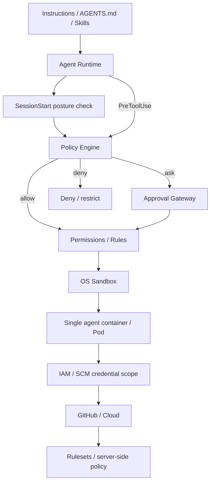
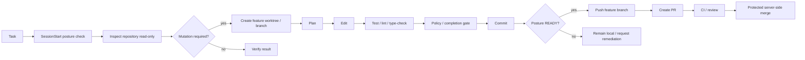

[English](README.md) | [日本語](README.ja.md)

# Agent Harness

Vendor-neutral reference architecture and implementation for secure autonomous software-engineering agents.

The core premise is that an LLM is not a security boundary. Autonomous execution must be constrained by independent lifecycle policy, repository posture checks, OS sandboxing, workload isolation, external IAM/SCM authority, server-side repository rules, and machine-verifiable completion gates.

## Architecture

The layers have deliberately different responsibilities:

| Layer | Responsibility |
|---|---|
| Instructions / Skills | Desired behavior, workflow and architecture guidance |
| SessionStart posture check | Detect repository/security configuration drift before work begins |
| Hooks / Policy Engine | Semantic and lifecycle policy |
| Permissions / Rules | Static command, tool and path classification |
| Sandbox | Reduce filesystem/process/network capability and credential exposure |
| Container / Pod | Host and resource isolation; default baseline is one Pod / one container |
| IAM / SCM policy | Contain credential compromise with least privilege and short-lived scope |
| GitHub rulesets | Authoritative branch/PR/CI enforcement |
| Completion Gate | Machine-verifiable definition of done |
| Telemetry | Audit, incident analysis and policy tuning |

## Repository posture states

At `SessionStart`, the harness checks repository identity and GitHub-side controls such as required PRs, force-push prevention, and required status checks. Each check is `pass`, `fail`, or `unknown`; the session becomes:

- `READY` — normal policy applies;
- `RESTRICTED` — local development is allowed, but remote SCM mutation is denied;
- `BLOCKED` — mutating actions are denied.

If `.agent-harness/security.json` is missing, built-in `restricted` defaults are used. Invalid explicit configuration is `BLOCKED`. Stale posture is rechecked before remote trust-boundary operations such as `git push` or `gh pr create`.

## Standard autonomous flow

## Repository layout

- [Architecture](docs/01-architecture.md) ([日本語](docs/ja/01-architecture.md))
- [Design Principles](docs/02-design-principles.md) ([日本語](docs/ja/02-design-principles.md))
- [Security Model](docs/03-security-model.md) ([日本語](docs/ja/03-security-model.md))
- [Adoption Guide](docs/04-adoption-guide.md) ([日本語](docs/ja/04-adoption-guide.md))
- [Product Mapping](docs/05-product-mapping.md) ([日本語](docs/ja/05-product-mapping.md))
- [Vendor Harnesses](docs/06-vendor-harnesses.md) ([日本語](docs/ja/06-vendor-harnesses.md))
- [Implementation Decision Log](docs/decision-log.md) ([日本語](docs/ja/decision-log.md))
- [DL-011: Sandbox-first credential exposure reduction](docs/decisions/DL-011-sandbox-first-credential-isolation.md)
- [DL-012: SessionStart repository posture](docs/decisions/DL-012-sessionstart-repository-posture.md)
- [`reference/harness/`](reference/harness/) — vendor adapters
- [`reference/posture/`](reference/posture/) — repository posture checker and cache
- [`policy.example.json`](reference/policies/policy.example.json) — semantic policy
- [`repository-security.example.json`](reference/policies/repository-security.example.json) — repository posture profile
- [`preflight.py`](reference/launcher/preflight.py) — optional launcher/CI preflight
- [`agent-pod.yaml`](reference/kubernetes/agent-pod.yaml) — single-container hardened Pod baseline

## Credential responsibility split

The baseline intentionally does not add an SCM broker or sidecar merely to hide credentials. Sandbox and local policy reduce exposure; short-lived repository-scoped credentials and least-privilege GitHub App/IAM permissions contain compromise; GitHub rulesets preserve protected-branch invariants even if a credential is exposed.

## Guiding rule

> Make safe actions easy and autonomous; detect unsafe environments early; make critical authority boundaries independent of the model and its credentials.
