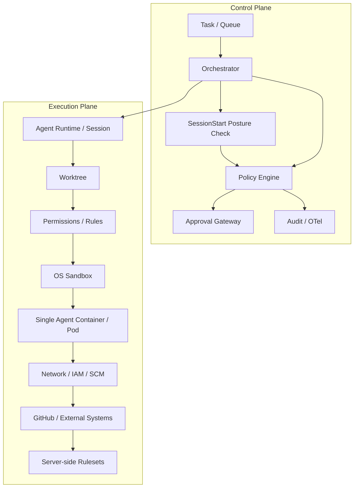
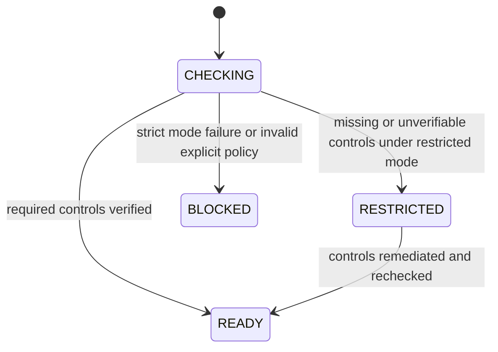
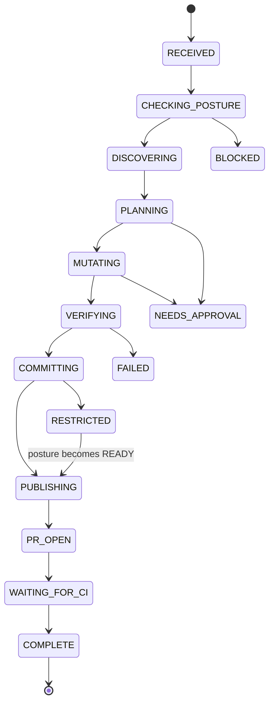
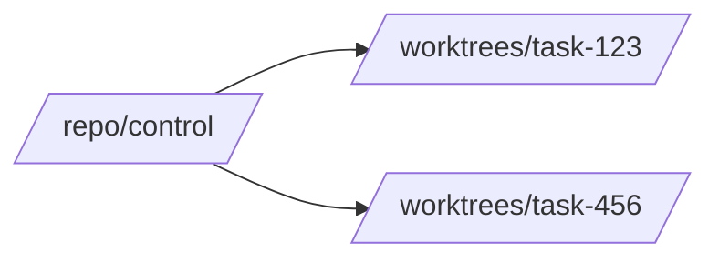

[← README](../README.md) | [日本語](ja/01-architecture.md) | [Next: Design Principles →](02-design-principles.md)

# Reference Architecture

## 1. Objective

An autonomous coding agent should be able to inspect a repository, create an isolated worktree, modify code, validate the result, commit, push a feature branch and create a pull request with minimal human interaction. Autonomy must not imply unrestricted authority, and the deployment should remain as simple as the threat model allows.

## 2. Control plane and execution plane

The control plane decides what should be allowed. The execution plane supplies the technical capability boundary. Repository posture detects whether external safety assumptions are currently true. A failure in one layer must not silently grant authority belonging to another layer.

## 3. Repository posture before mutation

At `SessionStart`, discover the repository and evaluate GitHub-side controls. Normalize individual checks as `pass`, `fail`, or `unknown`, then derive `READY`, `RESTRICTED`, or `BLOCKED`.

`RESTRICTED` deliberately preserves local work: repository inspection, source edits, tests and local commits may continue, while remote mutation such as `git push` or `gh pr create` is denied. `BLOCKED` denies mutation. Posture is cached per session with a TTL and refreshed when the active repository changes or a stale remote trust-boundary operation is attempted.

A missing `.agent-harness/security.json` uses built-in `restricted` defaults. An invalid explicit policy fails closed to `BLOCKED`.

## 4. State machine

Persist authoritative task state outside model context. Context compaction, process restart, model switching or subagent execution must not erase the security or workflow state.

## 5. Worktree model

Use one worktree per mutable task and keep the original checkout as a stable control checkout.

Before commit or remote publication, verify the active repository, worktree and branch. Never allow direct push to the protected default branch. The posture cache must refresh if a session moves into a different repository; moving between worktrees of the same repository remains supported.

## 6. Credential and authority model

The baseline is one Pod / one agent container. Do not introduce an SCM broker, sidecar, or command shim solely to hide credentials unless a concrete deployment threat model justifies the added trusted components.

Sandboxing and local policy reduce credential exposure. Credential compromise is nevertheless a possible failure mode and must be contained by short-lived repository-scoped credentials, least-privilege GitHub App/IAM permissions, and server-side repository rules. See [DL-011](decisions/DL-011-sandbox-first-credential-isolation.md).

## 7. Approval gateway

`allow` is a bounded routine operation, `deny` violates invariant policy, and `ask` requires external authorization. Approvals should be narrowly scoped to a semantic action rather than changing the whole session into an unrestricted mode.

## 8. Completion pipeline

The model saying "done" is not evidence of completion. A deterministic gate should verify expected worktree/branch, required tests, lint/type checks, commit/PR/CI state and other task-specific invariants. Stop hooks may use this gate, but retry/time/tool/cost circuit breakers belong in the orchestrator.

## 9. Deployment baseline

For Kubernetes, prefer the smallest secure baseline:

- one Pod / one agent container unless stronger isolation is explicitly required;
- non-root, no privileged mode, no hostPath or runtime socket;
- drop capabilities and use seccomp RuntimeDefault;
- read-only root filesystem where practical;
- ephemeral task workspace and explicit resource limits;
- network controls appropriate to the environment;
- short-lived least-privilege cloud and SCM credentials;
- GitHub rulesets / branch protection as authoritative SCM enforcement.

See [`agent-pod.yaml`](../reference/kubernetes/agent-pod.yaml) and [`network-policy.yaml`](../reference/kubernetes/network-policy.yaml).

---

[← README](../README.md) | [日本語](ja/01-architecture.md) | [Next: Design Principles →](02-design-principles.md)
