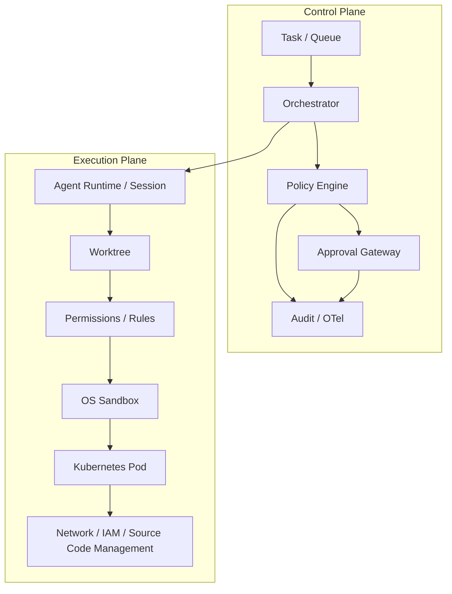
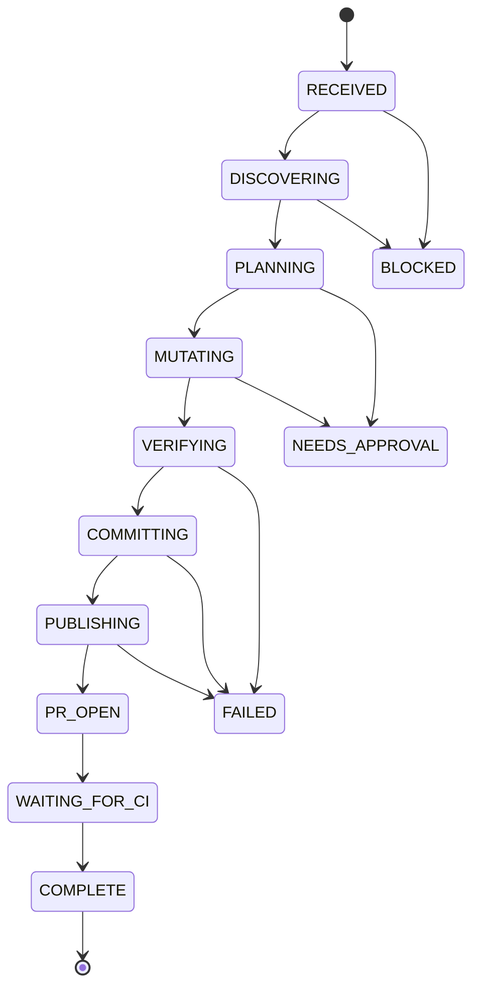
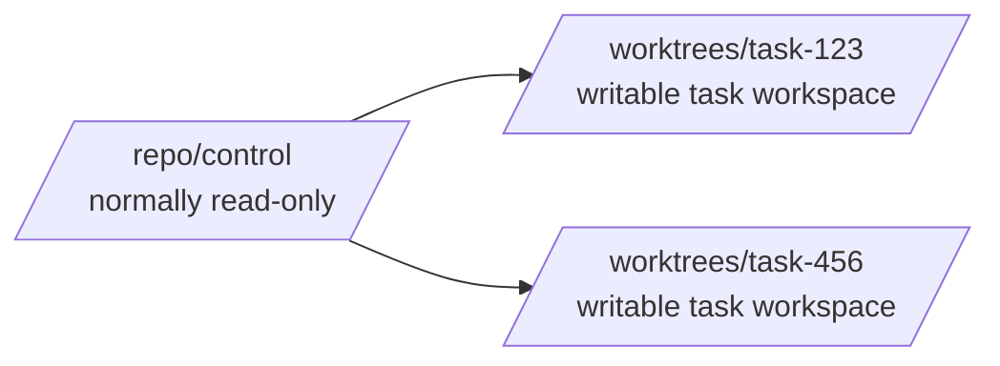

[← README](../README.md) | [日本語](ja/01-architecture.md) | [Next: Design Principles →](02-design-principles.md)

# Reference Architecture

## 1. Objective

An autonomous coding agent should be able to inspect a repository, create an isolated worktree, modify code, validate the result, commit, push a feature branch and create a pull request with minimal human interaction. Autonomy must not imply unrestricted authority.

## 2. Control plane and execution plane

Separate policy decisions from execution.

The control plane decides what should be allowed. The execution plane supplies the technical capability boundary. A failure in one layer must not silently grant authority belonging to another layer.

## 3. State machine

Treat autonomous work as an explicit state machine rather than an unconstrained chat loop.

Persist state outside the model context. Context compaction, process restart, model switching or subagent execution must not destroy authoritative task state.

## 4. Worktree model

Use one worktree per mutable task. Keep the original checkout as a stable control checkout.

Recommended rules:

- discovery may run against the control checkout;
- before the first mutation, create `feature/<task-id>-<slug>`;
- all writes happen in the task worktree;
- verify current repository, worktree and branch before commit/push;
- never allow direct push to the protected default branch;
- clean up worktrees only after durable task state and artifacts are recorded.

## 5. Approval gateway

Approval is an escalation path, not the default operating mode.

A policy decision has three outcomes:

- `allow`: bounded routine operation;
- `deny`: operation violates invariant policy;
- `ask`: operation may be legitimate but requires external authorization.

An approval request should contain normalized structured data: task/session ID, actor, tool, command/action, target, repository, branch, reason, risk classification, proposed scope and expiry.

Approvals should be narrowly scoped and short-lived. Prefer approving a single semantic action over switching the whole session into an unrestricted mode.

## 6. Completion pipeline

The model saying "done" is not evidence of completion. A deterministic gate should check the relevant invariants, for example:

1. expected worktree and branch;
2. no prohibited/untracked artifacts;
3. required tests pass;
4. lint/type checks pass;
5. expected commit exists;
6. remote feature branch exists;
7. PR exists and targets the expected base;
8. required CI/checks are successful;
9. required metadata or evidence is attached.

A Stop hook may use this gate to reject premature completion, but the orchestrator must enforce a retry/circuit-breaker limit to prevent infinite loops.

## 7. Subagents

Subagents are useful for context isolation and parallel analysis, not as a privilege boundary. Give subagents explicit scopes and preferably reduced capabilities. The parent orchestrator remains responsible for aggregating results and enforcing global policy.

## 8. Deployment baseline

For a Kubernetes deployment:

- non-root container;
- no privileged mode;
- no hostPath;
- no Docker/container-runtime socket;
- drop Linux capabilities;
- seccomp RuntimeDefault;
- read-only root filesystem where practical;
- ephemeral task workspace;
- resource requests/limits;
- default-deny network policy plus explicit egress path;
- workload identity instead of static cloud keys;
- short-lived repository-scoped source code management credentials.

See the reference manifests: [`agent-pod.yaml`](../reference/kubernetes/agent-pod.yaml) and [`network-policy.yaml`](../reference/kubernetes/network-policy.yaml).

The agent's built-in sandbox remains useful inside the Pod. The Pod is the host/process isolation boundary; the agent sandbox is the per-command filesystem/network capability boundary.

---

[← README](../README.md) | [日本語](ja/01-architecture.md) | [Next: Design Principles →](02-design-principles.md)
