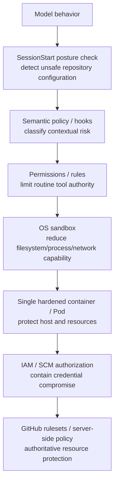

[← Design Principles](02-design-principles.md) | [日本語](ja/03-security-model.md) | [Next: Adoption Guide →](04-adoption-guide.md)

# Security Model

## Threat model

Assume the agent can encounter malicious instructions in source/issues/web/tool output, hallucinated or destructive commands, compromised dependencies, accidental credential disclosure, over-privileged MCP tools, incorrect repository/worktree selection, runaway retries, compromised local policy code, and attempts to reach cloud metadata or internal control-plane endpoints.

Also assume **credential compromise is possible**. The architecture must limit the damage even when a GitHub credential becomes visible to the agent.

## Defense in depth and responsibility separation

No single layer is expected to catch every failure. In particular, Sandbox does **not** own the responsibility of making repository safety depend on perfect credential secrecy.

## Trusted computing base

Keep the TCB small. The baseline includes the orchestrator, policy engine, posture checker, sandbox implementation, workload isolation, credential issuance/authorization system, and external server-side policy. Agent-generated code and model reasoning are untrusted. A broker/sidecar is intentionally excluded from the default TCB because adding one creates additional privileged code and operational state.

## Repository posture

At SessionStart, verify assumptions that the local policy depends on: repository identity, default branch, required pull requests, force-push prevention, and required status checks where those controls can be read from GitHub.

Checks are three-valued:

- `pass`: the control is verified;
- `fail`: the control is verified absent or non-compliant;
- `unknown`: the control cannot currently be verified, for example because the API/plan/integration does not expose it.

`unknown` must not be silently converted to `pass` or `fail`. The configured posture mode decides how to respond. See [DL-012](decisions/DL-012-sessionstart-repository-posture.md).

## Credentials

Prefer short-lived repository-scoped credentials and least privilege. Reduce exposure with sandbox deny paths, environment hygiene and semantic policy such as denying `gh auth token` or direct credential-file reads.

However, the security invariant is not "the agent can never observe a credential." The stronger invariant is:

> Credential compromise must not imply unrestricted repository or organization authority.

Contain compromise with narrow GitHub App/IAM permissions, short lifetime, server-side branch/ruleset enforcement, audit and revocation. Production credentials unrelated to coding work should normally be absent from agent Pods.

## Sandbox

The sandbox should bound ordinary filesystem, process and network capability and reduce secret exposure. It is a defense layer, not the sole authority boundary. Use vendor-native credential masking when it is reliable and convenient, but do not add privileged broker infrastructure solely to recreate masking on vendors that do not provide it.

## Network

Network controls should match the deployment threat model. Default-deny egress is valuable in environments with internal services or cloud metadata exposure, but native `git` / `gh` access to GitHub may be intentionally allowed. Where network access is broad, compensate with least-privilege credentials and strong server-side SCM policy.

## Git and SCM

Routine feature-branch work can be autonomous. Deny or require approval for force push, protected-branch mutation, tag/release creation, workflow modification and merge according to policy.

Before remote mutation, require repository posture to be `READY`. `RESTRICTED` allows local development but blocks operations such as `git push` and `gh pr create`. `BLOCKED` denies mutation.

SCM server-side rules remain authoritative. An agent credential should not be able to bypass protected-branch invariants.

## Hook failure semantics

Hooks provide semantic policy but their failure behavior varies by vendor/version. A timeout/crash/malformed hook output must not be able to defeat IAM scope or server-side GitHub protections. Repository posture is advisory/fail-fast at SessionStart and enforced again at PreToolUse; it is not a replacement for GitHub-side controls.

## Audit

Capture task/session/turn IDs, runtime/version, policy version, repository posture and check results, tool/action, allow/deny/ask decision, approvals, execution outcome, commit/PR/CI identifiers, and sandbox/network denials. Do not log raw secrets.

---

[← Design Principles](02-design-principles.md) | [日本語](ja/03-security-model.md) | [Next: Adoption Guide →](04-adoption-guide.md)
