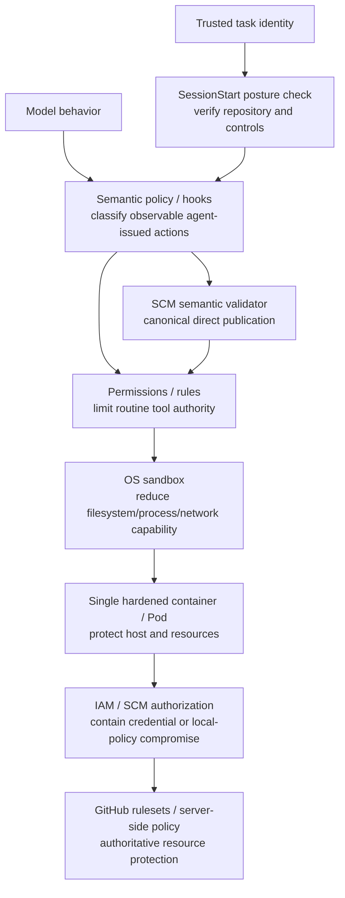

[← Design Principles](02-design-principles.md) | [日本語](ja/03-security-model.md) | [Next: Adoption Guide →](04-adoption-guide.md)

# Security Model

## Threat model

Assume the agent can encounter malicious instructions in source/issues/web/tool output, hallucinated or destructive commands, compromised dependencies, accidental credential disclosure, over-privileged MCP tools, incorrect repository/worktree selection, shell-command ambiguity, runaway retries, compromised local policy code, and attempts to reach cloud metadata or internal control-plane endpoints.

Also assume **credential compromise is possible**. The architecture must limit the damage even when a GitHub credential becomes visible to the agent.

Also assume an allowed command may execute arbitrary repository-controlled code internally. A hook that observes `pytest`, `npm test`, or another outer invocation may not observe every subprocess, network request, or secondary SCM action performed by that code.

## Defense in depth and responsibility separation



No single layer is expected to catch every failure. Sandbox does **not** own the responsibility of making repository safety depend on perfect credential secrecy, and hooks do not own authoritative repository identity, server-side branch policy, or complete mediation of arbitrary nested execution.

## Trusted computing base

Keep the TCB small. The baseline includes the orchestrator/trusted launcher, trusted-root policy engine, posture checker, SCM semantic validator, sandbox implementation, workload isolation, credential issuance/authorization system, and external server-side policy. Agent-generated code and model reasoning are untrusted. A broker/sidecar is intentionally excluded from the default TCB because adding one creates additional privileged code and operational state.

Production policy, posture, SCM validation, and completion implementation execute from `AGENT_HARNESS_TRUSTED_ROOT`, outside the agent-mutable workspace. Repository copies remain reference/development artifacts. See [DL-015](decisions/DL-015-trusted-harness-boundary.md).

## Trusted task identity

The repository is part of task identity. The trusted launcher supplies `AGENT_HARNESS_EXPECTED_REPOSITORY`; repository-local configuration cannot authoritatively replace it. Missing trusted identity is `UNKNOWN` and therefore prevents remote publication under the default `restricted` minimum. Mismatch is `BLOCKED`.

The trusted launcher also owns `AGENT_HARNESS_MINIMUM_POSTURE_MODE`, defaulting to `restricted`. Repository-local `mode: warn` cannot weaken that minimum. This prevents a repository from weakening the policy that determines whether it may publish to itself.

## Repository posture

At SessionStart, verify assumptions that publication policy depends on: trusted repository identity, default branch, required pull requests, force-push prevention, and required status checks where those controls can be read from GitHub.

Checks are three-valued:

- `pass`: the control is verified;
- `fail`: the control is verified absent or non-compliant;
- `unknown`: the control cannot currently be verified.

`unknown` must not silently become `pass`. The effective posture mode decides whether it blocks, restricts or warns. Explicit trusted repository mismatch remains `BLOCKED` regardless of mode. See [DL-012](decisions/DL-012-sessionstart-repository-posture.md).

## Credentials

Prefer short-lived repository-scoped credentials and least privilege. Reduce exposure with sandbox deny paths, environment hygiene and semantic policy such as denying `gh auth token` or direct credential-file reads.

However, the security invariant is not "the agent can never observe a credential." The stronger invariant is:

> Credential compromise must not imply unrestricted repository or organization authority.

Contain compromise with narrow GitHub App/IAM permissions, short lifetime, server-side branch/ruleset enforcement, audit and revocation. Production credentials unrelated to coding work should normally be absent from agent Pods.

## Sandbox

The sandbox should bound ordinary filesystem, process and network capability and reduce secret exposure. It is a defense layer, not the sole authority boundary. Use vendor-native credential masking when it is reliable and convenient, but do not add privileged broker infrastructure solely to recreate masking on vendors that do not provide it.

## Network

Network controls should match the deployment threat model. Default-deny egress is valuable in environments with internal services or cloud metadata exposure, but native `git` / `gh` access to GitHub may be intentionally allowed. Where network access is broad, compensate with least-privilege credentials and strong server-side SCM policy.

## Git, shell and SCM publication

Routine local feature-branch work can be autonomous, but **direct agent-issued remote publication visible at the hook boundary** is deliberately narrower than arbitrary shell access.

Only these direct Git push shapes are autonomous:

```bash
git push
git push --set-upstream origin HEAD
```

The SCM semantic validator requires `READY` posture, checks that the current branch is not the GitHub-reported default branch, confirms `origin` still points at the checked repository, and verifies the expected upstream for plain `git push`. Arbitrary direct remotes, refspecs, tags, delete/force forms and configuration overrides are outside the autonomous path.

Direct `gh pr create` cannot override repository, head branch or base branch in the autonomous path. Compound shell syntax such as `&&`, `||`, `;`, pipes, redirection, newlines and command substitution is also not autonomously allowlisted, because prefix regexes can otherwise misclassify a later mutation as read-only. See [DL-013](decisions/DL-013-canonical-scm-publication.md).

This semantic contract does **not** establish that an allowed executable cannot perform a secondary SCM or network operation internally. The hook is evidence for the direct-action claim only. Critical repository authority must remain bounded by IAM/SCM scope and authoritative GitHub-side rules even when nested repository-controlled code bypasses local semantic visibility. See [DL-016](decisions/DL-016-semantic-policy-is-not-complete-mediation.md).

`RESTRICTED` permits local development but blocks direct remote publication through the harness. `BLOCKED` denies mutations observable at the hook boundary. GitHub server-side rules remain authoritative even if the local validator, nested code, or credential is compromised.

## Hook failure semantics

Hooks provide semantic policy but their failure behavior varies by vendor/version. A timeout/crash/malformed hook output must not be able to defeat IAM scope or server-side GitHub protections. Repository posture is fail-fast/context at SessionStart and enforced again at PreToolUse; it is not a replacement for GitHub-side controls. Likewise, hooks are not assumed to observe every nested process spawned by an allowed command.

## Audit

Capture task/session/turn IDs, trusted expected repository, runtime/version, policy version, repository posture and check results, tool/action, semantic validation result, allow/deny/ask decision, approvals, execution outcome, commit/PR/CI identifiers, and sandbox/network denials. Do not log raw secrets. Audit events describe what the harness observed; absence of a hook event is not evidence that no nested side effect occurred.

---

[← Design Principles](02-design-principles.md) | [日本語](ja/03-security-model.md) | [Next: Adoption Guide →](04-adoption-guide.md)
