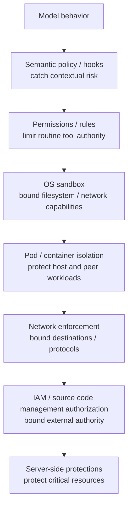
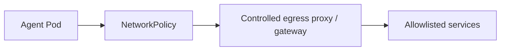

[← Design Principles](02-design-principles.md) | [日本語](ja/03-security-model.md) | [Next: Adoption Guide →](04-adoption-guide.md)

# Security Model

## Threat model

Assume the agent can encounter:

- malicious instructions in source code, issues, web pages, documentation or tool output;
- hallucinated or destructive commands;
- dependency-install scripts and compromised packages;
- accidental credential disclosure;
- malicious or over-privileged MCP tools;
- incorrect repository/worktree/branch selection;
- runaway retry loops;
- compromised hook/policy code;
- attempts to access cloud metadata or internal control-plane endpoints.

## Defense in depth

No single layer should be expected to catch every failure mode. The architecture behind these boundaries is described in [Reference Architecture](01-architecture.md).

## Trusted computing base

Keep the TCB small. At minimum it includes the orchestrator, policy engine, sandbox implementation, workload isolation, credential broker and external authorization systems. Agent-generated code and model reasoning are not trusted components.

## Credentials

Prefer workload identity and short-lived credentials. Do not mount broad personal credentials into the agent home directory. Where possible, credentials should be inaccessible to ordinary filesystem reads and injected only into the process or proxy that needs them.

Repository credentials should be scoped to required repositories and operations. Production credentials should normally be absent from coding-agent Pods.

## Network

Use network controls outside the agent runtime as the hard boundary. A recommended pattern is:

Block cloud metadata endpoints, cluster administration endpoints and unrelated internal networks. Agent-native domain filtering can be used as defense in depth, not as the only network boundary. See the reference [`network-policy.yaml`](../reference/kubernetes/network-policy.yaml).

## MCP and external tools

MCP extends the agent's authority and therefore belongs inside the threat model. Combine:

1. MCP tool permission/rule;
2. semantic PreToolUse policy;
3. MCP server authentication/authorization;
4. least-privilege service account/IAM;
5. audit logging.

A read-only service account is preferable for production data access. Avoid exposing generic administrative MCP tools to autonomous sessions.

## Git and Source Code Management

Allow routine operations such as status, diff, log, feature-branch commit/push and PR creation. Deny or require approval for force push, protected-branch mutation, tag/release creation, workflow modification and merge depending on organizational policy. The sample classifications are in [`policy.example.json`](../reference/policies/policy.example.json).

Source code management server-side rules are the final authority. An agent credential should not be able to bypass them.

## Hook failure semantics

Hooks are useful for semantic policy but their failure behavior varies by product and version. If a hook timeout, crash or malformed output can permit execution, treat the hook as fail-open. Protect invariants using sandbox, IAM and server-side controls that remain effective when the hook is absent.

## Audit

Capture at least:

- task/session/turn identifiers;
- model/runtime/version;
- policy version;
- tool/action and normalized target;
- allow/deny/ask decision and reason;
- approval actor/scope/expiry;
- execution outcome;
- commit/PR/CI identifiers;
- sandbox/network denials.

Do not log raw secrets. Prefer structured events suitable for OTel or a centralized analytics store.

---

[← Design Principles](02-design-principles.md) | [日本語](ja/03-security-model.md) | [Next: Adoption Guide →](04-adoption-guide.md)
