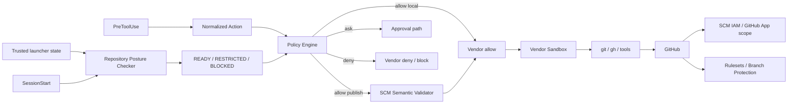

[← Product Mapping](05-product-mapping.md) | [日本語](ja/06-vendor-harnesses.md) | [README →](../README.md)

# Vendor Harness Implementations

The repository contains project-local harness configurations for Claude Code, OpenAI Codex, and Devin CLI. All three use the same deny-first Policy Engine, repository posture checker, SCM semantic validator, and deterministic completion gate.



## Files

- [`.claude/settings.json`](../.claude/settings.json) — Claude Code SessionStart, PreToolUse, Stop hooks and sandbox baseline.
- [`.codex/hooks.json`](../.codex/hooks.json) — Codex SessionStart, PreToolUse, Stop hooks.
- [`.devin/hooks.v1.json`](../.devin/hooks.v1.json) — Devin CLI SessionStart, PreToolUse, Stop hooks.
- [`.devin/config.json`](../.devin/config.json) — Devin CLI static permissions.
- [`reference/harness/`](../reference/harness/) — vendor adapters and SCM semantic validation.
- [`reference/posture/checker.py`](../reference/posture/checker.py) — GitHub repository security posture checker.
- [`reference/policies/repository-security.example.json`](../reference/policies/repository-security.example.json) — repository-local posture requirements.
- [`reference/policies/policy.example.json`](../reference/policies/policy.example.json) — semantic action policy.
- [`reference/launcher/preflight.py`](../reference/launcher/preflight.py) — optional explicit preflight for launchers/CI.
- [`reference/kubernetes/agent-pod.yaml`](../reference/kubernetes/agent-pod.yaml) — one-Pod / one-container deployment baseline.

## Keep the deployment simple

The default architecture is deliberately one Pod / one agent container. A separate SCM broker, sidecar, `git` shim, or `gh` shim is not part of the baseline. Credential exposure is reduced with sandboxing and policy, while credential compromise is contained independently by short-lived repository-scoped credentials, least-privilege GitHub App/IAM permissions, and GitHub-side rulesets. See [DL-011](decisions/DL-011-sandbox-first-credential-isolation.md).

## Trusted launcher state and SessionStart posture

Repository identity is trusted task state, not something a repository may self-assert. The launcher/orchestrator should set:

```bash
export AGENT_HARNESS_EXPECTED_REPOSITORY=owner/repository
export AGENT_HARNESS_MINIMUM_POSTURE_MODE=restricted
```

`AGENT_HARNESS_MINIMUM_POSTURE_MODE` defaults to `restricted`, so repository-local `mode: warn` cannot weaken unattended execution. A trusted interactive launcher may explicitly lower it to `warn`.

At `SessionStart`, the checker compares `origin` with the trusted expected repository, reads repository metadata, and asks GitHub for the effective active rules on the default branch. It normalizes requirements to `pass`, `fail`, or `unknown`, then derives:

- `READY` — trusted identity and required controls are verified, or a trusted `warn` mode explicitly accepts warnings;
- `RESTRICTED` — local development may continue but remote SCM mutation is denied;
- `BLOCKED` — mutating operations are denied.

Missing trusted repository identity is `UNKNOWN`; under the default minimum it remains `RESTRICTED`. A trusted repository mismatch is always `BLOCKED`. Missing `.agent-harness/security.json` uses built-in `restricted` defaults; invalid explicit policy is `BLOCKED`.

The result is cached per session. A stale cache or repository-root change triggers re-evaluation. See [DL-012](decisions/DL-012-sessionstart-repository-posture.md).

For a launcher or CI job that should fail before starting an agent:

```bash
AGENT_HARNESS_EXPECTED_REPOSITORY=owner/repository \
  python reference/launcher/preflight.py --require-ready
```

## Canonical autonomous publication

Do not try to interpret arbitrary shell or Git refspec syntax as safe. The autonomous push path consists only of:

```bash
git push
git push --set-upstream origin HEAD
```

PreToolUse then verifies `READY` posture, current branch, GitHub-reported default branch, `origin`, checked repository, and upstream. Arbitrary remote/refspec/tag/delete/force/config-override forms are not autonomous. Plain `git push` requires upstream `origin/<current-branch>`; first publication uses the fixed `--set-upstream origin HEAD` form.

`gh pr create` remains available, but autonomous execution may not override `--repo`/`-R`, `--head`/`-H`, or `--base`/`-B`. Compound shell syntax (`&&`, `||`, `;`, pipes, redirection, newlines, command substitution) is outside the autonomous allowlist even when the first command looks read-only. See [DL-013](decisions/DL-013-canonical-scm-publication.md).

## Vendor notes

### Claude Code

Use native SessionStart and PreToolUse hooks plus the sandbox. Deny known credential-file reads and unsandboxed fallback where supported. Native credential masking can be enabled as additional hardening from trusted settings, but it is not the final SCM authority boundary.

### Codex

Use project hooks plus the Codex sandbox/workspace controls. Current Codex PreToolUse `ask` remains mapped to deny until runtime enforcement provides the contract required by this harness. Repository posture and GitHub-side controls remain independent of that hook limitation.

### Devin CLI

Use lifecycle hooks, static permissions, and the Devin sandbox. Keep native `git` and `gh` rather than introducing a broker by default. SessionStart provides posture context/cache; PreToolUse remains the semantic enforcement point.

## Worktree-safe invocation

Hook commands locate the active repository with `git rev-parse --show-toplevel`. Moving between worktrees for the same repository is supported; moving to another repository causes posture re-evaluation.

## Approval and completion

Central-policy `ask` remains external-approval class. Compound shell and non-canonical remote publication therefore fall out of the autonomous path rather than being guessed safe by prefix regexes. Claude Code can use native PreToolUse `ask`; Codex and Devin mappings stay fail-closed where their hook approval semantics do not provide the same contract.

The `Stop` hook runs [`completion_gate.sh`](../reference/scripts/completion_gate.sh). External orchestration still needs retry/time/tool/cost circuit breakers.

## Validation

```bash
python -m pip install pytest
python -m pytest reference/hooks/tests reference/harness/tests reference/posture/tests -q
AGENT_HARNESS_EXPECTED_REPOSITORY=owner/repository \
  python reference/launcher/preflight.py --json
```

Regression coverage includes compound-shell bypass, arbitrary push/refspec rejection, trusted repository mismatch, repository-local `warn` not weakening the default minimum, default-branch push rejection, and PR repository/head/base overrides.

---

[← Product Mapping](05-product-mapping.md) | [日本語](ja/06-vendor-harnesses.md) | [README →](../README.md)
