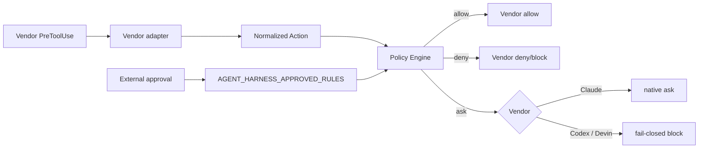

[← Product Mapping](05-product-mapping.md) | [日本語](ja/06-vendor-harnesses.md) | [README →](../README.md)

# Vendor Harness Implementations

The repository contains runnable project-local harness configurations for Claude Code, OpenAI Codex, and Devin CLI. All three feed tool calls into the same deny-first Policy Engine and translate the result into the vendor's hook response schema.



## Files

- [`.claude/settings.json`](../.claude/settings.json) — Claude Code PreToolUse and Stop hooks.
- [`.codex/hooks.json`](../.codex/hooks.json) — Codex PreToolUse and Stop hooks.
- [`.devin/hooks.v1.json`](../.devin/hooks.v1.json) — Devin CLI project hook file.
- [`.devin/config.json`](../.devin/config.json) — Devin CLI static permissions.
- [`reference/harness/claude.py`](../reference/harness/claude.py), [`codex.py`](../reference/harness/codex.py), [`devin.py`](../reference/harness/devin.py) — vendor adapters.
- [`reference/hooks/policy_engine.py`](../reference/hooks/policy_engine.py) — shared policy evaluator.
- [`reference/policies/policy.example.json`](../reference/policies/policy.example.json) — shared policy.

## Worktree-safe invocation

Each committed hook locates the active repository through `git rev-parse --show-toplevel`. This avoids hard-coding a checkout path and works when an agent moves from the control checkout to a task worktree.

## Approval handoff

Rules classified as `ask` are not automatically made safe merely because a vendor can display a prompt. An external orchestrator may promote a specific rule to allow by injecting `AGENT_HARNESS_APPROVED_RULES`, for example:

```bash
AGENT_HARNESS_APPROVED_RULES=scm-merge-release codex
```

The variable must be supplied by the trusted launcher/orchestrator, not written into repository configuration. A comma-separated list is supported. `*` exists for controlled testing but should not be used for unattended production sessions.

Claude Code supports a native PreToolUse `ask` result, so unapproved `ask` remains interactive. Current Codex parses `ask` but does not enforce it as a supported PreToolUse outcome; the adapter therefore maps unapproved `ask` to `deny`. Devin uses its portable top-level blocking shape for central-policy `ask`; its static permission system can still provide interactive prompts independently.

## Completion gate

The `Stop` hook runs [`completion_gate.sh`](../reference/scripts/completion_gate.sh). A failed gate blocks completion and sends the failure reason back to the agent. Keep retry/cost/time circuit breakers in the external orchestrator because a Stop hook can otherwise create an unbounded self-repair loop.

## Configuration trust

Project hooks are executable policy code. Treat `.claude/`, `.codex/`, `.devin/`, `AGENTS.md`, workflow files, and the harness itself as security-sensitive. The sample central policy classifies edits to these files as `ask`. Server-side repository rules and code review should remain authoritative.

## Validation

Run:

```bash
python -m pip install pytest
python -m pytest reference/hooks/tests reference/harness/tests -q
```

The GitHub Actions workflow [`harness-tests.yml`](../.github/workflows/harness-tests.yml) runs the adapter/policy tests and validates committed JSON files.

## Production notes

This is a reference harness, not a replacement for OS sandboxing, Kubernetes isolation, egress control, workload identity, GitHub rulesets, or cloud IAM. In production, use short-lived repository-scoped credentials and make protected-branch and production mutations impossible server-side even if hooks fail.

---

[← Product Mapping](05-product-mapping.md) | [日本語](ja/06-vendor-harnesses.md) | [README →](../README.md)
