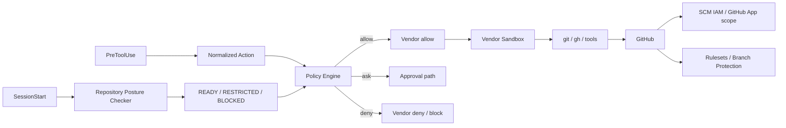

[← Product Mapping](05-product-mapping.md) | [日本語](ja/06-vendor-harnesses.md) | [README →](../README.md)

# Vendor Harness Implementations

The repository contains project-local harness configurations for Claude Code, OpenAI Codex, and Devin CLI. All three use the same deny-first Policy Engine, repository posture checker, and deterministic completion gate.



## Files

- [`.claude/settings.json`](../.claude/settings.json) — Claude Code SessionStart, PreToolUse, Stop hooks and sandbox baseline.
- [`.codex/hooks.json`](../.codex/hooks.json) — Codex SessionStart, PreToolUse, Stop hooks.
- [`.devin/hooks.v1.json`](../.devin/hooks.v1.json) — Devin CLI SessionStart, PreToolUse, Stop hooks.
- [`.devin/config.json`](../.devin/config.json) — Devin CLI static permissions.
- [`reference/harness/`](../reference/harness/) — vendor adapters.
- [`reference/posture/checker.py`](../reference/posture/checker.py) — GitHub repository security posture checker.
- [`reference/policies/repository-security.example.json`](../reference/policies/repository-security.example.json) — posture policy example.
- [`reference/policies/policy.example.json`](../reference/policies/policy.example.json) — semantic action policy.
- [`reference/launcher/preflight.py`](../reference/launcher/preflight.py) — optional explicit preflight for launchers/CI.
- [`reference/kubernetes/agent-pod.yaml`](../reference/kubernetes/agent-pod.yaml) — one-Pod / one-container deployment baseline.

## Keep the deployment simple

The default architecture is deliberately one Pod / one agent container. A separate SCM broker, sidecar, `git` shim, or `gh` shim is not part of the baseline. Those components add sockets, processes, deployment state, and privileged trust boundaries of their own.

Credential exposure is reduced with sandboxing and policy, but credential compromise is treated as a possible failure mode. Its blast radius must be contained independently by short-lived repository-scoped credentials, least-privilege GitHub App/IAM permissions, and GitHub-side rulesets. See [DL-011](decisions/DL-011-sandbox-first-credential-isolation.md).

## Repository posture at SessionStart

Each vendor runs the common checker at `SessionStart`. The checker discovers the current repository, reads repository metadata, and asks GitHub for the effective active rules that apply to the default branch. It normalizes each requirement to `pass`, `fail`, or `unknown`, then derives a session state:

- `READY` — all required controls are verified, or the configured `warn` profile accepts warnings;
- `RESTRICTED` — local development may continue but remote SCM mutation is denied;
- `BLOCKED` — mutating operations are denied.

If `.agent-harness/security.json` is missing, built-in `restricted` defaults are used. An invalid explicit policy is `BLOCKED`. `UNKNOWN` is distinct from `FAIL` so unavailable GitHub plan/API capabilities or insufficient metadata permissions do not masquerade as a confirmed insecure configuration.

The result is cached per session. Before a remote trust-boundary operation such as `git push` or `gh pr create`, PreToolUse reuses the cache only while it is within the configured TTL; stale state is rechecked. See [DL-012](decisions/DL-012-sessionstart-repository-posture.md).

For a launcher or CI job that should fail before starting an agent, run:

```bash
python reference/launcher/preflight.py --require-ready
```

## Vendor notes

### Claude Code

Use native SessionStart and PreToolUse hooks plus the sandbox. Deny known credential-file reads and unsandboxed fallback where supported. Native credential masking can be enabled as additional hardening from trusted settings, but it is not the final SCM authority boundary.

### Codex

Use project hooks plus the Codex sandbox/workspace controls. Current Codex PreToolUse `ask` remains mapped to deny until runtime enforcement provides the contract required by this harness. Repository posture and GitHub-side controls remain independent of that hook limitation.

### Devin CLI

Use lifecycle hooks, static permissions, and the Devin sandbox. Keep native `git` and `gh` rather than introducing a broker by default. SessionStart is used for posture context/cache; PreToolUse remains the enforcement point for semantic actions.

## Worktree-safe invocation

Hook commands locate the active repository with `git rev-parse --show-toplevel` instead of embedding an absolute checkout path. This remains compatible with a session that moves from a control checkout to a task worktree.

## Approval and completion

Central-policy `ask` remains external-approval class. Claude Code can use native PreToolUse `ask`; Codex and Devin mappings stay fail-closed where their hook approval semantics do not provide the same contract.

The `Stop` hook runs [`completion_gate.sh`](../reference/scripts/completion_gate.sh). External orchestration still needs retry/time/tool/cost circuit breakers.

## Validation

```bash
python -m pip install pytest
python -m pytest reference/hooks/tests reference/harness/tests reference/posture/tests -q
python reference/launcher/preflight.py --json
```

---

[← Product Mapping](05-product-mapping.md) | [日本語](ja/06-vendor-harnesses.md) | [README →](../README.md)
