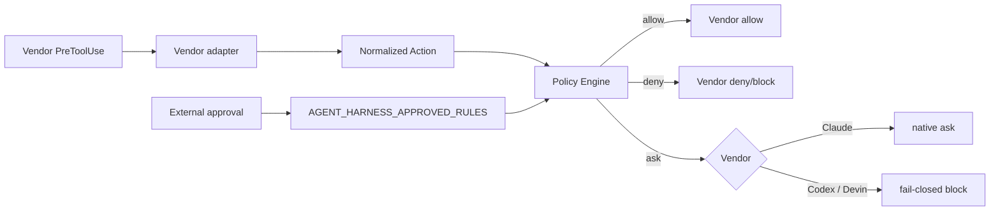
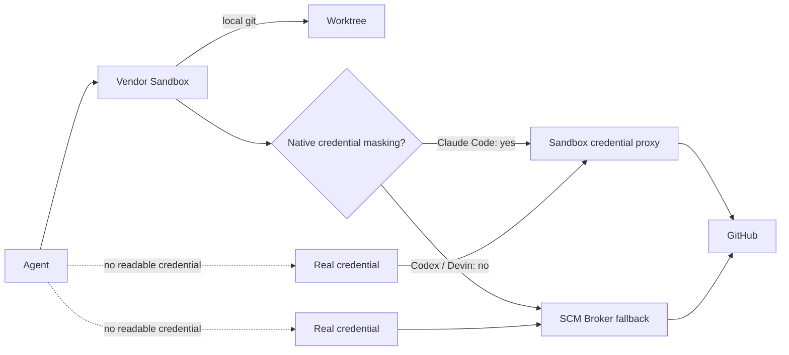

[← Product Mapping](05-product-mapping.md) | [日本語](ja/06-vendor-harnesses.md) | [README →](../README.md)

# Vendor Harness Implementations

The repository contains runnable project-local harness configurations for Claude Code, OpenAI Codex, and Devin CLI. All three feed tool calls into the same deny-first Policy Engine and translate the result into the vendor's hook response schema.



## Files

- [`.claude/settings.json`](../.claude/settings.json) — Claude Code hooks plus strict sandbox baseline.
- [`reference/claude/managed-settings.example.json`](../reference/claude/managed-settings.example.json) — trusted Claude credential masking example.
- [`.codex/hooks.json`](../.codex/hooks.json) — Codex PreToolUse and Stop hooks.
- [`reference/codex/config.example.toml`](../reference/codex/config.example.toml) — Codex workspace-write profile with spawned-command network disabled.
- [`.devin/hooks.v1.json`](../.devin/hooks.v1.json) — Devin CLI project hook file.
- [`.devin/config.json`](../.devin/config.json) — Devin CLI static permissions including credential path denial.
- [`reference/harness/`](../reference/harness/) — vendor adapters.
- [`reference/scm_broker/`](../reference/scm_broker/) — fallback remote-SCM broker used only where native credential masking is insufficient.
- [`reference/shims/git`](../reference/shims/git) and [`reference/shims/gh`](../reference/shims/gh) — agent-facing command shims for brokered remote operations.
- [`reference/kubernetes/agent-with-scm-broker.yaml`](../reference/kubernetes/agent-with-scm-broker.yaml) — sidecar deployment example where only the broker receives the GitHub credential.
- [`reference/hooks/policy_engine.py`](../reference/hooks/policy_engine.py) — shared policy evaluator.
- [`reference/policies/policy.example.json`](../reference/policies/policy.example.json) — shared policy.

## Credential isolation: sandbox first

Credential confidentiality follows [DL-011](decisions/DL-011-sandbox-first-credential-isolation.md): use native sandbox credential mediation first and introduce privileged broker infrastructure only when the vendor sandbox cannot keep the real credential out of the agent process.



### Claude Code

Claude Code currently supports sandbox credential masking. The trusted user/managed-settings example masks `GH_TOKEN` / `GITHUB_TOKEN` and the token field inside `~/.config/gh/hosts.yml`; sandboxed commands see only a sentinel, while the sandbox proxy substitutes the real value on requests to the allowed GitHub hosts. The repository-local `.claude/settings.json` enables strict sandbox startup and disables unsandboxed fallback. Credential `mask` itself must be installed from a trusted user/managed settings source rather than project-local settings.

### Codex

Codex currently provides OS-level workspace/network sandboxing but not equivalent credential masking. The recommended profile keeps spawned-command network disabled. The agent container receives no GitHub token or credential file; `git`/`gh` remote operations are routed through the SCM broker socket. Local Git operations still execute normally in the worktree.

### Devin CLI

Devin's sandbox can hide credential paths through `Read(...)` deny rules for the whole session. Since hiding those files also prevents native `gh` from consuming them and there is no equivalent credential masking/injection, remote operations use the same broker fallback. Devin's fail-closed sandbox startup remains part of the security invariant.

### Broker boundary

The broker is intentionally narrow. It supports only approved semantic remote operations: `git push/fetch/pull/clone` and `gh pr create/view/status/checks`. It rejects `gh auth`, generic `gh api`, Git credential operations, arbitrary shell execution, and workspace escape. The broker constructs the canonical GitHub repository URL itself instead of trusting an agent-modifiable remote URL.

The token is present only in the broker container/process environment. The agent container intentionally has no token, `gh` credential file, Git credential store, or GitHub SSH private key mounted into it.

## Worktree-safe invocation

Each committed hook locates the active repository through `git rev-parse --show-toplevel`. This avoids hard-coding a checkout path and works when an agent moves from the control checkout to a task worktree.

## Approval handoff

Rules classified as `ask` are not automatically made safe merely because a vendor can display a prompt. An external orchestrator may promote a specific rule to allow by injecting `AGENT_HARNESS_APPROVED_RULES`, for example:

```bash
AGENT_HARNESS_APPROVED_RULES=scm-merge-release codex
```

The variable must be supplied by the trusted launcher/orchestrator, not written into repository configuration. Claude Code supports native PreToolUse `ask`; current Codex/Devin mappings remain fail-closed until their hook semantics are sufficient for the same contract.

## Completion gate

The `Stop` hook runs [`completion_gate.sh`](../reference/scripts/completion_gate.sh). A failed gate blocks completion and sends the failure reason back to the agent. Keep retry/cost/time circuit breakers in the external orchestrator because a Stop hook can otherwise create an unbounded self-repair loop.

## Configuration trust

Project hooks are executable policy code. Treat `.claude/`, `.codex/`, `.devin/`, `AGENTS.md`, workflow files, and the harness itself as security-sensitive. The sample central policy classifies edits to these files as `ask`. Server-side repository rules and code review should remain authoritative.

## Validation

Run:

```bash
python -m pip install pytest
python -m pytest reference/hooks/tests reference/harness/tests reference/scm_broker/tests -q
```

The GitHub Actions workflow [`harness-tests.yml`](../.github/workflows/harness-tests.yml) runs the policy/adapter/broker tests and validates committed JSON files.

## Production notes

The broker example accepts `SCM_BROKER_GH_TOKEN` to make the trust boundary explicit and testable. Production should replace a stored PAT with a short-lived, repository-scoped GitHub App installation token issued by a trusted credential provider. Never mount that credential into the agent container.

---

[← Product Mapping](05-product-mapping.md) | [日本語](ja/06-vendor-harnesses.md) | [README →](../README.md)
