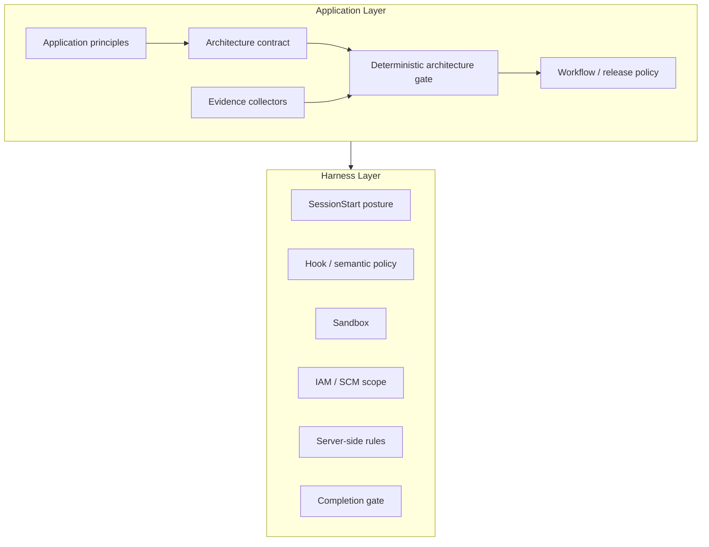
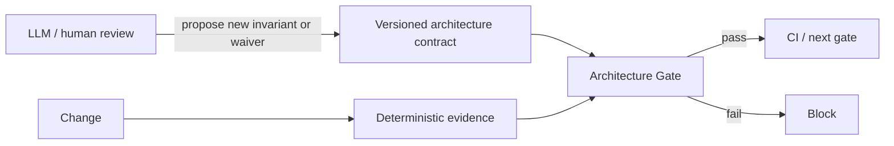
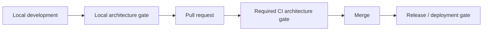

[← Vendor Harnesses](06-vendor-harnesses.md) | [日本語](ja/07-application-architecture.md) | [Next: Application Design Principles →](08-application-design-principles.md)

# Application-Layer Architecture

## 1. Why an application layer exists

The harness is infrastructure. It supplies reusable execution boundaries: lifecycle hooks, repository posture, semantic policy, sandboxing, IAM/SCM containment, server-side enforcement, deterministic completion, and audit.

An application built on the harness has a different responsibility: it defines **what must be true for that application to be considered architecturally valid and releasable**.



The application layer **uses** the harness but does not redefine its security boundaries. The harness answers “is this action permitted and contained?” The application answers “does this change preserve the architecture and product invariants of this application?”

## 2. Architecture contract

Application architecture is represented as version-controlled policy-as-code. The reference contract is `.agent-harness/application-architecture.json`.

A contract contains machine-verifiable invariants such as:

- required architectural artifacts;
- forbidden legacy/bypass components;
- required or forbidden file content patterns;
- evidence that deterministic tests/checkers exist;
- explicit, expiring waivers.

The contract is itself a control-plane artifact and therefore inherits the harness rule that `.agent-harness/` changes require approval/review.

## 3. Deterministic gate, not agent opinion

An LLM can review architecture, explain trade-offs, discover missing invariants, and propose contract changes. It must not be the authority that decides whether an invariant passed.

The merge/release path uses a **deterministic architecture gate**:



The same repository state plus the same contract must produce the same result, independent of model choice, prompt, temperature, conversation history, or reviewer confidence.

## 4. Evidence model

Gate inputs should be structured evidence with explicit provenance. The initial reference implementation deliberately starts with local deterministic evidence:

- path existence / absence;
- regex presence / absence in a specific file.

Future collectors may add dependency graphs, API schemas, generated architecture metadata, test reports, static-analysis results, or signed external attestations. A collector may be sophisticated, but the final predicate must remain deterministic.

A non-deterministic analysis can be used to **discover what should be checked**, not as the check result itself.

## 5. Gate placement

Architecture validation should occur at more than one lifecycle point where useful:



The authoritative merge/release instance should run in CI or another trusted execution environment. Local runs are fast feedback, not the final authority.

## 6. Failure semantics

Architecture gate configuration errors fail closed. Unsupported check types, malformed contracts, path escapes, expired waivers, and failed invariants produce a non-zero result.

An application may have advisory architectural principles that cannot be reduced to stable evidence. Those principles remain review guidance and must be labeled as advisory rather than disguised as deterministic controls.

## 7. Waivers

Exceptions are first-class data, not comments or prompt instructions. A waiver must identify:

- check ID;
- owner;
- reason;
- expiry date.

Expired waivers stop bypassing the gate automatically. Changes to waivers are changes to the architecture contract and therefore follow the same control-plane review path.

## 8. Reference implementation

Run the application architecture gate with:

```bash
python reference/application_gate/gate.py
```

or emit structured output:

```bash
python reference/application_gate/gate.py --json
```

The reference implementation is intentionally small and standard-library-only. The objective is not to create a universal architecture DSL immediately; it is to establish the application-layer contract and deterministic enforcement boundary first.

---

[← Vendor Harnesses](06-vendor-harnesses.md) | [日本語](ja/07-application-architecture.md) | [Next: Application Design Principles →](08-application-design-principles.md)
