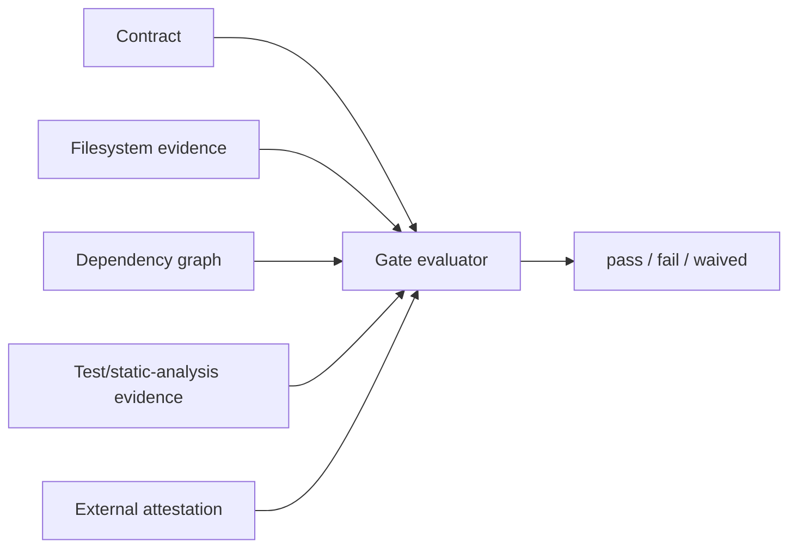
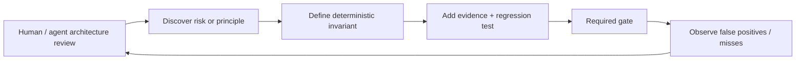

[← Application Architecture](07-application-architecture.md) | [日本語](ja/08-application-design-principles.md) | [Decision Log →](decision-log.md)

# Application-Layer Design Principles

## 1. Separate application invariants from harness invariants

Harness invariants protect execution and authority boundaries. Application invariants protect the architecture, behavior, maintainability, and release quality of one application. Do not mix the two policy domains merely because they share the same enforcement infrastructure.

## 2. A principle is not a gate until it has deterministic evidence

Architectural prose is guidance. A gate requires an explicit predicate over reproducible evidence. If a principle cannot yet be converted into such a predicate, keep it advisory and record the gap rather than pretending it is enforced.

## 3. LLM review is not authoritative for pass/fail

LLM review is useful for finding risks, discovering missing rules, explaining violations, and proposing new invariants. LLM review is not authoritative for architecture-gate pass/fail because its output is non-deterministic and context-dependent.

## 4. Prefer executable architecture

Where an architectural rule matters repeatedly, encode it in machine-verifiable form: dependency constraints, forbidden edges, required boundaries, schema compatibility, path ownership, static-analysis rules, tests, or signed evidence. Architecture that exists only in prose will drift.

## 5. Separate declaration, evidence collection, and evaluation

The architecture contract declares invariants. Evidence collectors observe repository/system state. The gate evaluates evidence against the contract. Keeping these responsibilities separate makes collectors replaceable and the final decision auditable.

## 6. Fail closed on gate infrastructure errors

Malformed contracts, unsupported check types, unreadable required evidence, path escapes, and evaluator failures are gate failures. A broken architecture-control system must not silently produce green status.

## 7. Make exceptions explicit, narrow, owned, and temporary

A waiver is policy data. It must identify the exact invariant, reason, owner, and expiry. Avoid broad “ignore architecture checks” switches. Expiry must be evaluated mechanically.

## 8. Protect the policy that protects the application

Architecture contracts, gate implementation, CI wiring, evidence collectors, and waivers are control-plane artifacts. Application code must not be able to weaken them through the same unreviewed path used for routine source edits.

## 9. Required CI is the authoritative merge gate

Local architecture checks optimize feedback. Required CI checks provide the authoritative merge signal because they run from a known revision in a controlled environment. Release/deployment may add stricter gates but must not weaken merge-time invariants implicitly.

## 10. Gate the invariant, not a proxy when the real evidence is available

Avoid fragile heuristics when structured evidence exists. For example, prefer a dependency graph over grepping import strings, an API schema diff over an LLM description of compatibility, and a test result over prose claiming that tests pass.

## 11. Version contracts and evidence schemas

Architecture policy evolves. Contract and evidence formats must have explicit versions, validation, and migration rules so that old and new gate semantics cannot be confused.

## 12. Keep gates composable

A large application will have different invariant classes: layering, API compatibility, data migration, security, reliability, operability, and release readiness. Each can have a focused deterministic gate, composed into an application release decision instead of one monolithic checker.

## 13. Reviews improve policy; gates enforce policy

The intended feedback loop is:

This makes non-deterministic reasoning valuable without making it the authority boundary.

---

[← Application Architecture](07-application-architecture.md) | [日本語](ja/08-application-design-principles.md) | [Decision Log →](decision-log.md)
