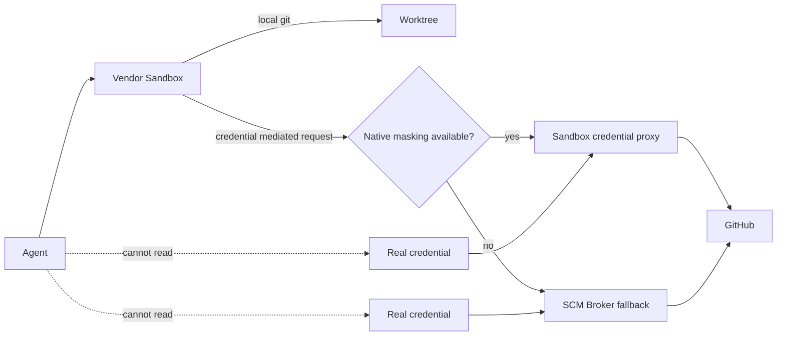

# DL-011 — Sandbox-first credential isolation

- Date: 2026-09-05
- Status: Accepted; Revisit on vendor change
- Scope: Claude Code / Codex / Devin CLI / SCM authentication

## Decision

Credential confidentiality is enforced **sandbox-first**. The agent should be able to perform approved GitHub operations while never receiving reusable GitHub credentials as ordinary readable data.

The preferred order is:

1. use the vendor sandbox's native credential-masking/mediation capability when it can keep the real credential out of the agent process;
2. otherwise keep credentials outside the agent container/process namespace and delegate only semantic remote SCM operations to a narrow SCM broker;
3. never rely on prompt instructions or hook deny rules as the credential confidentiality boundary.

## Current vendor mapping

### Claude Code

Use native sandbox credential masking. `GH_TOKEN` / `GITHUB_TOKEN`, or the token field inside `~/.config/gh/hosts.yml`, is replaced with a sentinel inside sandboxed commands. The sandbox proxy injects the real credential only for explicitly allowed GitHub hosts. Repository-local settings enable strict sandboxing, while masking configuration is supplied as trusted user/managed settings because Claude Code intentionally ignores credential `mask` configuration from repository-local settings.

Reference: `reference/claude/managed-settings.example.json`.

### Codex

Current Codex sandbox provides OS-level workspace and network isolation but does not expose an equivalent credential-masking mechanism. Therefore the agent container receives no GitHub token or credential files. Spawned-command network remains disabled and GitHub remote operations are delegated over the harness SCM socket to the broker sidecar.

Reference: `reference/codex/config.example.toml`, `reference/shims/`, and `reference/scm_broker/`.

### Devin CLI

Devin sandbox can hide paths covered by `Read(...)` deny rules for the entire session, so GitHub credential files are denied. Because hiding the files also prevents native `gh` from consuming them and Devin does not currently provide Claude-style masking/injection, remote GitHub operations use the same broker fallback. Sandbox startup remains fail-closed.

## Broker constraints

The SCM broker is deliberately not a generic shell or GitHub API proxy. It exposes a small semantic allowlist:

- Git remote: `push`, `fetch`, `pull`, `clone`;
- GitHub CLI: `pr create`, `pr view`, `pr status`, `pr checks`.

It rejects generic `gh api`, `gh auth`, Git credential operations, arbitrary commands, and workspace escapes. It owns the canonical repository identity and substitutes its own GitHub remote URL rather than trusting `.git/config`.

## Security invariant

> The agent may possess GitHub capability, but must not possess reusable GitHub credentials.

A deployment is non-compliant if the agent can obtain a real token through its filesystem, environment, process inspection, credential helper invocation, CLI auth commands, or broker response.

## Upgrade path / revisit triggers

Re-evaluate this decision when:

- Codex adds native credential masking/injection comparable to Claude Code;
- Devin CLI adds native credential masking/injection while preserving sandbox guarantees;
- Claude Code changes masking scope, platform behavior, or trusted settings requirements;
- a vendor provides a first-class SCM capability that performs authenticated Git/GitHub operations without exposing credentials to the agent process.

When a native mechanism becomes sufficiently strong, remove the broker for that vendor rather than retaining unnecessary privileged infrastructure.
