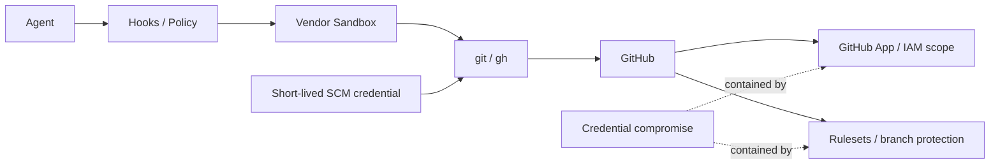

# DL-011 — Sandbox-first credential exposure reduction

- Date: 2026-09-05
- Status: Accepted; Revisit on vendor change
- Scope: Claude Code / Codex / Devin CLI / SCM authentication

## Decision

Use the vendor sandbox and local policy to **reduce credential exposure**, but do not make credential confidentiality the single security invariant on which repository safety depends.

The default architecture remains one Pod / one agent container. Do not introduce an SCM broker, sidecar, or extra Pod merely to hide GitHub credentials unless a concrete threat model requires it.

## Responsibility split

- **Sandbox**: reduce filesystem, process, and network access; hide known credential files where the vendor supports it; prevent broad host access.
- **Hooks / policy**: deny semantic credential-extraction operations such as `gh auth token`, protect control-plane files, and classify risky SCM actions.
- **Credential management**: prefer short-lived, repository-scoped credentials with the minimum permissions required.
- **GitHub App / IAM**: contain blast radius if a credential is compromised.
- **GitHub rulesets / branch protection**: remain the authoritative server-side enforcement for protected branches, force pushes, required PRs, and required checks.

## Security invariant

> Credential compromise is a possible failure mode; compromise must not imply unrestricted repository or organization authority.

This deliberately avoids the stronger but brittle claim that the agent can never observe a credential. Native masking remains valuable defense in depth where available, but the system must remain safe enough when that control fails.

## Current vendor mapping

### Claude Code

Enable the native sandbox and deny reads of common credential locations. If managed settings support credential masking in the deployment, use it as additional hardening. Do not rely on masking as the final SCM authority boundary.

### Codex

Use its sandbox and project/managed controls to bound filesystem and network access. Do not add a broker solely because Codex lacks Claude-style credential masking. Use least-privilege short-lived GitHub credentials and server-side protections instead.

### Devin CLI

Use its sandbox and permissions to hide known credential files where practical. Keep native `git` / `gh` usage simple; rely on SCM/IAM scope and GitHub-side protections for compromise containment.

## Rejected default

A broker/sidecar design was considered and implemented experimentally, then removed. It introduced extra processes, sockets, shims, deployment configuration, and privileged components whose own failure modes increased system complexity. It remains an optional future pattern only for deployments with a demonstrated need for stronger credential isolation.

## Revisit triggers

Re-evaluate when a vendor adds materially stronger native credential mediation, when the SCM credential model changes, or when a deployment threat model requires stronger process separation than the one-container baseline can provide.
