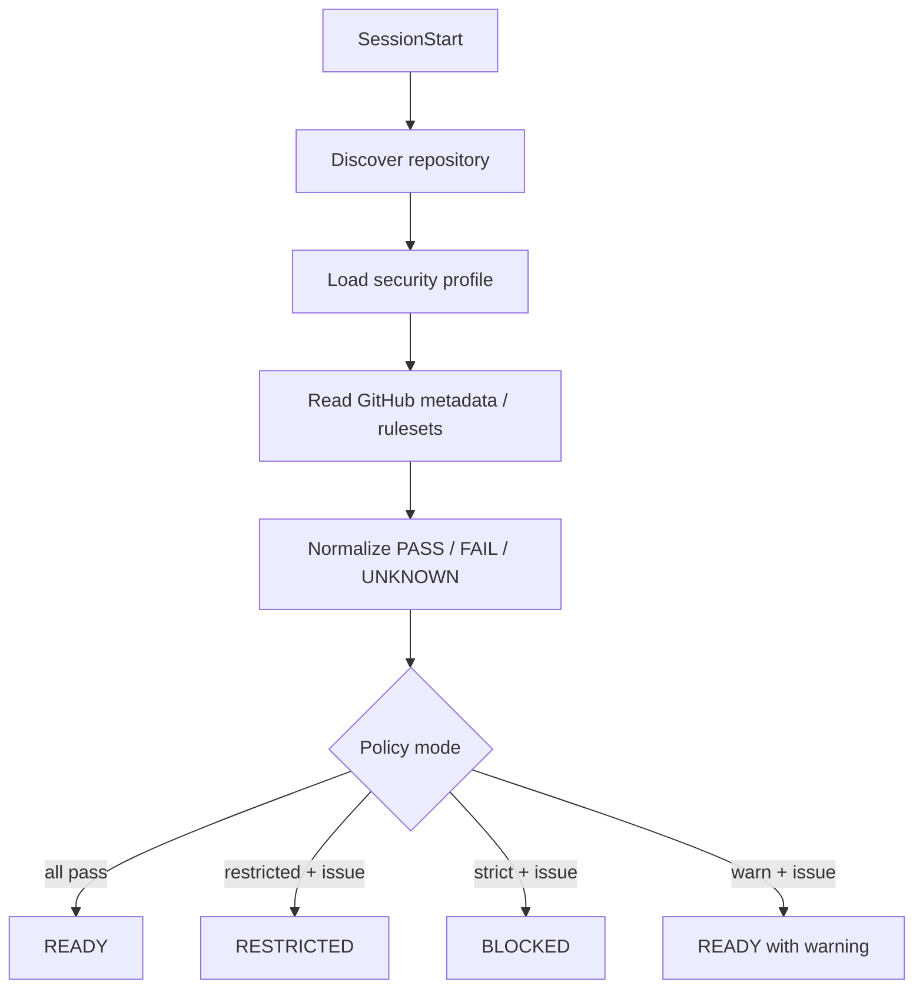

# DL-012 — Validate repository security posture at SessionStart

- Date: 2026-09-05
- Status: Accepted; Revisit on vendor change
- Scope: Claude Code / Codex / Devin CLI / GitHub repository controls

## Decision

Run a repository security posture check at `SessionStart` and cache the normalized result for later policy decisions. Re-check before remote SCM mutations when the cached result is stale.

The checker validates local repository identity plus GitHub-side controls such as required pull requests, non-fast-forward protection, and required status checks. Results use three-valued check status (`pass`, `fail`, `unknown`) and three session posture states (`READY`, `RESTRICTED`, `BLOCKED`).

## Missing configuration

A missing `.agent-harness/security.json` is not treated as a configuration parser failure. The harness uses built-in `restricted` defaults. This allows read-only discovery, local edits, tests, and local commits while preventing remote SCM mutation until required GitHub controls can be verified.

An invalid explicit configuration is different: it is a control-plane failure and produces `BLOCKED`.

## Unknown external state

`UNKNOWN` is distinct from `FAIL`. Examples include insufficient GitHub API permission, unavailable ruleset APIs, or a temporary metadata failure. This distinction matters because some GitHub plans/integrations cannot read every protection endpoint even when server-side controls exist.

Mode semantics:

- `strict`: any required `FAIL` or `UNKNOWN` => `BLOCKED`;
- `restricted`: any required `FAIL` or `UNKNOWN` => `RESTRICTED`;
- `warn`: retain `READY` but inject the warning into session context.

## Enforcement

`SessionStart` is primarily a fail-fast/context mechanism, not the authoritative security boundary. The cached posture is consulted again by `PreToolUse`:

- `BLOCKED`: mutating operations are denied;
- `RESTRICTED`: remote SCM mutations such as `git push` and `gh pr create` are denied, while local development work can continue;
- `READY`: normal central policy applies.

The posture cache has a TTL. Remote trust-boundary operations trigger a refresh once the cached result is stale.

## Responsibility split

The checker detects configuration drift; it does not replace GitHub enforcement. Rulesets/branch protection remain authoritative, IAM contains credential compromise, Sandbox bounds local capabilities, and hooks decide semantic operations.

## Revisit triggers

Re-evaluate when vendor SessionStart control semantics become stronger, GitHub exposes more uniformly readable protection metadata, or the harness gains an organization-level policy service that can supply authoritative repository posture without per-session GitHub API queries.
