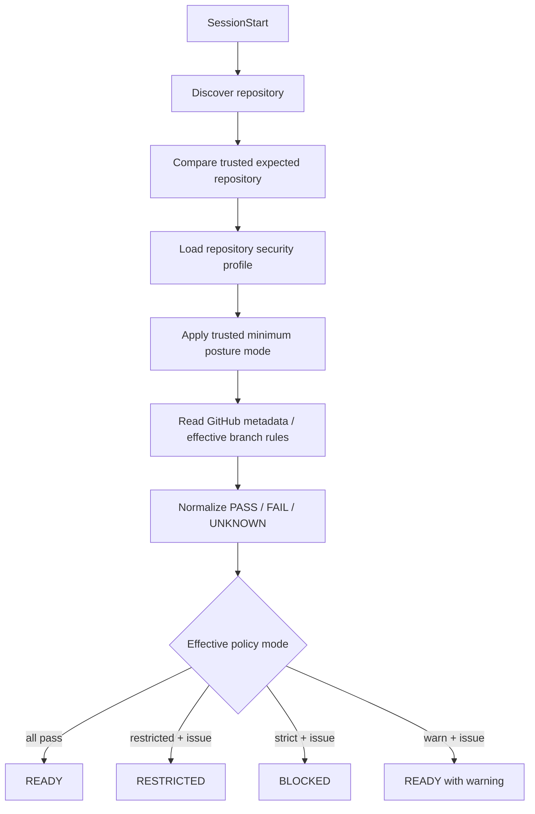

# DL-012 — Validate repository security posture at SessionStart

- Date: 2026-09-05
- Status: Accepted; Revisit on vendor change
- Scope: Claude Code / Codex / Devin CLI / GitHub repository controls

## Decision

Run a repository security posture check at `SessionStart` and cache the normalized result for later policy decisions. Re-check before remote SCM mutations when the cached result is stale.

The checker validates repository identity plus GitHub-side controls such as required pull requests, non-fast-forward protection, and required status checks. Results use three-valued check status (`pass`, `fail`, `unknown`) and three session posture states (`READY`, `RESTRICTED`, `BLOCKED`).



## Trusted repository identity

Repository identity is task/orchestration state, not repository-owned configuration. A trusted launcher or orchestrator supplies:

```text
AGENT_HARNESS_EXPECTED_REPOSITORY=owner/repository
```

The actual `origin` repository must match this value. A mismatch is `BLOCKED`. If the trusted value is absent, identity is `UNKNOWN`; with the default minimum mode this keeps the session `RESTRICTED` and prevents remote publication.

Repository-local `.agent-harness/security.json` may also declare `expected_repository` as an additional consistency check, but it cannot replace or override the trusted launcher identity. A conflict between the two is `BLOCKED`.

## Minimum posture authority

Repository-local configuration must not be able to weaken unattended execution policy. The trusted launcher owns:

```text
AGENT_HARNESS_MINIMUM_POSTURE_MODE=restricted
```

`restricted` is the default when the variable is absent. The effective mode is the stricter of the repository-local mode and the trusted minimum. Therefore a repository-local `mode: warn` cannot weaken the default autonomous posture. A trusted interactive launcher may explicitly set the minimum to `warn` when that behavior is desired.

## Missing configuration

A missing `.agent-harness/security.json` is not treated as a parser failure. The harness uses built-in `restricted` defaults. This allows read-only discovery, local edits, tests, and local commits while preventing remote SCM mutation until trusted identity and required GitHub controls can be verified.

An invalid explicit configuration is different: it is a control-plane failure and produces `BLOCKED`.

## Unknown external state

`UNKNOWN` is distinct from `FAIL`. Examples include missing trusted task identity, insufficient GitHub API permission, unavailable effective-rule APIs, or temporary metadata failure.

Effective mode semantics:

- `strict`: any required `FAIL` or `UNKNOWN` => `BLOCKED`;
- `restricted`: any required `FAIL` or `UNKNOWN` => `RESTRICTED`;
- `warn`: retain `READY` but inject the warning into session context.

Explicit trusted repository mismatch or trusted/repository-policy identity conflict is always `BLOCKED`, independent of mode.

## Enforcement

`SessionStart` is primarily a fail-fast/context mechanism, not the authoritative security boundary. The cached posture is consulted again by `PreToolUse`:

- `BLOCKED`: mutating operations are denied;
- `RESTRICTED`: remote SCM mutations such as canonical `git push` and `gh pr create` are denied, while local development work can continue;
- `READY`: normal central policy and SCM semantic validation apply.

The posture cache has a TTL. Remote trust-boundary operations trigger a refresh once the cached result is stale. The active repository root is also compared with the cached root so moving a session to a different repository forces re-evaluation.

## Responsibility split

The checker detects repository/control configuration drift; it does not replace GitHub enforcement. Trusted launch state establishes task identity, Rulesets/branch protection remain authoritative server-side controls, IAM contains credential compromise, Sandbox bounds local capabilities, and hooks decide semantic operations.

## Revisit triggers

Re-evaluate when vendor SessionStart control semantics become stronger, GitHub exposes more uniformly readable protection metadata, or the harness gains an organization-level policy/task service that can supply authoritative repository posture without per-session GitHub API queries.
