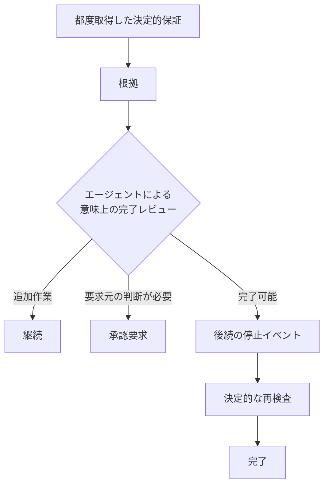

# Go 完了保証 実装ノート

## 位置づけ

完了保証は「既知で決定的に表現可能な完了条件」と、エージェントが担う非決定的な意味上の完了評価を分離する。

S5 は保証スライスであり、ベンダーフック形式ではない。Go の中核は `internal/completion` に実装し、Claude Code / Codex / Devin の停止イベント変換は S6 で接続する。

## 中核契約

決定的保証が成功しても、それだけでタスクが意味的に完了したとは主張しない。

## 権威ある情報

停止時に都度取得したリポジトリ変更権限の報告を入力とする。SessionStart のスナップショット、過去の事前検査、ローカル `origin/main` 等を完了判定の権威ある情報として受け入れない。

S5 coreは次を再照合する。

- 現在のブランチ
- ローカル HEAD
- 都度取得した報告に束縛されたリポジトリ / 既定ブランチ
- 配送差分なし判定時の GitHub 既定ブランチ先頭
- ワークツリーの清浄性（未追跡ファイルを含む）

## 配送差分なし

次のすべてが成立する場合だけ「リポジトリ配送差分なし」を決定的な根拠として成立させる。

- fresh reportが`READY`
- current branch = authoritative default branch
- worktreeがtracked/untrackedともclean
- local HEAD = fresh report HEAD
- GitHubから直接取得したdefault branch head = local HEAD

これは意味上の完了ではなく、リポジトリ配送差分がないという機械的事実だけを意味する。

## 通常の決定的ゲート

no-delivery-deltaを証明できない場合はrepository-specific `Gate`へ委譲する。

Gate失敗は`blocked`。Gate成功はdeterministic assurance成功に過ぎず、初回Stopでは`review_required`を返す。

## 後続確認

初回のdeterministic assurance成功:

- `review_required`
- EvidenceをAgentへ返す
- task requirements / plan / execution results / unresolved concerns / new findingsを非決定的に評価させる

follow-up Stop:

- deterministic assuranceを再実行
- 依然成功している場合だけ`complete`

書込み可能なrepository stateに「Agent review済み」flagを保存しない。follow-up markerのvendor-specific取得と信頼境界はS6で扱う。

## 根拠

- repository
- branch
- local head
- default branch
- GitHub default head（適用時）
- no-delivery-delta
- checks
  - repository_authority
  - current_branch
  - local_head
  - clean_worktree
  - github_default_head
  - deterministic_gate

不明状態は成功に変換しない。

## 検証

`internal/completion/completion_test.go`で次を固定する。

- 清浄な既定ブランチでも初回は意味上のレビューが必須
- 後続確認で決定的な再検査後に完了可能
- 機能ブランチは決定的ゲートを使用
- ゲート失敗は停止
- 未反映変更がある既定ブランチは配送差分なしの短絡判定を使用不可
- GitHub head mismatchはno-delta shortcut不可
- branch/HEAD変化はblocked
- 情報取得機構の欠落はフェイルクローズ

## 対象外

- vendor-specific Stop schema / response mapping
- follow-up markerのvendorごとの意味論
- repository-specific gate commandの配備方法
- CI / artifact / deployment evidenceの全体系
- semantic completionの決定化
- task requirementsの完全な機械表現

これらをS5 coreの適合主張へ含めない。
