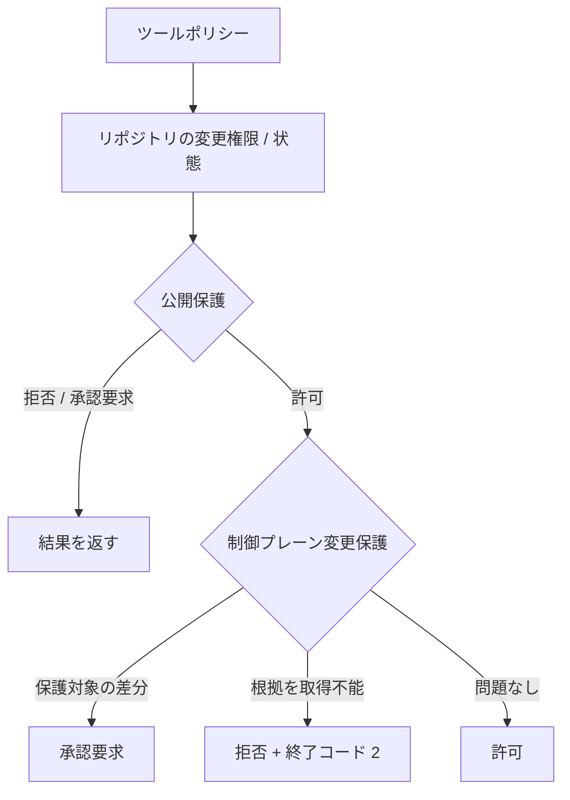

# Go 制御プレーン変更保護 実装ノート

## 位置づけ

本書は Agent Harness 全体仕様の「公開保護」のうち、制御プレーン変更を実際の公開差分から検出して明示審査へ引き上げる責務を、Go による本番実装でどのように具体化したかを記録する。

S4 は保証スライスであり、パッケージ名やツール機能名ではない。Go 実装は `internal/controlplane` に配置し、公開保護の後段として接続する。

## 保証契約

Go 実装は次を満たすことを目標とする。

1. S3 公開保護が自律的に許可した直接公開だけを S4 の対象にする。
2. 比較基準にはローカル `origin/main` 等を使わず、都度取得したリポジトリ変更権限が確認したリポジトリと、GitHub から直接取得した既定ブランチ先頭を使う。
3. GitHub の既定ブランチ先頭コミットがローカルオブジェクトデータベースに存在することを確認してから差分を評価する。
4. 実際に公開される `base...HEAD` 差分から保護対象パスを抽出する。
5. 保護対象パスを含む場合は許可を承認要求へ引き上げる。
6. 権威ある状態、ベースコミット、差分を確立できない場合は拒否と非0終了にし、不明の根拠を保持する。
7. S3 が承認要求 / 拒否した操作を S4 が許可へ変更しない。

## 実装

中心実装は `internal/controlplane/guard.go`。

実行順序は trusted runtime で固定する。



### 権威ある情報

入力に利用する repository identity、current branch、local HEAD、default branch は fresh Repository Authority report に束縛する。

Control-plane Change Guard 自身は GitHub の current default branch head を `BranchHead(repository, defaultBranch)` から再取得する。ローカル remote-tracking ref は authority として使用しない。

### 差分

authoritative base SHA に対して次を実施する。

```text
git cat-file -e <base>^{commit}
git diff --name-only <base>...<current-head>
```

base commit が存在しない場合に fetch を暗黙実行しない。どの network / credential / remote を用いて object を取得するかは別責務であり、S4 の観測処理が勝手に能力を拡張しないためである。

### 保護対象パス

初期 contract は Python S4 で検証済みの範囲を起点とし、現在のリポジトリ構成に対して次を保護する。

- `.agent-harness/`
- `.claude/`
- `.codex/`
- `.devin/`
- `.github/workflows/`
- `reference/claude/`
- `reference/codex/`
- `reference/harness/`
- `reference/hooks/`
- `reference/posture/`
- `reference/policies/`
- `reference/launcher/`
- `reference/scripts/`
- `reference/kubernetes/`
- `AGENTS.md`
- `.github/pull_request_template.md`

この集合は implementation detail ではなく、現時点で制御意味論・vendor wiring・trusted execution・CI/publication/completion behavior を変更し得る既知の path contract である。構成変更で責務が移動した場合は Evolution 対象とする。

## 根拠

S4 は既存 `PublicationEvidence.Checks` に次の check を追加する。

- `control_plane_authority`
- `control_plane_provider`
- `default_branch_head`
- `base_commit`
- `publication_diff`
- `control_plane_paths`

`pass` / `fail` / `unknown` を保持する。取得不能を空値や成功へ変換しない。

## 失敗時の意味論

- S3 非 `allow`: S4 は実行しない。
- Repository Authority が fresh `READY` でない: deny。
- Git / GitHub provider 不在: deny + error。
- GitHub default branch head 取得不能: deny + error。
- base commit がローカルにない: deny + error。
- diff 取得不能: deny + error。
- protected path あり: ask。
- protected path なし: S3 の allow を維持。

trusted runtime は error を `control-plane-evidence-error` として非0終了へ変換し、Evidence を出力する。

## 検証

### 単体テスト

`internal/controlplane/guard_test.go`

- protected path normalization
- protected / non-protected diff
- default branch head failure
- missing base commit
- diff failure
- protected diff の ask 昇格

### 実行時統合テスト

`internal/trustedexec/run_test.go`

- `Repository Authority → Publication Guard → Control-plane Change Guard` の順序
- S3 非 allow 時に S4 を実行しないこと
- S4 unknown Evidence を保持して exit 2 になること

### CI

GitHub Actions `Agent Harness Go` で Linux / macOS の双方について `go test ./...` と `go build` を実行する。

## Python との差分

Python S4 の責務・findings は再利用するが、`gh` subprocess と PATH 上の `git` をそのまま移植しない。Go implementation は S2/S3 と同じ固定 Git / GitHub provider を利用し、runtime pipeline に型付き evaluator として組み込む。

## 対象外

- GitHub server-side review / rules の代替
- merge / release / deploy の認可
- arbitrary child process / alternate API publication の完全仲介
- base commit の安全な fetch mechanism
- TOCTOU の完全排除
- protected path集合の永続的完全性
- audit storage / transport

これらを S4 適合済みという主張に含めない。

## 収束判定

S4 内部について、既知の保証契約は deterministic test と runtime wiring に追跡でき、S3 が許可していない publication を S4 が拡張許可する経路は持たない。外部責任と対象外を上記に明示した状態を、Go S4 の初回収束点とする。
