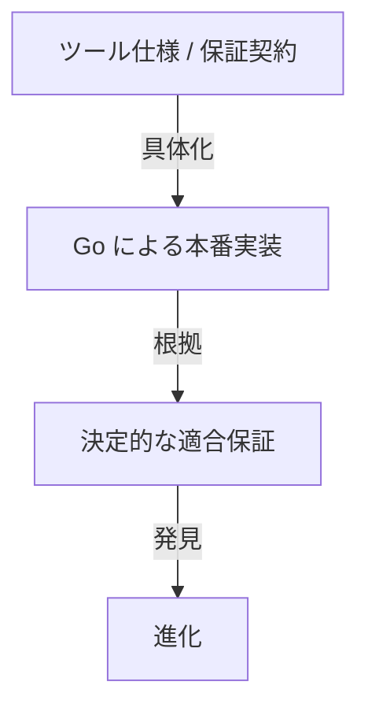

# 本番実装方針 — Go のみ

## 決定

Agent Harness の本番実装は Go のみとする。

Python 実装は廃止し、今後の適合対象、回帰対象、互換対象、差分比較対象には含めない。

## 保証の基準

今後の収束判定は、次の関係だけを対象とする。

Python との実装差、判断一致、バイト互換、テストデータ一致は完了条件にしない。

## Python から引き継ぐもの

Python 実装そのものは保持しないが、過去の具体化・レビューで得られた一般化可能な発見は知識として保持してよい。

例:

- 書き込み可能な状態を権威ある情報として扱わない
- ローカルのリモート追跡参照を GitHub の権威ある情報の代替にしない
- 複合シェルコマンドを読み取り専用 / 公開可能と誤分類しない
- 暗黙の Git / GitHub 設定による公開対象の変更を考慮する
- インタープリター / 読み込み / 環境依存は信頼された実行環境の失敗形態になり得る
- 決定的な完了状態だけで意味上のタスク完了を確定しない

これらは Python 互換性のためではなく、保証契約、Go テスト、根拠、設計判断へ一般化された知識として残す。

## 削除対象

- Python の本番 / 参照実装
- Python 専用の単体 / 統合テスト
- Python ↔ Go の差分回帰
- Python を将来の参照実装として維持する記述
- Python実装との機能同等性を完了条件とする記述

## 維持対象

- Go による本番実装
- 実装非依存のツール仕様 / 用語集
- 保証スライスのレビュー文書
- Go 実装ノート
- Python 由来であっても一般化済みの発見 / 判断履歴
- シェル / JSON / Kubernetes 等、言語実装ではない配備 / 参照資材

## 進化

今後の発見は、Go 実装と仕様・保証契約・根拠の不整合として扱う。

実装で仕様不足を発見した場合は、単純にGoを既存仕様へ合わせるのではなく、次を判定する。

1. 仕様の不足
2. 実装エラー
3. 新しい要求
4. 外部保証の責任

必要ならモデルを進化させ、その後 Go 実装と決定的保証を更新する。

## 旧 Python PR

旧 Python 実装 PR はマージせず閉じる。履歴は Git / GitHub 上の歴史的根拠として参照可能だが、現行の実装系列には含めない。
