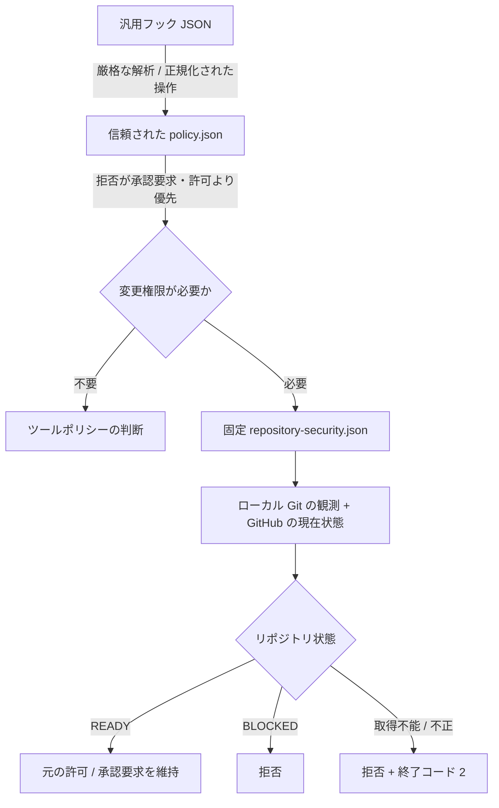

[ツール仕様書](../../spec/agent-harness-spec.ja.md) | [Go 実装ノート](implementation-notes.ja.md) | [Issue #19](https://github.com/tomo-chan/agent-harness/issues/19)

# Go 実装ノート — リポジトリの変更権限 / 状態

## 1. 位置づけと範囲

本書は、Agent Harness 全体仕様のリポジトリ保護を Go で具体化し、S2
保証スライスで評価するための実装記録である。リポジトリの変更権限 / 状態は
ツールアーキテクチャ上の責務名であり、S2 は横断的な保証レビュー軸である。
`internal/repository` を「S2 package」とは扱わない。

仕様比較は2026-09-12時点のPR #16 HEAD `936e41e`（BH-03監査契約を含む）、Go基線は
PR #15 HEAD `139dede`、Python比較はPR #7 HEAD `4af4d5b` を対象とする。

本実装は PR #15 の信頼された実行環境 / ポリシー強制に積み重ね、固定した信頼基点、
単一バイナリ、厳格な JSON、ツールポリシー / 操作ダイジェストを再利用する。Python PR #7 は
保証契約と既知の失敗形態を比較する参照実装であり、型、モジュール構成、環境、キャッシュ、
`gh` 子プロセスを逐語移植しない。

対象は次に限定する。

- trusted expected repository name / immutable GitHub repository ID、task worktree、Git common directory、branch と repository-security policy の束縛・検証
- 現在の local Git identity / worktree / branch / HEAD の観測
- GitHub canonical identity / default branch / active stateと、trusted policyが明示したauthority sourceの取得
- generic action が repository mutation authority を必要とするかの保守的分類と、直接file mutation targetのworktree内検証
- policy の `allow` / `ask` より先に適用する fresh authority evaluation
- pass / fail / unknown と利用した状態の Evidence
- repository-controlled selector、overlay、cacheによる弱化の除去

Git push、PR作成、merge等のpublication semantics、control-plane change、completion、
vendor固有mapping、配布適合は実装しない。

## 2. 実行経路



tool-policy `deny` は repository取得前に確定できる。`allow` と `ask` のmutationは
repository authorityを通り、通常approvalは `BLOCKED` を反転できない。`Read` / `Glob` /
`Grep` と固定した完全一致commandだけをread-onlyとする。command allowlistは固定した
`exec` / `Bash` にだけ適用し、未知toolが `pwd` 等を自己申告しても迂回できない。未知tool、
commandless tool、追加引数、shell合成、`git branch -D`等のvariantはmutationとして扱う。
直接file mutationは `path` / `file_path` を正規化してtrusted worktree内に束縛する。shellや
未知toolのmutationは実対象を証明できないため、本段階ではfail-closedに拒否する。この分類は
S3のpublication分類ではない。

## 3. 信頼された束縛

### 固定したリポジトリポリシー

実行fileのsymlink解決後の親と `AGENT_HARNESS_TRUSTED_ROOT` が一致する場合だけ、同じrootの
固定名 `repository-security.json` を読む。境界外symlink、欠落、directory、不正JSON、
重複key、未知field、型不正を拒否する。schemaは実験上のversion 1であり、安定版契約ではない。
同じschemaの参照例は [`repository-security.example.json`](repository-security.example.json) に置く。

```json
{
  "schema_version": 1,
  "authority_source": "github_rules",
  "expected_repository": "acme/widget",
  "expected_repository_id": 123456789,
  "expected_worktree_root": "/srv/agent-harness/worktrees/task-123",
  "expected_git_dir": "/srv/agent-harness/control/widget/.git/worktrees/task-123",
  "expected_git_common_dir": "/srv/agent-harness/control/widget/.git",
  "expected_branch": "feature/task-123",
  "requirements": {
    "require_linked_worktree": true,
    "require_pull_request": true,
    "block_force_push": true,
    "required_status_checks": true
  }
}
```

`authority_source` は必須で、次のいずれかをtrusted policyが明示する。runtimeは403等を理由に
別sourceへfallbackしない。

| 取得元 | GitHub API | 保証できる範囲 | 設定制約 |
|---|---|---|---|
| `github_rules` | `GET /repos/{owner}/{repo}/rules/branches/{branch}` | current branchのeffective rulesとdefault branchのrule types | `require_pull_request`、`block_force_push`、`required_status_checks`を評価可能 |
| `github_branch_metadata` | `GET /repos/{owner}/{repo}/branches/{branch}` | exact current branchのauthoritative `protected` boolean | 詳細rule要件を証明できないため、3要件をtrusted fileで明示的に`false`にしなければconfigを拒否 |

`github_branch_metadata` はGitHub server-side protectionの詳細をlocal policyで代用しない。例えば
private/free repositoryで詳細APIが利用できず、local task branchのmutationだけを許可する場合は、
trusted operatorが次を明示する。

```json
{
  "authority_source": "github_branch_metadata",
  "requirements": {
    "require_linked_worktree": true,
    "require_pull_request": false,
    "block_force_push": false,
    "required_status_checks": false
  }
}
```

この`false`はdefault branch保護が成立したというEvidenceではなく、その保証を本sourceでは主張
しないという明示的な縮退である。default branchへのlocal mutation拒否、exact task binding、
current branchの`protected`拒否は引き続き必須であり、publicationはS3で別途検証する。
branch metadata sourceはcurrent branchがGitHubに存在することも要求する。未公開branchの404は
unknownとして拒否するため、branchを誰がいつpre-createするかはdeployment/S3との接続契約になる。

`expected_repository_id`、task固有のworktree / Git directories / branchは必須であり、
trusted control planeがworktree作成結果から生成して保護する。local repositoryが同じ
`remote.origin.url`を自己申告するだけではidentityを成立させない。

要件の省略値はすべて `true` とし、省略が弱化にならない。`false` を指定できるのはtrusted
fileだけである。repository checkoutの `.agent-harness/security.json` は読まず、次のlegacy /
Python selectorが非空ならoperator misconfigurationとして起動を拒否する。

- `AGENT_HARNESS_TRUSTED_REPOSITORY_SECURITY_POLICY`
- `AGENT_HARNESS_REPOSITORY_SECURITY_POLICY`
- `AGENT_HARNESS_TRUSTED_EXPECTED_REPOSITORY`
- `AGENT_HARNESS_EXPECTED_REPOSITORY`
- `AGENT_HARNESS_MINIMUM_POSTURE_MODE`
- `AGENT_HARNESS_STATE_DIR`
- `SSL_CERT_FILE`
- `SSL_CERT_DIR`

したがってrepository側はenv、overlay、writable cacheからexpected identity、minimum
requirements、評価結果を差し替えられない。これはtrusted root自体の所有権、read-only mount、
更新、置換競合を証明しない。

### ローカル Git と GitHub

local observationはPATH探索せず `/usr/bin/git` を直接起動する。継承した `GIT_DIR`、
`GIT_WORK_TREE`、global/system config、credential helper、fsmonitor、hookを権威入力にしない。
`remote.origin.url` はlocal configからincludeを無効にして取得し、github.comの限定したHTTPS /
SSH形式だけを `owner/repository` に正規化する。local root、per-worktree Git directory、
Git common directory、branchは
trusted policyのtask固有値と完全一致させ、repository-controlledなorigin文字列だけでは
identityを成立させない。

GitHub stateはGo標準libraryから固定 `https://api.github.com` へ取得する。repositoryがAPI
endpoint、proxy、redirectを選べない。`AGENT_HARNESS_GITHUB_TOKEN` はアクセス用credential
だけであり、policy、identity、endpointを変更しない。token欠落・scope不足・rate limit・
network/TLS failureはmutation authorityを与えない。LinuxでTLS trust rootを変更し得る
`SSL_CERT_FILE` / `SSL_CERT_DIR` は非空なら起動を拒否する。tokenのtrusted injection、scope、rotation、
secret isolationは配備側の責務である。

## 4. リポジトリ状態と変更権限

各mutationでcacheを使わず次を新規取得する。

1. absolute `cwd` とsymlink解決結果
2. Git repository root と `cwd` の包含関係
3. local root / per-worktree Git directory / Git common directory / branch とtrusted task bindingの一致
4. direct file mutation targetのsymlinkを含む正規化とworktree包含
5. raw local `origin` とtrusted expected repositoryの一致
6. current branch、HEAD object ID、linked worktree
7. GitHub immutable repository ID、`full_name`、default branch、archived / disabled
8. trusted policyが選択したGitHub authority sourceによるcurrent branch protection
9. `github_rules`選択時だけ、default branchへ現在適用されるrule types

本実装はproduction候補として単一の厳格な判定を採る。必要なcheckがすべてpassしたときだけ
`READY` とし、failまたはunknownを1件でも含む場合は `BLOCKED` とする。Python S2の
`warn` / `restricted` mode、TTL、context cacheは移植しない。これらが必要かはQ-04の
運用・鮮度契約と合わせて決める。

`require_linked_worktree` が有効ならcontrol checkoutを拒否する。detached HEAD、trusted branch
不一致、GitHubのdefault branch、選択sourceがprotectedと報告するcurrent branch、archived /
disabled repository、expected name / immutable ID不一致を拒否する。`github_rules`でdefault
branchを確認するrule typeは `pull_request`、`non_fast_forward`、`required_status_checks` である。
GitHubのserver-side authorizationが最終権威であり、rule presenceやbranch metadataだけで
rules parameterの完全性やcredentialの迂回不能性を保証したことにはならない。

外部APIやlocal queryが取得不能ならcheckは `unknown` として保持し、decisionは `deny`、
processはexit 2とする。検証済みの不一致や保護不足は `BLOCKED` の通常decisionとして
`deny`、exit 0とする。callerは非zero、欠落/不正output、panic、signal、timeoutを拒否として
扱わなければならない。

### 本番リポジトリで取得した根拠（2026-09-12）

`tomo-chan/agent-harness`（private repository）でsource可用性を実測した。

| 取得元 | 結果 |
|---|---|
| effective Rules API | HTTP 403（private/free planでは利用不可） |
| branch-protection詳細API | HTTP 403（private/free planでは利用不可） |
| branch metadata API | default/current branchともHTTP 200。`protected`を取得可能 |

`github_branch_metadata`を明示し、詳細rule要件を明示的に`false`としたtrusted configで、実binary、
実linked worktree、GitHub repository ID `1357803614`、current branch
`feature/go-repository-authority`を組み合わせた正常系E2Eを実行した。実装commit `17bcf6f`に対して
posture `READY`、decision `allow`、current branch `protected=false`とsource固有response digestが
得られた。これはhook判断だけを評価しており、test targetへの書込みやpublicationは実行していない。
sourceのHTTP 403、metadata欠落、protected branchはtestsでunknown/failからREADYへ変換されない。

## 5. 根拠

mutationの判断には既存のtool policy / action SHA-256に加え、次を結び付ける。

- repository-security policy全byteのSHA-256
- posture stateと各checkのpass / fail / unknown
- canonical repositoryとimmutable ID、repository root、mutation target、branch、HEAD、default branch、linked worktree
- 選択したGitHub authority source名、metadata response、current/default source responseのSHA-256
- 取得時刻

action digestには検証前の `cwd` も含める。response digestは取得byteを識別するが、GitHub
responseへの独立署名や永続audit storeではない。取得時刻・commit・task identityとの長期的な
保存と照合は未実装である。

## 6. 仕様 → Goによる具体化 → S2 の根拠

| 全体仕様 | Goによる具体化 | 決定的な根拠 | 評価 |
|---|---|---|---|
| TR-01 | 固定trusted rootの `repository-security.json`。legacy selector、repository overlay、cacheを権威から除外 | `TestTrustedPaths`、`TestSingleBinary`、`TestLoadConfigRejectsAmbiguousOrInvalidPolicy` | 配備前提付き部分適合 |
| RE-01 | local root/per-worktree Git dir/common-dir/branch/targetとtrusted task bindingを照合し、GitHub immutable ID/canonical metadataと明示authority sourceをfresh取得 | `TestAssessReadyUsesFreshLocalAndGitHubEvidence`、`TestAssessReadyWithAvailableGitHubBranchMetadataSource`、production repository E2E | direct file mutation範囲で部分適合 |
| RE-02 | task固有worktree/Git dirs/branch、linked worktree、non-detached branch、default/protected branch拒否 | `TestAssessBindsAnActualLinkedWorktree`、`TestAssessRejectsProtectedExpectedBranch`、`TestAssessBranchMetadataSourceFailsClosed` | trusted task config生成は配備前提 |
| PO-01 | policy `deny`を維持し、mutationの `allow` / `ask` をauthority denyで上書き | `TestRuntimeAppliesRepositoryAuthorityInActualEvaluationPath` | 実行経路で確認 |
| PO-02 | policy/actionにrepository policy、local target、GitHub response digest、取得時刻を追加 | `TestAssessReadyUsesFreshLocalAndGitHubEvidence`、runtime integration test | audit永続化を除き部分適合 |
| BH-03 | decision JSONに判断と根拠を相関可能な形で返すが、監査記録の保存・完全性・配信を実装しない | decision Evidence tests | 未適合。Q-09として明示 |
| FA-01 | identity/path/config/Git/GitHub不成立をallowへ変換しない。unknownはdeny + exit 2 | `TestAssessPreservesUnknownAndFailsClosedOnGitHubError`、subprocess異常cases | caller前提付き適合 |
| CP-01 | Python構造ではなく同じ保証・failure vectorsを比較 | 第7章と対応tests | Repository Authority範囲で部分適合 |

この表はS2全体、実配備、GitHub側強制の適合済み宣言ではない。

## 7. Python S2との差分比較

| 観点 | Python PR #7 | Go具体化 | 評価 |
|---|---|---|---|
| trusted input | S1 launcherがenvへ再束縛したpolicy path / expected repository | trusted root直下の固定fileにidentityとrequirementsを統合 | Goはruntime selectorを削減。どちらも配備基盤の保護が必要 |
| runtime / import | launcher、adapter、`authority.py`、`checker.py`、`gh` / `git` subprocess、Python import path | 単一Go process、標準library GitHub client、固定 `/usr/bin/git` | GoはPython interpreter/import/複数module/`gh`探索を除去するがGit executableはTCBに残る |
| repository config | monotonic overlayで強化可能 | overlayを読まない | Goは弱化経路とmerge complexityを除去する一方、repository側の追加要件を表せない |
| state / cache | READY / RESTRICTED / BLOCKED、TTL cacheはcontextのみ | READY / BLOCKED、authorityは毎回fresh、cacheなし | Goは厳格で単純。interactive warn/restricted運用は未対応 |
| mutation分類 | explicit read-only allowlist。reviewで危険variantとunknown schemaを修正 | exact read-only forms以外をmutation扱い | 既知findingを否定testsへ移した |
| GitHub取得 | trusted path外の `gh api` subprocess | fixed HTTPS API、proxy/redirectなし、trusted source明示、fallbackなし | GoはPATH/config/`gh` version差を削減。TLS root、HTTP client、token供給が責務に加わる |
| Evidence | report、pass/fail/unknown、非権威cache | decision JSONへpolicy/local/GitHub digestとchecksを結合 | Goは判断との結合を強めるが永続auditではない |
| build / distribution | trusted source treeとPython version/module組合せ | OS/architecture別binary、Go toolchain、build flags、固定Git path | Goはruntimeを単純化する代わりにartifact provenance、署名、更新、失効を増やす |

Python PR #7のreviewで発見された4件、すなわちcache書込み失敗によるfresh authority破棄、
mutating command variantのread-only誤分類、unknown commandless toolの誤分類、overlayによるtrusted
identity消失は、Goではcache/overlayを採用せず、read-onlyを正に限定する構造と回帰testで扱う。

## 8. 未決事項 / 実装メモ

- Q-01: binary、repository policy、`/usr/bin/git`、OS trust storeの所有権、署名、更新、rollback、失効。
- Q-02/Q-10: repository policy schema、Evidence field、exit statusは実験契約。version negotiationと移行期間は未確定。
- Q-04: task固有worktree root / per-worktree Git directory / Git common directory / branchを実験schemaへ束縛した。これらを生成・保護するcontrol plane、worktree作成主体、再配置、TOCTOU、API鮮度/再試行は未確定。
- Q-04: `github_rules`と`github_branch_metadata`を明示sourceとして分離した。Rules typeのpresenceだけでparameterの十分性を決めてよいか、classic branch protection / ruleset / enterprise hostをどう統一するかは未確定。source自動fallbackは採用しない。
- Q-04/Q-05: branch metadata sourceはremote branchの存在を要求する。task branch pre-creationの主体、credential、publicationとの順序は未確定。
- Q-09/Q-11: 現行仕様BH-03が要求する監査記録のschema、保存、完全性、秘匿化、保持、配信保証、閲覧権限、書込失敗時の停止を実装していない。Evidence JSONは監査記録の代替ではない。必須CI、共有language-independent vector形式、部分適合表示も未確定。
- direct `Write` / `Edit` は `path` / `file_path` の既存または最寄りの既存親までsymlinkを解決し、trusted worktree内だけを許可する。shell、未知tool、複数targetは実対象を証明できないため拒否する。対応範囲を広げるにはadapter capabilityとexecutor側のtarget bindingが必要である。
- path containmentはmount point、hard link、検証後のsymlink置換を能力境界として防がない。配備時のmount構成、OS sandbox、実行時のopen/execute境界との結合が必要である。
- fixed read-only tool名のvendor mappingと、callerが全mutation経路を仲介することはS6の配備適合で確認する。
- GitHub tokenがないpublic repository以外の実運用、rate limit、network outage時の復旧は配備・運用契約が必要である。
- S3 publication、S4 control-plane change、S5 completion、S6 vendor/deploymentを先回りして実装しない。

したがって本実装は、Repository Authority / Posture のproduction implementation候補と
S2評価Evidenceを提供するが、S2全体の最終適合やAgent Harness全体のproduction readinessを
主張しない。
