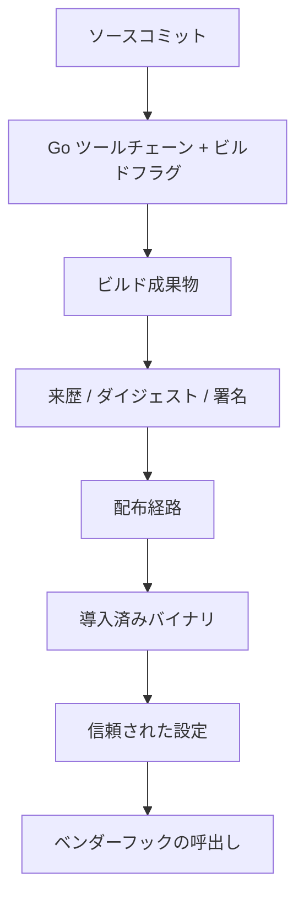

# Go ベンダー統合 / 配備 実装ノート

## 位置づけ

本書は Agent Harness 全体仕様のベンダー統合 / 配備を、Go による本番実装でどのように具体化するかを記録する。

S6 は保証スライスであり、Claude Code / Codex / Devin という製品名を中核保証の内部モデルへ持ち込むためのものではない。ベンダーアダプターはライフサイクルイベント / 応答スキーマを共通契約へ写像し、S1〜S5 の保証結果を弱化しないことを責務とする。

## 共通ライフサイクル契約

Go 実装はベンダー入力を次の共通イベントへ正規化する。

- `SessionStart`
- `PreToolUse`
- `Stop`

`PreToolUse` は `policy.Action` へ、`Stop` は `completion.Request` へ変換する。

`stop_hook_active` は repository stateへ永続化せず、vendor payloadから follow-up Stop marker として `completion.Request.FollowUp` へ渡す。

## ベンダー別の判断写像

### Claude Code

- `allow` → allow
- `ask` → ask
- `deny` → deny

### Codex

現行の参照アダプター契約では製品固有の `ask` を直接表現しないため、

- `allow` → allow
- `ask` → 拒否（理由に承認が必要であることを保持）
- `deny` → deny

とする。`ask` を `allow` へ弱化しない。

### Devin

- `allow` → 空の成功応答
- `ask` / `deny` → 停止

とする。`ask` は承認が必要である理由を保持する。

## 停止イベントの写像

S5 完了保証の結果に対して、`complete` だけをベンダーの停止成功へ写像する。

- `blocked` → 停止
- `review_required` → 停止し、エージェントへ意味上の完了レビューを要求
- `complete` → Stop許可

したがって決定的保証が一度成功しただけでベンダーアダプターがタスク終了を許可する経路はない。

## SessionStart

SessionStart は診断・文脈供給だけを行い、完了判定の権威ある情報のスナップショットを保存しない。権威ある完了判断は、停止時に状態を都度再評価する S5 へ委譲する。

## フェイルクローズ

次はfail-closedとする。

- 不正な JSON
- 未対応のライフサイクルイベント
- `tool_name` / `tool_input` / `cwd` の欠落または不正
- 未対応のベンダー
- 信頼された評価器が未接続
- S1〜S5 評価器のエラー
- 不明な判断値

不明なベンダー判断は許可に変換しない。

## 実装

- `internal/vendor/adapter.go`
  - vendor/event normalization
  - common Action / Completion Request変換
  - vendor decision mapping
- `internal/vendor/runtime.go`
  - lifecycle dispatch
  - trusted evaluator dependency injection
  - vendor response rendering
- `internal/trustedexec/api.go`
  - S1〜S4共通evaluatorへのproduction接続
  - Stop時のfresh Repository Authority + S5実行
  - trusted completion gate binding
- `internal/repository/completion.go`
  - mutation targetを要求しないStop-time authority handoff
- `main.go`
  - `agent-harness vendor <claude|codex|devin>`
  - `agent-harness version`
- tests
  - ask mapping
  - Stop review loop
  - follow-up completion
  - malformed/unknown input
  - evaluator failure
  - trusted completion gate path

## 本番接続の境界

`internal/vendor` は vendor-specific schema translationを担い、trusted evaluator自体の選択権を持たない。Productionでは固定binaryが `internal/trustedexec` のevaluatorを注入する。

`agent-harness vendor <name>` はこの固定wiringを使用し、repository側の設定やvendor payloadから任意adapter / evaluatorを差し替えない。

Completion gateもrepository内scriptを直接実行せず、trusted binaryと同じtrusted rootの固定名 `completion-gate` executableへ束縛する。これにより、repository mutationがcompletion判定そのものを書き換える経路を持たせない。

## 配備の信頼連鎖

Go単一binary化でPython interpreter/import pathの可変性は減るが、代わりに次のtrust chainがproduction responsibilityになる。

最低限、次を識別・検証可能にする必要がある。

- ソースコミット ↔ 成果物の対応
- Go version / target OS / architecture
- 再現可能または証明可能なビルド来歴
- 成果物の SHA-256
- 署名 / 検証ポリシー
- バージョン管理
- 段階更新
- ロールバック
- 失効
- 古いバイナリの検出
- 導入済みバイナリと信頼された設定の束縛

### バイナリの自己識別

`internal/buildinfo` と `agent-harness version` は、Go toolchainが埋め込んだ次の情報をJSONで出力する。

- release version
- release source commit
- build date
- Go version
- GOOS
- GOARCH
- module path
- VCS revision
- VCS modified flag
- VCS time

これによりinstalled binaryをsource commit / platformへ照合するための観測点を提供する。ただしbinary自身のself-reportは独立した署名・provenance証明ではない。artifact digest / signature / attestationとの照合が別途必要である。

### CI による保証

GitHub Actions `Agent Harness Go` はLinux/macOS双方で次を実行する。

- `go test ./...`
- `go test -race ./...`
- `go vet ./...`
- `go build ./...`

さらにGoReleaser v2によるsnapshot jobはLinux/macOSのamd64/arm64 archiveを生成し、
release identityを埋め込んだ実行可能ファイル、`checksums.txt`、artifact uploadを検証する。
snapshotを含むこれらの検証はsource-level / runtime / packaging assuranceであり、
公開済みartifactの配布経路や導入先の完全性まで単独では保証しない。

### リリース経路

`tomo-chan/panemux` の運用を基線として、Release PleaseとGoReleaserを分離して接続する。

1. `main` pushでRelease PleaseがConventional Commitsをversion / changelogへ変換し、release PRを管理する。
2. `GITHUB_TOKEN`によるPR作成・更新は`pull_request` workflowを再帰起動しないため、action outputのPR番号・head branch・head SHAを照合し、そのheadへ通常CIを`workflow_dispatch`する。
3. 全チェックを通過したrelease PRのmergeで`v` prefixのtagとdraft GitHub releaseを作成する。
4. release作成時だけGoReleaserを起動し、全Go assurance gateの成功後に4 platform archiveとSHA-256 manifestを既存draftへ添付する。
5. GitHub releaseの公開はmaintainerによる明示操作とし、workflowはdraftを自動公開しない。

Workflow actionはcommit SHAで固定し、通常CIは`contents: read`、Release Please jobは
`contents: write` / `pull-requests: write`、CI dispatch jobは`actions: write`と読取権限、
GoReleaser jobは`contents: write`だけを持つ。
リリース用credentialはGitHub Actionsのjob-scoped `GITHUB_TOKEN`に限定し、repositoryへ保存しない。

Release Pleaseによるtag / draft作成とGoReleaserのasset uploadは別の外部副作用である。
asset buildが失敗した場合は公開済みとみなさず、失敗jobを修復・再実行してdraft assetと
checksumを確認する。既存tagを削除・再作成する通常経路は設けない。

GitHub artifact attestationを採用する場合、private repositoryでの利用可否はGitHub planとorganization設定に依存するため、利用可能性を確認してからproduction requirementへ昇格する。attestationが利用できない場合でも、SHA-256、署名、配布経路、installed artifact verificationを別の決定的mechanismで確立する必要がある。

## 認証情報の封じ込め

Hookによるdenyはcredential compromise後の外部権限境界の代替ではない。

production deploymentでは、可能な範囲で次を外部強制する。

- short-lived credentials
- repository scoped permissions
- least privilege
- network egress controls
- sandbox / workload isolation
- GitHub server-side rules
- secretをrepository writable領域へ置かない

## 対象外

- vendor製品自身の完全性
- undocumented vendor behaviorの保証
- hookを経由しない任意子プロセスの完全仲介
- credential compromise後の完全封じ込め
- build system / registry / OS updater自体の完全性
- artifact signing / attestation service自体の完全性

## 収束判定

Vendor mapping coreについて、S1〜S5結果を弱化しないこと、Stop loopを維持すること、unknown/errorをfail-openしないことをunit testへ固定した状態を初回収束点とする。

Production deployment trust-chainについては、binary self-identificationとCI検証をGo側の観測可能な具体化として追加した。artifact provenance / signing / rollout / rollback / revocation / installed artifact verificationは外部強制境界との接続が必要であり、実配備時の追加適合条件として残す。
