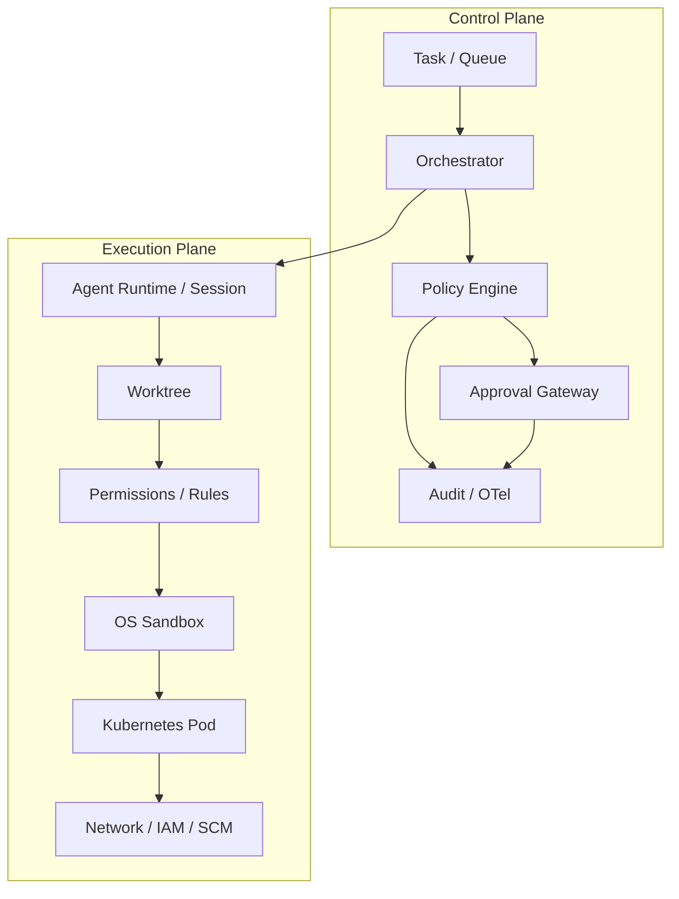
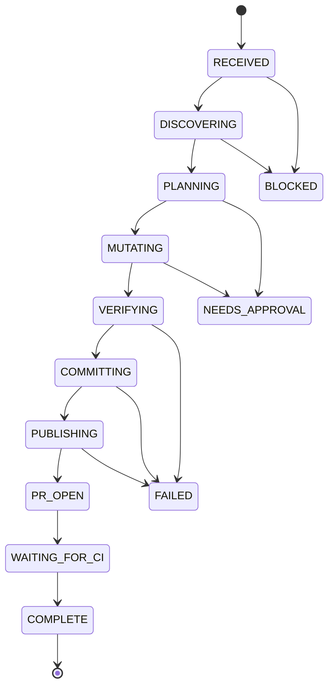
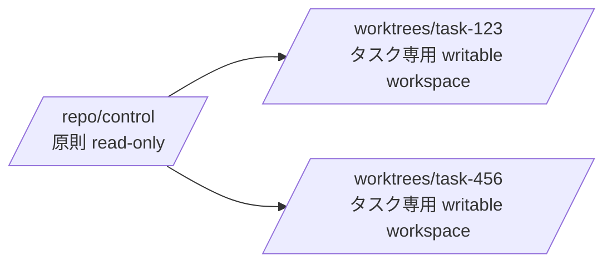

[← README](../../README.ja.md) | [English](../01-architecture.md) | [次: 設計原則 →](02-design-principles.md)

# リファレンスアーキテクチャ

## 1. 目的

自律型コーディングエージェントは、リポジトリ調査、隔離された worktree の作成、コード変更、検証、commit、feature branch への push、PR 作成までを、できる限り人間の介入なしで実行できることが望まれます。ただし、自律性は無制限な権限を意味しません。

## 2. Control Plane と Execution Plane

ポリシー判断と実行能力を分離します。

Control Plane は「何を許可するか」を決めます。Execution Plane は「技術的に何が可能か」を制限します。あるレイヤーが壊れても、別レイヤーの権限まで暗黙に拡大しない構造にします。

## 3. 状態機械として扱う

自律作業は自由形式のチャットループではなく、明示的な状態機械として扱います。

状態はモデルのコンテキスト外に永続化します。Context compaction、プロセス再起動、モデル切替、subagent 実行が発生しても、タスクの正本となる状態を失わないことが重要です。

## 4. Worktree モデル

変更を伴うタスクごとに 1 worktree を割り当てます。元の checkout は安定した control checkout として扱います。

推奨ルール:

- 調査は control checkout で実施してよい。
- 最初の変更前に `feature/<task-id>-<slug>` を作成する。
- 書き込みはすべてタスク worktree 内で行う。
- commit / push 前に repository / worktree / branch を再検証する。
- protected default branch への直接 push は許可しない。
- durable な状態と成果物を保存してから worktree を削除する。

## 5. Approval Gateway

承認は通常フローではなく、権限境界を越える場合の escalation path とします。

Policy Engine の基本結果は 3 種類です。

- `allow`: 制約内の通常操作
- `deny`: 不変条件に違反するため拒否
- `ask`: 正当な可能性はあるが外部承認が必要

承認要求には、task/session ID、actor、tool、command/action、target、repository、branch、reason、risk class、scope、expiry などの正規化された情報を含めます。

セッション全体を unrestricted mode に切り替えるより、単一の semantic action に対して短時間・狭い範囲の承認を与える方が安全です。

## 6. Completion Pipeline

モデルが「完了した」と発言すること自体は、完了の証拠になりません。決定的な Completion Gate で、例えば以下を確認します。

1. 期待する worktree / branch であること
2. 不要な dirty file / untracked artifact がないこと
3. 必須テストが成功していること
4. lint / type check が成功していること
5. 必要な commit が存在すること
6. remote feature branch が存在すること
7. PR が存在し、期待する base branch を向いていること
8. 必須 CI/check が成功していること
9. 必要な metadata / evidence が保存されていること

実装例は [`completion_gate.sh`](../../reference/scripts/completion_gate.sh) を参照してください。Stop hook からこの Gate を利用して premature completion を拒否できます。ただし retry loop が無限化しないよう、Orchestrator 側に circuit breaker を設けます。

## 7. Subagent

Subagent は context isolation や並列調査には有効ですが、セキュリティ境界ではありません。Subagent には明示的な scope と、可能なら縮小した権限を与えます。最終的な状態統合と global policy enforcement は親 Orchestrator が担います。

## 8. Kubernetes 配備の基準

最低限、以下を推奨します。

- non-root container
- privileged mode 禁止
- hostPath 禁止
- Docker / container runtime socket 非公開
- Linux capabilities を drop
- seccomp `RuntimeDefault`
- 可能な範囲で read-only root filesystem
- ephemeral task workspace
- resource requests / limits
- default-deny NetworkPolicy + 明示的 egress path
- static cloud key ではなく workload identity
- repository-scoped / short-lived SCM credential

リファレンス: [`agent-pod.yaml`](../../reference/kubernetes/agent-pod.yaml) / [`network-policy.yaml`](../../reference/kubernetes/network-policy.yaml)

Agent 内蔵 sandbox と Pod isolation は競合するのではなく補完関係です。Pod は host/process/resource isolation、Agent Sandbox は tool execution 単位の filesystem/network capability boundary を担います。

---

[← README](../../README.ja.md) | [English](../01-architecture.md) | [次: 設計原則 →](02-design-principles.md)
