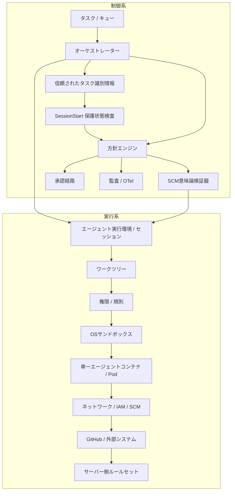
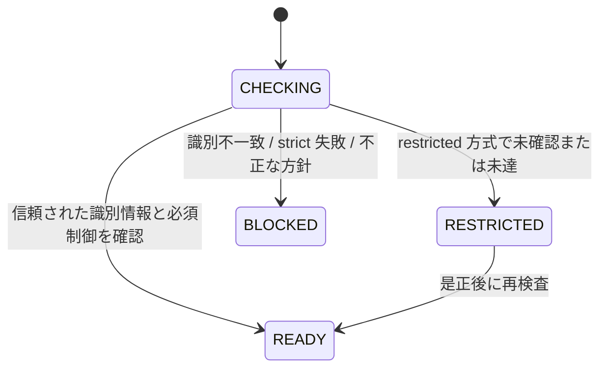
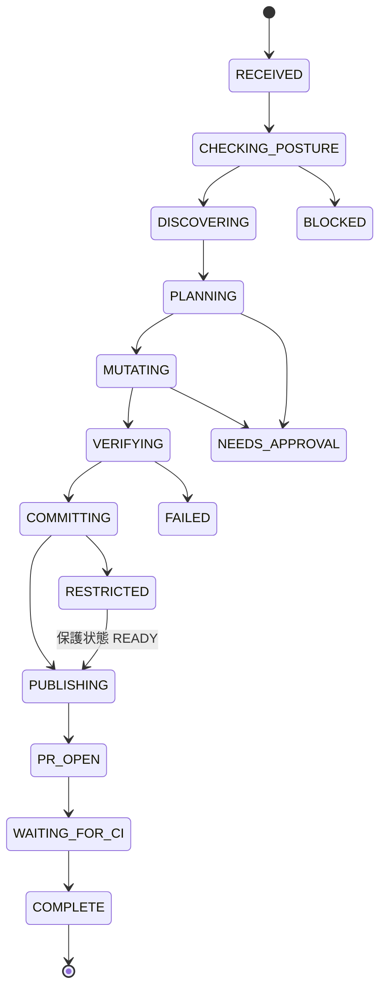
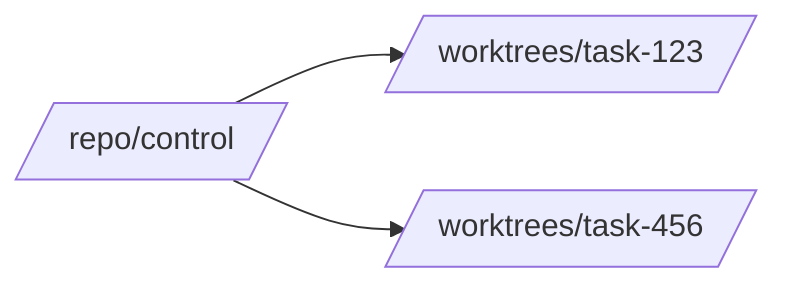

[← README](../../README.ja.md) | [English](../01-architecture.md) | [次: 設計原則 →](02-design-principles.md)

# 参照アーキテクチャ

## 1. 目的

自律型のコーディングエージェントが、リポジトリ調査、ワークツリー作成、コード変更、検証、コミット、機能ブランチの公開、プルリクエスト作成までを、できる限り人間の介入なしで実行できることを目指す。

ただし、自律性は無制限な権限を意味しない。配備構成は、脅威モデルが許す範囲でできるだけ単純に保つ。

## 2. 制御系と実行系



制御系は「何を許可するか」を決め、実行系は「技術的に何が可能か」の能力境界を提供する。信頼された起動処理やオーケストレーターの状態がタスク識別情報を確立し、リポジトリ内設定は追加要件を定義できるが、権威的なタスク識別情報を再定義できない。リポジトリ保護状態の検査は、外部の安全前提が現在も成立しているかを確認する。

本番環境の方針・保証コードは、エージェントが変更可能なワークスペースの外にある信頼ルートから実行する。リポジトリ内の同等ファイルは参照・開発用であり、本番環境の信頼の起点にはしない。

## 3. 変更操作前のリポジトリ保護状態

`SessionStart` でリポジトリを特定し、`AGENT_HARNESS_EXPECTED_REPOSITORY` と比較し、信頼された最小保護状態を適用してGitHub側の制御を評価する。各検査結果は `pass` / `fail` / `unknown` に正規化し、`READY` / `RESTRICTED` / `BLOCKED` を導出する。



`RESTRICTED` では、リポジトリ調査、ソース編集、テスト、ローカルコミットを継続できるが、正規形の `git push` や `gh pr create` など、ハーネスが観測する直接の遠隔変更は拒否する。`BLOCKED` では、フック境界で観測可能な変更操作を拒否する。

保護状態はセッション単位で有効期限付きキャッシュに保存し、現在のリポジトリが変わった場合や、古い状態のまま遠隔の信頼境界を越えようとした場合に再検査する。

`.agent-harness/security.json` がない場合は組み込みの `restricted` 標準値を使用し、明示的な方針が不正な場合は `BLOCKED` とする。リポジトリ内の `mode: warn` だけでは、信頼された最小保護状態の標準値 `restricted` を弱められない。対話用途で弱める場合のみ、信頼された起動処理が明示的に最小値を変更する。

## 4. 正規形の直接SCM公開

任意のシェル構文やGit参照指定を安全だと推測しない。**フック境界で観測可能な、エージェントが直接発行する公開操作**について、自律経路を次の2形式に限定する。

```bash
git push
git push --set-upstream origin HEAD
```

意味論検証器は、保護状態が `READY` であること、現在のブランチ、GitHubから取得した既定ブランチ、`origin`、検査済みリポジトリ識別、上流ブランチを確認する。任意の遠隔リポジトリ、出力先参照指定、タグ、削除・強制形式、Git設定の上書きは、直接の自律公開経路から外す。直接の `gh pr create` では、リポジトリ、作業元ブランチ、基準ブランチの上書きを禁止する。

`&&`、`||`、`;`、パイプ、リダイレクト、改行、コマンド置換などの複合シェル構文も自律許可対象外とする。読み取り専用コマンドの後ろに変更操作を隠せないようにし、シェル解析器の複雑さをハーネスへ持ち込まない。詳細は [DL-013](decisions/DL-013-canonical-scm-publication.md) を参照する。

これは、ハーネスが観測できる直接操作に対する意味論的契約である。テスト実行器などの許可済みプログラムが、内部で別プロセスを起動したり、二次的なSCM操作やネットワーク操作を行ったりできないことまでは保証しない。その可能性があっても成立しなければならない重要な外部不変条件は、下位の能力制御、最小権限のIAM / SCM認可、権威的なサーバー側方針によって守る。詳細は [DL-016](decisions/DL-016-semantic-policy-is-not-complete-mediation.md) を参照する。

## 5. 状態遷移



権威的なタスク状態はモデル文脈の外に保持する。文脈圧縮、プロセス再起動、モデル切り替え、サブエージェント実行によってセキュリティ状態や作業状態を失わないようにする。

## 6. ワークツリーモデル

変更を伴うタスクごとに1つのワークツリーを使い、元のチェックアウトは安定した制御用チェックアウトとして扱う。



コミットや直接の遠隔公開前に、現在のリポジトリ、ワークツリー、ブランチを検証する。GitHubから取得した既定ブランチへの直接プッシュを、ハーネスが承認する経路には含めない。

異なるリポジトリへセッションが移動した場合は保護状態キャッシュを再評価し、同一リポジトリ内のワークツリー移動は継続して対応する。

## 7. 認証情報と権限モデル

基準構成は **1 Pod / 1エージェントコンテナ** とする。具体的な脅威モデルが要求しない限り、認証情報を隠すことだけを目的にSCM仲介サービス、サイドカー、コマンド差し替えを導入しない。

サンドボックスとローカル方針は認証情報への露出を低減するが、認証情報の侵害は起こり得る故障形態とする。短寿命・リポジトリ限定の認証情報、最小権限のGitHub App / IAM、サーバー側リポジトリ規則によって影響範囲を制限する。

同じ下位制御は、リポジトリ管理下の子プロセスがローカルの意味論的可視性を迂回した場合でも有効でなければならない。詳細は [DL-011](decisions/DL-011-sandbox-first-credential-isolation.md) と [DL-016](decisions/DL-016-semantic-policy-is-not-complete-mediation.md) を参照する。

## 8. 承認経路

`allow` は範囲を限定した通常操作、`deny` は不変条件への違反、`ask` は外部承認が必要な操作を表す。セッション全体を無制限状態にするのではなく、単一の意味論的操作へ短時間かつ狭い範囲の承認を与える。

複合シェルや正規形ではない直接の遠隔公開は、安全と推測せず自律経路から外す。

## 9. 完了判定

モデルが「完了した」と発言すること自体は根拠にならない。決定的な判定によって、期待するワークツリー / ブランチ、必須テスト、静的検査、型検査、コミット、プルリクエスト、CI状態など、タスク固有の不変条件を確認する。Stopフックからこの判定を利用できるが、再試行回数、時間、ツール呼び出し数、費用の上限はオーケストレーター側にも持たせる。

テストやビルドコマンドの成功は、それが直接確立する完了条件に対する根拠でしかない。内部のすべての子プロセスや副作用が意味論的に仲介されたことの根拠にはしない。

## 10. Kubernetes配備の基準構成

脅威モデルが要求しない限り、最小の安全な基準構成を採用する。

- 1 Pod / 1エージェントコンテナ
- 本番ハーネスコードを可変ワークスペースの外にある信頼された読み取り専用ルートへ配置
- 非root、特権実行禁止、`hostPath` / 実行環境ソケット禁止
- Linux能力を削除し、seccomp `RuntimeDefault` を使用
- 可能ならルートファイルシステムを読み取り専用にする
- 一時的なタスクワークスペースと明示的な資源上限
- 配備環境に応じたネットワーク制御
- 短寿命・最小権限のクラウド / SCM認証情報
- リポジトリ内設定の外から信頼されたタスク識別情報を供給
- GitHubルールセット / ブランチ保護を権威的なSCM強制とする

参照: [`agent-pod.yaml`](../../reference/kubernetes/agent-pod.yaml) / [`network-policy.yaml`](../../reference/kubernetes/network-policy.yaml)

---

[← README](../../README.ja.md) | [English](../01-architecture.md) | [次: 設計原則 →](02-design-principles.md)
