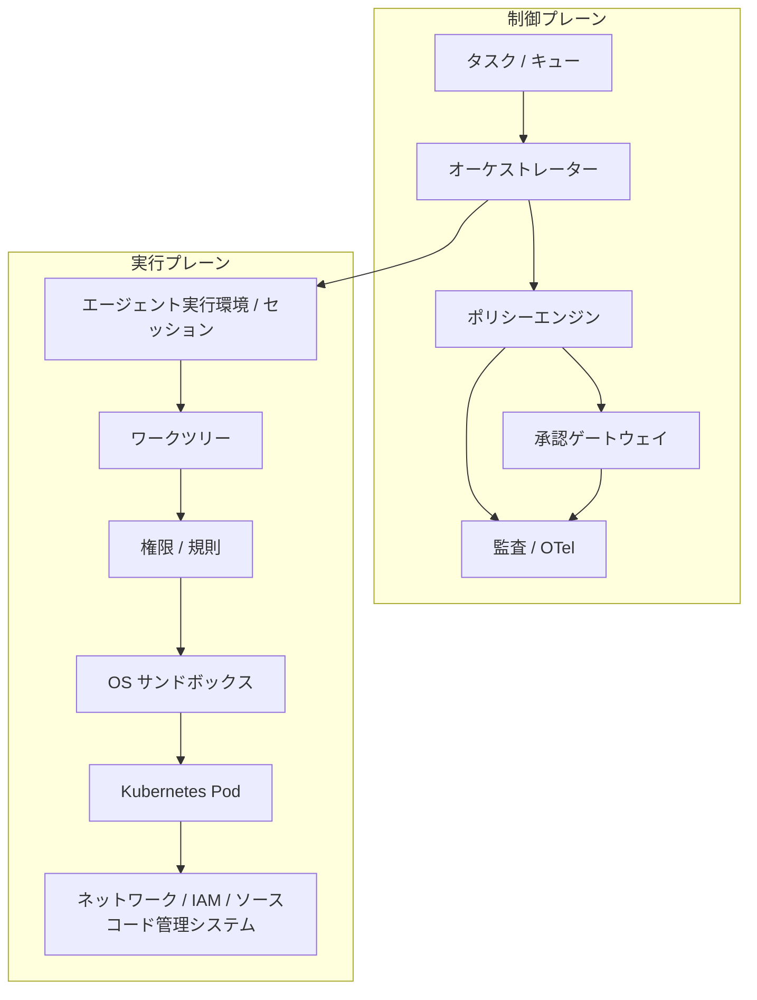
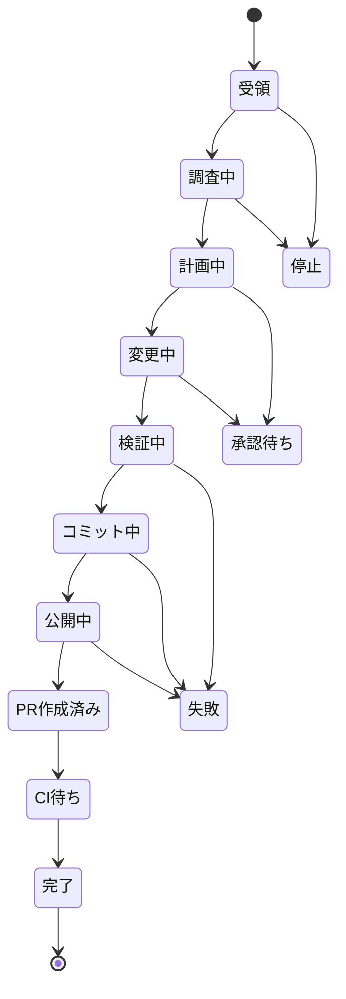
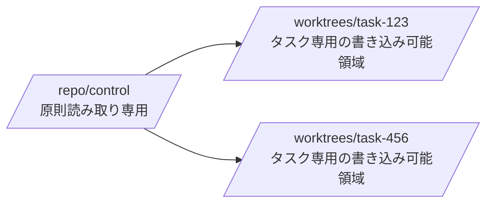

[← README](../../README.ja.md) | [English](../01-architecture.md) | [次: 設計原則 →](02-design-principles.md)

# リファレンスアーキテクチャ

## 1. 目的

自律型コーディングエージェントは、リポジトリ調査、隔離されたワークツリーの作成、コード変更、検証、コミット、機能ブランチへの push、PR 作成までを、できる限り人間の介入なしで実行できることが望まれます。ただし、自律性は無制限な権限を意味しません。

## 2. 制御プレーンと実行プレーン

ポリシー判断と実行能力を分離します。

制御プレーンは「何を許可するか」を決めます。実行プレーンは「技術的に何が可能か」を制限します。あるレイヤーが壊れても、別レイヤーの権限まで暗黙に拡大しない構造にします。

## 3. 状態機械として扱う

自律作業は自由形式のチャットループではなく、明示的な状態機械として扱います。

状態はモデルのコンテキスト外に永続化します。コンテキスト圧縮、プロセス再起動、モデル切替、サブエージェント実行が発生しても、タスクの正本となる状態を失わないことが重要です。

## 4. ワークツリーモデル

変更を伴うタスクごとに 1 つのワークツリーを割り当てます。元のチェックアウトは安定した制御用チェックアウトとして扱います。

推奨ルール:

- 調査は制御用チェックアウトで実施してよい。
- 最初の変更前に `feature/<task-id>-<slug>` を作成する。
- 書き込みはすべてタスク用ワークツリー内で行う。
- コミット / push 前にリポジトリ / ワークツリー / ブランチを再検証する。
- 保護された既定ブランチへの直接 push は許可しない。
- 永続的な状態と成果物を保存してからワークツリーを削除する。

## 5. 承認ゲートウェイ

承認は通常フローではなく、権限境界を越える場合の権限拡大経路とします。

ポリシーエンジンの基本結果は 3 種類です。

- `allow`: 制約内の通常操作
- `deny`: 不変条件に違反するため拒否
- `ask`: 正当な可能性はあるが外部承認が必要

承認要求には、タスク / セッション ID、主体、ツール、コマンド / 操作、対象、リポジトリ、ブランチ、理由、危険度、適用範囲、有効期限などの正規化された情報を含めます。

セッション全体を無制限モードに切り替えるより、単一の意味論的操作に対して短時間・狭い範囲の承認を与える方が安全です。

## 6. 完了処理

モデルが「完了した」と発言すること自体は、完了の証拠になりません。決定的な完了ゲートで、例えば以下を確認します。

1. 期待するワークツリー / ブランチであること
2. 不要な未反映ファイル / 未追跡成果物がないこと
3. 必須テストが成功していること
4. リント / 型検査が成功していること
5. 必要なコミットが存在すること
6. リモートの機能ブランチが存在すること
7. PR が存在し、期待するベースブランチを向いていること
8. 必須 CI / 検査が成功していること
9. 必要なメタデータ / 根拠が保存されていること

実装例は [`completion_gate.sh`](../../reference/scripts/completion_gate.sh) を参照してください。停止フックからこのゲートを利用して早すぎる完了を拒否できます。ただし再試行ループが無限化しないよう、オーケストレーター側に遮断機構を設けます。

## 7. サブエージェント

サブエージェントはコンテキスト分離や並列調査には有効ですが、セキュリティ境界ではありません。サブエージェントには明示的な適用範囲と、可能なら縮小した権限を与えます。最終的な状態統合と全体のポリシー強制は親オーケストレーターが担います。

## 8. Kubernetes 配備の基準

最低限、以下を推奨します。

- 非 root コンテナ
- 特権モード禁止
- hostPath 禁止
- Docker / コンテナ実行環境のソケットを非公開
- Linux capability を破棄
- seccomp `RuntimeDefault`
- 可能な範囲で読み取り専用のルートファイルシステム
- 一時的なタスク用ワークスペース
- リソース要求 / 上限
- 既定拒否の NetworkPolicy + 明示的な外向き通信経路
- 固定クラウドキーではなくワークロードアイデンティティ
- リポジトリに限定した短期のソースコード管理システム用認証情報

リファレンス: [`agent-pod.yaml`](../../reference/kubernetes/agent-pod.yaml) / [`network-policy.yaml`](../../reference/kubernetes/network-policy.yaml)

エージェント内蔵サンドボックスと Pod 分離は競合するのではなく補完関係です。Pod はホスト / プロセス / リソースの分離、エージェントサンドボックスはツール実行単位のファイルシステム / ネットワーク能力境界を担います。

---

[← README](../../README.ja.md) | [English](../01-architecture.md) | [次: 設計原則 →](02-design-principles.md)
