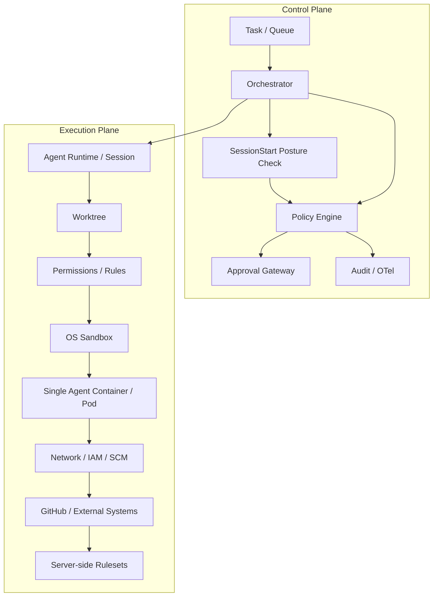
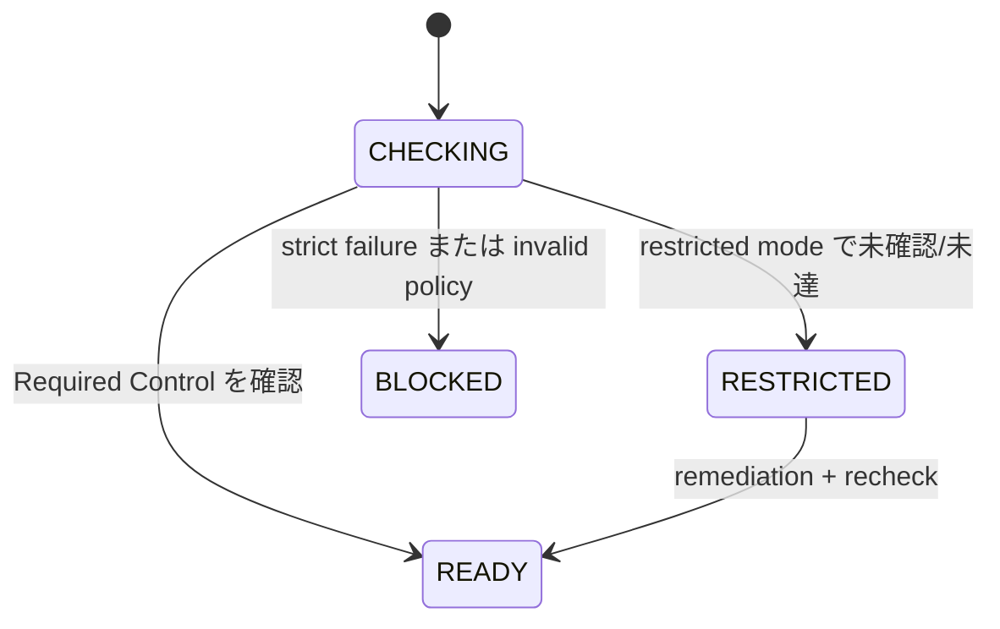
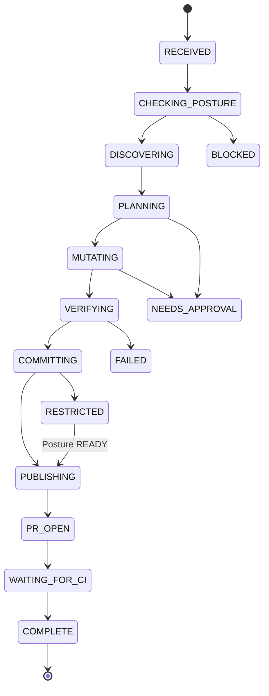
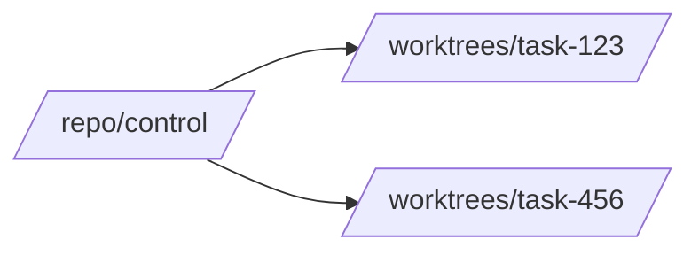

[← README](../../README.ja.md) | [English](../01-architecture.md) | [次: 設計原則 →](02-design-principles.md)

# リファレンスアーキテクチャ

## 1. 目的

自律型 Coding Agent は、Repository 調査、Worktree 作成、Code 変更、検証、Commit、Feature Branch Push、PR 作成までをできる限り人間の介入なしで実行できることを目指します。ただし自律性は無制限な Authority を意味せず、Deployment は Threat Model が許す範囲でできるだけ単純に保ちます。

## 2. Control Plane と Execution Plane

Control Plane は「何を許可するか」、Execution Plane は「技術的に何が可能か」を制御します。Repository Posture は外部 Security Assumption が現在も成立しているかを検出します。あるレイヤーが壊れても、別レイヤーの Authority を暗黙に獲得できないようにします。

## 3. Mutation 前の Repository Posture

`SessionStart` で Repository を特定し、GitHub-side Control を評価します。各 Check は `pass` / `fail` / `unknown` に正規化し、`READY` / `RESTRICTED` / `BLOCKED` を導出します。

`RESTRICTED` では Repository 調査、Source Edit、Test、Local Commit を継続できますが、`git push` や `gh pr create` などの Remote Mutation は deny します。`BLOCKED` では mutation を deny します。Posture は Session 単位で TTL 付き Cache に保存し、Active Repository が変わった場合や stale な状態で Remote Trust Boundary を越えようとした場合に再検証します。

`.agent-harness/security.json` がない場合は built-in `restricted` default を利用し、明示的 Policy が invalid な場合は `BLOCKED` とします。

## 4. State Machine

Authoritative Task State は Model Context の外に保持します。Compaction、Process Restart、Model Switch、Subagent 実行で Security / Workflow State を失わないようにします。

## 5. Worktree Model

Mutable Task ごとに 1 Worktree を使い、Original Checkout は Stable Control Checkout として扱います。

Commit / Remote Publication 前に Active Repository / Worktree / Branch を検証します。Protected Default Branch への Direct Push は禁止します。異なる Repository へ Session が移動した場合は Posture Cache を再評価し、同一 Repository 内の Worktree 移動は継続してサポートします。

## 6. Credential / Authority Model

Baseline は **1 Pod / 1 Agent Container** です。具体的な Threat Model が要求しない限り、Credential を隠すだけの目的で SCM Broker、Sidecar、Command Shim を導入しません。

Sandbox / Local Policy は Credential Exposure を低減しますが、Credential Compromise は起こり得る Failure Mode とします。Short-lived / Repository-scoped Credential、Least-privilege GitHub App / IAM、Server-side Repository Rule で Blast Radius を制限します。詳細は [DL-011](decisions/DL-011-sandbox-first-credential-isolation.md) を参照してください。

## 7. Approval Gateway

`allow` は Bound された Routine Operation、`deny` は Invariant 違反、`ask` は External Authorization が必要な操作です。Session 全体を unrestricted mode にするより、単一 Semantic Action へ短時間・狭い Scope の承認を与えます。

## 8. Completion Pipeline

Model が「完了した」と発言することは証拠ではありません。Deterministic Gate で Worktree / Branch、Required Test、Lint / Type Check、Commit / PR / CI 等の Task-specific Invariant を確認します。Stop Hook から利用できますが、Retry / Time / Tool / Cost Circuit Breaker は Orchestrator に持たせます。

## 9. Kubernetes Deployment Baseline

Threat Model が要求しない限り、最小の Secure Baseline を採用します。

- 1 Pod / 1 Agent Container
- non-root、privileged 禁止、hostPath / runtime socket 禁止
- Linux Capability drop、seccomp `RuntimeDefault`
- 可能なら read-only root filesystem
- ephemeral task workspace と明示的 Resource Limit
- Environment に応じた Network Control
- Short-lived / Least-privilege Cloud / SCM Credential
- GitHub Rulesets / Branch Protection を Authoritative SCM Enforcement とする

リファレンス: [`agent-pod.yaml`](../../reference/kubernetes/agent-pod.yaml) / [`network-policy.yaml`](../../reference/kubernetes/network-policy.yaml)

---

[← README](../../README.ja.md) | [English](../01-architecture.md) | [次: 設計原則 →](02-design-principles.md)
