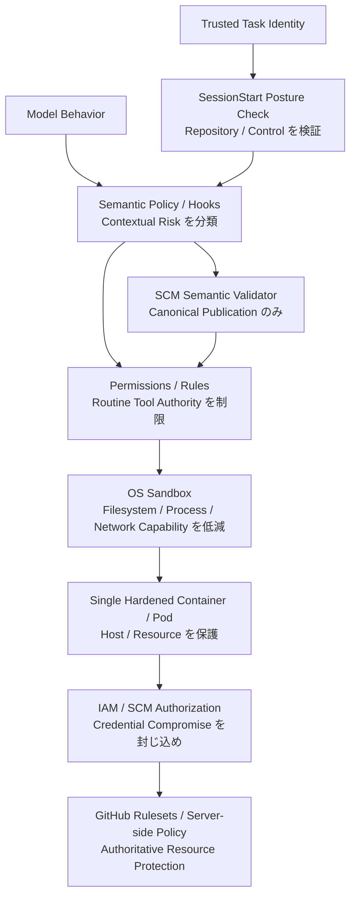

[← 設計原則](02-design-principles.md) | [English](../03-security-model.md) | [次: 導入ガイド →](04-adoption-guide.md)

# セキュリティモデル

## Threat Model

Agent が Source / Issue / Web / Tool Output の悪意ある指示、Hallucinated / Destructive Command、Compromised Dependency、Credential 誤露出、Over-privileged MCP、誤った Repository / Worktree、Shell Command Ambiguity、Runaway Retry、Compromised Local Policy、Cloud Metadata / Internal Endpoint へのアクセス試行に遭遇する前提で設計します。

さらに **Credential Compromise は起こり得る**ものとします。GitHub Credential が Agent から見えてしまっても、被害範囲を限定できる構造が必要です。

## Defense in Depth と責務分離



単一レイヤーに全 Failure Mode を背負わせません。Sandbox の責務を「Credential が絶対に漏れないこと」にまで拡張せず、Hook に Authoritative Repository Identity や Server-side Branch Policy の責務を持たせません。

## Trusted Computing Base

TCB は小さく保ちます。Baseline には Orchestrator / Trusted Launcher、Policy Engine、Posture Checker、SCM Semantic Validator、Sandbox Implementation、Workload Isolation、Credential Issuance / Authorization、External Server-side Policy が含まれます。Agent-generated Code と Model Reasoning は Untrusted です。

Credential を隠すだけのための Broker / Sidecar は Default TCB から除外します。Trusted Component と Operational State を増やすためです。

## Trusted Task Identity

Repository は Task Identity の一部です。Trusted Launcher が `AGENT_HARNESS_EXPECTED_REPOSITORY` を設定し、Repository-local Config はこれを Authoritative に置き換えられません。Trusted Identity 未設定は `UNKNOWN` となり、Default Minimum の `restricted` では Remote Publish を許可しません。不一致は `BLOCKED` です。

Trusted Launcher は `AGENT_HARNESS_MINIMUM_POSTURE_MODE` も所有し、Default は `restricted` とします。Repository-local `mode: warn` だけではこの Minimum を弱められません。Repository 自身が、自身への Publish 可否 Policy を弱められないようにするためです。

## Repository Posture

SessionStart で Trusted Repository Identity、Default Branch、Required Pull Request、Force-push Prevention、Required Status Checks 等を GitHub から取得可能な範囲で検証します。

Check は3値です。

- `pass`: Control を確認済み
- `fail`: Control が未達であることを確認
- `unknown`: 現在確認不能

`unknown` を勝手に `pass` に変換しません。Effective Posture Mode が block / restrict / warn を決定します。Trusted Repository Mismatch は Mode に関係なく `BLOCKED` です。詳細は [DL-012](decisions/DL-012-sessionstart-repository-posture.md) を参照してください。

## Credential

Short-lived / Repository-scoped / Least-privilege Credential を優先します。Sandbox の deny path、Environment Hygiene、`gh auth token` や Credential File Read を拒否する Semantic Policy で露出を低減します。

ただし Security Invariant は「Agent が Credential を絶対に観測できない」ではありません。

> Credential Compromise が unrestricted Repository / Organization Authority を意味してはいけない。

Narrow GitHub App / IAM Permission、短い Lifetime、Server-side Ruleset / Branch Protection、Audit / Revoke で Compromise を封じ込めます。Coding に不要な Production Credential は Agent Pod に置きません。

## Sandbox

Sandbox は通常の Filesystem / Process / Network Capability と Secret Exposure を狭めます。Defense Layer ではありますが、唯一の Authority Boundary ではありません。Vendor-native Credential Masking が安定して利用できる場合は追加 Hardening として使いますが、対応しない Vendor に同等機能を再現するためだけに Privileged Broker Infrastructure は追加しません。

## Network

Network Control は Deployment Threat Model に合わせます。Internal Service や Cloud Metadata への露出がある環境では Default-deny Egress が有効です。一方で native `git` / `gh` から GitHub への通信は意図的に許可する場合があります。Network を広く許す場合は Least-privilege Credential と Strong Server-side SCM Policy で補完します。

## Git / Shell / SCM Publication

Feature Branch の Local Routine Work は自律化しやすくしますが、Remote Publication は Arbitrary Shell Access より狭くします。

Autonomous な Git Push は次の2形式だけです。

```bash
git push
git push --set-upstream origin HEAD
```

SCM Semantic Validator は `READY` Posture、Current Branch が GitHub-reported Default Branch でないこと、`origin` が Checked Repository を指すこと、単純な `git push` では Upstream が期待値であることを確認します。Arbitrary Remote、Refspec、Tag、Delete / Force、Config Override は Autonomous Path 外です。

`gh pr create` では Repository / Head Branch / Base Branch の Override を禁止します。`&&`, `||`, `;`, Pipe, Redirection, Newline, Command Substitution 等の Compound Shell も Autonomous Allowlist 外です。Prefix Regex で先頭だけを見て Read-only と誤判定しないためです。詳細は [DL-013](decisions/DL-013-canonical-scm-publication.md) を参照してください。

`RESTRICTED` では Local Development を許可しながら Remote Publication を deny、`BLOCKED` では Mutation を deny します。Local Validator や Credential が破られても、GitHub Server-side Rule が最終 Enforcement を担います。

## Hook Failure Semantics

Hook は Semantic Policy に有効ですが Failure Behavior は Vendor / Version で異なります。Hook Timeout / Crash / Malformed Output が起きても IAM Scope / GitHub-side Protection を破れないようにします。SessionStart Posture Check は Fail-fast / Context、PreToolUse は Semantic Enforcement、GitHub-side Rule は Authoritative Enforcement という分担です。

## Audit

Task / Session / Turn ID、Trusted Expected Repository、Runtime / Version、Policy Version、Repository Posture と各 Check、Tool / Action、Semantic Validation Result、allow / deny / ask、Approval、Execution Result、Commit / PR / CI、Sandbox / Network Denial を Structured Event として記録します。Raw Secret は記録しません。

---

[← 設計原則](02-design-principles.md) | [English](../03-security-model.md) | [次: 導入ガイド →](04-adoption-guide.md)
