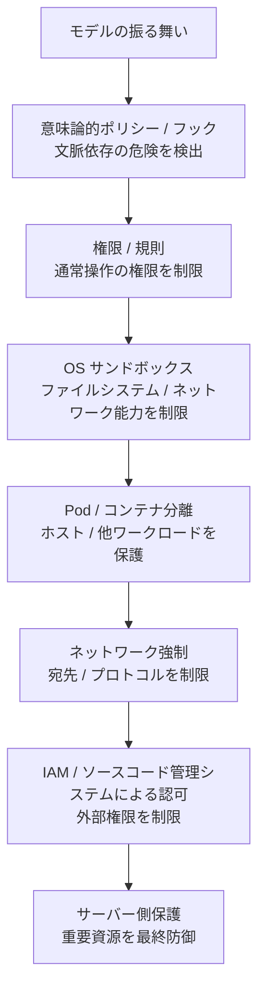
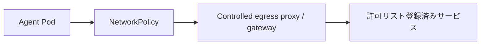

[← 設計原則](02-design-principles.md) | [English](../03-security-model.md) | [次: 導入ガイド →](04-adoption-guide.md)

# セキュリティモデル

## 脅威モデル

エージェントが以下に遭遇する前提で設計します。

- ソースコード、Issue、Web ページ、文書、ツール出力に埋め込まれた悪意ある指示
- 幻覚や破壊的なコマンド
- 依存関係の導入スクリプトや侵害されたパッケージ
- 認証情報の誤露出
- 悪意がある、または過大な権限を持つ MCP ツール
- リポジトリ / ワークツリー / ブランチの誤選択
- 暴走する再試行ループ
- 侵害されたフック / ポリシーコード
- クラウドメタデータや内部の制御プレーン接続先へのアクセス試行

## 多層防御

単一レイヤーですべての失敗形態を防ぐことは想定しません。各境界の責務は [リファレンスアーキテクチャ](01-architecture.md) を参照してください。

## 信頼されたコンピューティング基盤

TCB は小さく保ちます。少なくともオーケストレーター、ポリシーエンジン、サンドボックス実装、ワークロード分離、認証情報仲介、外部認可システムが含まれます。エージェント生成コードとモデルの推論は信頼されたコンポーネントではありません。

## 認証情報

ワークロードアイデンティティと短期認証情報を優先します。広範な個人認証情報をエージェントのホームディレクトリにマウントしません。可能であれば、通常のファイルシステム読み取りから認証情報を分離し、必要なプロセス / プロキシにだけ渡します。

リポジトリ認証情報は対象リポジトリと必要操作だけに限定します。本番認証情報は通常、コーディングエージェントの Pod に存在させるべきではありません。

## ネットワーク

エージェント実行環境の外側にあるネットワーク制御を強制境界とします。

クラウドメタデータ接続先、クラスタ管理接続先、無関係な内部ネットワークは遮断します。エージェント内蔵のドメインフィルタリングは多層防御として利用し、唯一のネットワーク境界にはしません。実装例は [`network-policy.yaml`](../../reference/kubernetes/network-policy.yaml) を参照してください。

## MCP / 外部ツール

MCP はエージェントの権限を拡張するため、脅威モデルに含めます。次の組み合わせを推奨します。

1. MCP ツールの権限 / 規則
2. 意味論的な PreToolUse ポリシー
3. MCP サーバーの認証 / 認可
4. 最小権限のサービスアカウント / IAM
5. 監査ログ

本番データへのアクセスには読み取り専用サービスアカウントを優先します。汎用管理 MCP ツールを自律セッションに公開することは避けます。

## Git / ソースコード管理システム

`status`、`diff`、`log`、機能ブランチのコミット / push、PR 作成などの通常操作は許可しやすくします。一方、強制 push、保護ブランチ変更、タグ / リリース作成、ワークフロー変更、マージなどは拒否または承認対象にします。サンプル分類は [`policy.example.json`](../../reference/policies/policy.example.json) を参照してください。

最終的な権威はソースコード管理システムのサーバー側規則です。エージェントの認証情報が規則セットやブランチ保護を迂回できてはいけません。

## フック失敗時の意味論

フックは意味論的ポリシーに有効ですが、失敗時の動作は製品やバージョンによって異なります。フックのタイムアウト / 異常終了 / 不正出力後に実行が継続する可能性がある場合、そのフックはフェイルオープンとして扱います。重要な不変条件は、フック不在でも有効なサンドボックス、IAM、サーバー側制御で守ります。

## 監査

最低限、以下を記録します。

- タスク / セッション / ターンの識別情報
- モデル / 実行環境 / バージョン
- ポリシーバージョン
- ツール / 操作と正規化された対象
- 許可 / 拒否 / 承認要求の判断と理由
- 承認主体 / 適用範囲 / 有効期限
- 実行結果
- コミット / PR / CI の識別情報
- サンドボックス / ネットワークによる拒否

生の秘密情報はログに記録しません。OTel や集中分析基盤に送れる構造化イベントを推奨します。

---

[← 設計原則](02-design-principles.md) | [English](../03-security-model.md) | [次: 導入ガイド →](04-adoption-guide.md)
