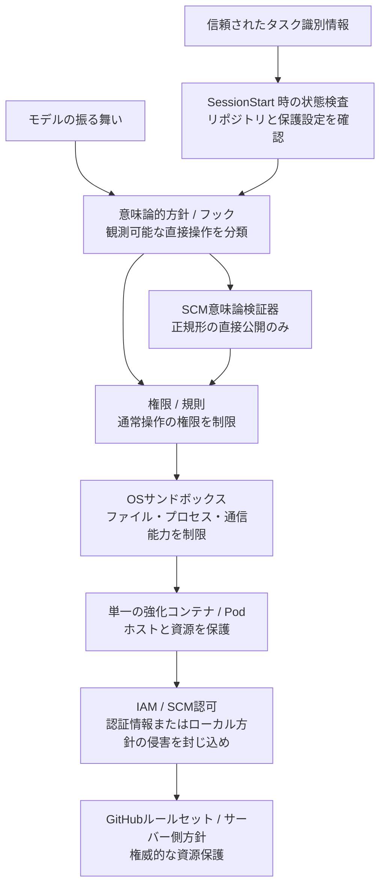

[← 設計原則](02-design-principles.md) | [English](../03-security-model.md) | [次: 導入ガイド →](04-adoption-guide.md)

# セキュリティモデル

## 脅威モデル

エージェントは、ソースコード、課題、Web、ツール出力に含まれる悪意ある指示、誤生成された破壊的コマンド、侵害された依存関係、認証情報の誤露出、過剰な権限を持つMCPツール、誤ったリポジトリやワークツリーの選択、シェルコマンドの曖昧性、無制限な再試行、侵害されたローカル方針コード、クラウドのメタデータや内部制御系へのアクセス試行に遭遇し得るものとする。

さらに、**認証情報の侵害は起こり得る**ものとする。GitHubの認証情報がエージェントから見えてしまっても、被害範囲を限定できる構造が必要である。

また、許可されたコマンドが、リポジトリ管理下の任意コードを内部で実行し得ることも前提とする。フックが `pytest`、`npm test` などの外側の呼び出しを観測できても、そのコードが内部で起動するすべての子プロセス、ネットワーク要求、二次的なSCM操作まで観測できるとは限らない。

## 防御の多層化と責務分離



単一の層にすべての故障形態を背負わせない。サンドボックスの責務を「認証情報が絶対に漏れないこと」にまで拡張せず、フックに権威的なリポジトリ識別、サーバー側ブランチ方針、任意の子プロセスに対する完全仲介の責務を持たせない。

## 信頼計算基盤

信頼計算基盤は小さく保つ。基準構成には、オーケストレーター / 信頼された起動処理、信頼ルート上の方針エンジン、リポジトリ状態検査器、SCM意味論検証器、サンドボックス実装、ワークロード隔離、認証情報の発行・認可機構、外部のサーバー側方針を含む。エージェントが生成したコードとモデルの推論は信頼しない。

本番環境の方針、状態検査、SCM検証、完了判定の実装は、エージェントが変更可能なワークスペースの外にある `AGENT_HARNESS_TRUSTED_ROOT` から実行する。リポジトリ内の同等ファイルは参照実装・開発用であり、本番環境の信頼の起点にはしない。詳細は [DL-015](decisions/DL-015-trusted-harness-boundary.md) を参照する。

認証情報を隠すことだけを目的とした仲介サービスやサイドカーは、標準の信頼計算基盤には含めない。権限を持つコードと運用状態を増やすためである。

## 信頼されたタスク識別情報

リポジトリはタスク識別情報の一部である。信頼された起動処理が `AGENT_HARNESS_EXPECTED_REPOSITORY` を設定し、リポジトリ内の設定はこれを権威的に置き換えられない。信頼された識別情報が未設定の場合は `UNKNOWN` とし、標準の最小状態 `restricted` では遠隔公開を許可しない。不一致は `BLOCKED` とする。

信頼された起動処理は `AGENT_HARNESS_MINIMUM_POSTURE_MODE` も所有し、標準値を `restricted` とする。リポジトリ内の `mode: warn` だけではこの最小状態を弱められない。リポジトリ自身が、自身への公開可否を決める方針を弱体化できないようにするためである。

## リポジトリ保護状態

SessionStartで、信頼されたリポジトリ識別、既定ブランチ、プルリクエスト必須、強制プッシュ防止、必須状態検査など、公開方針が依存する条件をGitHubから取得可能な範囲で確認する。

検査結果は3値とする。

- `pass`: 制御が満たされていることを確認済み
- `fail`: 制御が満たされていないことを確認済み
- `unknown`: 現在は確認不能

`unknown` を暗黙に `pass` へ変換しない。有効な保護状態の運用方式が、停止・制限・警告のいずれにするかを決める。信頼されたリポジトリ識別の不一致は運用方式に関係なく `BLOCKED` とする。詳細は [DL-012](decisions/DL-012-sessionstart-repository-posture.md) を参照する。

## 認証情報

短寿命・リポジトリ限定・最小権限の認証情報を優先する。サンドボックスの読み取り拒否、環境変数の衛生管理、`gh auth token` や既知の認証情報ファイル読み取りを拒否する意味論的方針によって露出を減らす。

ただし、セキュリティ上の不変条件は「エージェントが認証情報を絶対に観測できないこと」ではない。

> 認証情報が侵害されても、無制限のリポジトリ権限や組織権限を得られてはならない。

限定されたGitHub App / IAM権限、短い有効期間、サーバー側のブランチ保護・ルールセット、監査、失効によって侵害を封じ込める。開発作業に不要な本番認証情報は、通常エージェントPodへ配置しない。

## サンドボックス

サンドボックスは通常のファイル、プロセス、ネットワーク能力と秘密情報への露出を制限する。防御層ではあるが、唯一の権限境界ではない。ベンダーが提供する認証情報の秘匿機能を安定して利用できる場合は追加防御として使用してよいが、対応しないベンダーに同等機能を再現することだけを目的に権限を持つ仲介基盤を追加しない。

## ネットワーク

ネットワーク制御は配備先の脅威モデルに合わせる。内部サービスやクラウドのメタデータへ到達可能な環境では、送信通信を既定拒否にすることが有効である。一方、標準の `git` / `gh` からGitHubへの通信は意図的に許可する場合がある。通信範囲を広く許可する場合は、最小権限の認証情報と強いサーバー側SCM方針で補完する。

## Git・シェル・SCM公開

機能ブランチ上の通常のローカル作業は自律化しやすくするが、**フック境界で観測できる、エージェントが直接発行した遠隔公開操作**は、任意のシェル操作より狭くする。

自律実行を許可する直接のGit公開は次の2形式だけとする。

```bash
git push
git push --set-upstream origin HEAD
```

SCM意味論検証器は、保護状態が `READY` であること、現在のブランチがGitHubから取得した既定ブランチではないこと、`origin` が検査済みのリポジトリを指していること、単純な `git push` では上流ブランチが期待値であることを確認する。任意の遠隔リポジトリ、参照指定、タグ、削除・強制形式、設定上書きは、直接の自律公開経路から外す。

直接の `gh pr create` では、リポジトリ、作業元ブランチ、基準ブランチの上書きを禁止する。`&&`、`||`、`;`、パイプ、リダイレクト、改行、コマンド置換などを含む複合シェルも、自律許可対象外とする。先頭部分だけを正規表現で見て読み取り専用と誤判定することを防ぐためである。詳細は [DL-013](decisions/DL-013-canonical-scm-publication.md) を参照する。

この意味論的契約は、許可された実行ファイルが内部で二次的なSCM操作やネットワーク操作を実行できないことまでは保証しない。フックが提供する根拠は、エージェントが直接発行した操作に対する主張の範囲に限る。リポジトリ管理下の子プロセスがローカルの意味論的可視性を迂回しても、重要なリポジトリ権限はIAM / SCM権限範囲と権威的なGitHub側規則によって制約され続けなければならない。詳細は [DL-016](decisions/DL-016-semantic-policy-is-not-complete-mediation.md) を参照する。

`RESTRICTED` ではローカル開発を許可しつつ、ハーネスが観測する直接の遠隔公開を拒否する。`BLOCKED` ではフック境界で観測可能な変更操作を拒否する。ローカル検証器、子プロセス、認証情報のいずれかが侵害されても、GitHubのサーバー側規則を最終的な権威的強制として残す。

## フック障害時の意味

フックは意味論的方針には有効だが、障害時の挙動はベンダーやバージョンによって異なる。フックの時間切れ、異常終了、不正な出力が起きても、IAMの権限範囲やGitHub側の保護を破れないようにする。SessionStartの保護状態検査は早期検出と文脈提供、PreToolUseは観測可能な直接操作の意味論的制御、GitHub側規則は権威的な強制という責務分担とする。

同様に、許可されたコマンドが起動するすべての子プロセスをフックが観測できるとは仮定しない。

## 監査

タスク、セッション、ターンの識別子、信頼された期待リポジトリ、実行環境と版、方針の版、リポジトリ保護状態と各検査結果、ツールと操作、意味論検証結果、許可・拒否・承認要求、承認結果、実行結果、コミット・プルリクエスト・CI識別子、サンドボックスやネットワークによる拒否を構造化イベントとして記録する。生の秘密情報は記録しない。

監査イベントは「ハーネスが観測した内容」を表す。フックイベントが存在しないことを、子プロセスによる副作用が存在しなかった根拠として扱わない。

---

[← 設計原則](02-design-principles.md) | [English](../03-security-model.md) | [次: 導入ガイド →](04-adoption-guide.md)
