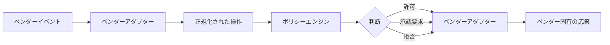

[← 導入ガイド](04-adoption-guide.md) | [English](../05-product-mapping.md) | [README →](../../README.ja.md)

# 製品マッピング

このプロジェクトでは、ベンダー非依存の内部モデルを採用します。各製品の機能をそのままアーキテクチャに持ち込むのではなく、共通の責務レイヤーへマッピングします。[リファレンスアーキテクチャ](01-architecture.md) と [設計原則](02-design-principles.md) も参照してください。

| 関心事 | Claude Code | OpenAI Codex | Devin CLI |
|---|---|---|---|
| 行動ガイダンス | CLAUDE.md / 規則 / スキル | AGENTS.md / スキル | AGENTS.md / 規則 / スキル |
| ライフサイクルポリシー | フック | フック | フック |
| 実行前セマンティックゲート | PreToolUse | PreToolUse | PreToolUse |
| 実行後検証 | PostToolUse | PostToolUse | PostToolUse |
| 承認介入 | PermissionRequest | PermissionRequest / 承認アーキテクチャ | PermissionRequest |
| 完了ゲート | Stop | Stop | Stop |
| 静的コマンド / ツールポリシー | Permissions | Rules / 承認ポリシー | Permissions |
| OS サンドボックス | Seatbelt / bubblewrap 系サンドボックス | Codex サンドボックス | OS サンドボックス |
| ネットワークポリシー | サンドボックスのドメイン制御 | サンドボックス / ネットワーク制御 | サンドボックスのドメイン制御。実運用前に現在の安定性を再確認 |
| 中央 / 企業ポリシー | 管理設定 | 管理設定 / 要件 | Team Settings |
| 観測可能性 | フック / テレメトリー統合 | OTel / エージェント固有イベント | フック / 企業向け分析 |
| ローカルからクラウドへの遷移 | 別ワークフローとして扱う | Codex クラウドアーキテクチャ | `/handoff` |

## Claude Code

公式ドキュメント: [Claude Code Hooks](https://code.claude.com/docs/en/hooks) / [Sandboxing](https://code.claude.com/docs/en/sandboxing)

Claude Code はライフサイクルフックの種類が多く、意味論的なオーケストレーションを細かく組み込みやすい製品です。一方で、フックコマンド自体を通常のエージェント用シェルコマンドと同じサンドボックスに守られていると仮定してはいけません。フックコードは信頼されたコードとして小さく、防御的に保ちます。

## Codex

公式ドキュメント: [OpenAI Codex documentation](https://developers.openai.com/codex/) / [Codex open-source repository](https://github.com/openai/codex)

Codex はサンドボックス、承認ポリシー、規則、管理設定、テレメトリーの責務分離が明確で、外部の Agent Harness を設計する際の参考になります。App Server を使う構成ではツール承認を構造化された制御プレーンイベントとして扱いやすくなります。ただしフック失敗時の意味論はバージョンごとに確認し、重要な不変条件は独立した境界で保護します。

## Devin CLI

公式ドキュメント: [Devin CLI Hooks](https://docs.devin.ai/cli/extensibility/hooks/overview) / [Permissions](https://docs.devin.ai/cli/reference/permissions)

Devin CLI は権限とサンドボックスの適用範囲の結びつきが強く、自律サンドボックスモードにより無人ワークロードを構成しやすい設計です。直接編集 / 書き込みツールの境界やネットワークフィルタリングの成熟度は周辺アーキテクチャで補完します。またローカルからクラウドへの引継ぎは別の信頼領域への遷移として扱います。

## 移植性の方針

内部では以下の流れに統一します。

現行の Go 実装は [`internal/policy/policy.go`](../../internal/policy/policy.go)、共通のベンダー写像は [`internal/vendor/adapter.go`](../../internal/vendor/adapter.go) を参照してください。

すべてのベンダー機能を完全に抽象化する必要はありません。組織側が所有すべきセキュリティ / オーケストレーションの意味論だけを正規化し、各製品固有の有用な機能はアダプターの背後に残します。

## 実装時の注意

各製品のフックスキーマ、判断フィールド、失敗時動作、サンドボックス能力は変化し得ます。アダプターはバージョンを認識できる構成にし、CI でスキーマ適合テストを実行できるようにすることを推奨します。特に本番導入前には、各製品の最新公式仕様と実動作を再検証してください。

---

[← 導入ガイド](04-adoption-guide.md) | [English](../05-product-mapping.md) | [README →](../../README.ja.md)
