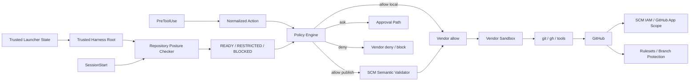

[← 製品マッピング](05-product-mapping.md) | [English](../06-vendor-harnesses.md) | [README →](../../README.ja.md)

# Vendor 別 Harness 実装

このリポジトリには Claude Code、OpenAI Codex、Devin CLI 向けの Reference Hook Wiring を実装しています。3 製品とも共通の deny-first Policy Engine、Repository Posture Checker、SCM Semantic Validator、Deterministic Completion Gate を利用します。Production では Executable Harness と Normative Policy を Agent-mutable Workspace の外にある Trusted Root から解決します。



## 実装ファイル

- [`.claude/settings.json`](../../.claude/settings.json) — Claude Code SessionStart / PreToolUse / Stop の Reference Hook Wiring と Sandbox Baseline
- [`.codex/hooks.json`](../../.codex/hooks.json) — Codex SessionStart / PreToolUse / Stop の Reference Hook Wiring
- [`.devin/hooks.v1.json`](../../.devin/hooks.v1.json) — Devin CLI SessionStart / PreToolUse / Stop の Reference Hook Wiring
- [`.devin/config.json`](../../.devin/config.json) — Devin CLI Static Permissions
- [`reference/launcher/trusted_hook.py`](../../reference/launcher/trusted_hook.py) — Trusted-root Hook Entrypoint
- [`reference/harness/`](../../reference/harness/) — Vendor Adapter / SCM Semantic Validation
- [`reference/posture/checker.py`](../../reference/posture/checker.py) — GitHub Repository Security Posture Checker
- [`reference/policies/repository-security.example.json`](../../reference/policies/repository-security.example.json) — Trusted Repository Posture Requirement 例
- [`reference/policies/policy.example.json`](../../reference/policies/policy.example.json) — Semantic Action Policy
- [`reference/launcher/preflight.py`](../../reference/launcher/preflight.py) — Launcher / CI 向け明示的 Preflight
- [`reference/kubernetes/agent-pod.yaml`](../../reference/kubernetes/agent-pod.yaml) — 1 Pod / 1 Container Baseline

## Deployment をシンプルに保つ

Default Architecture は **1 Pod / 1 Agent Container** とします。SCM Broker、Sidecar、`git` shim、`gh` shim は Baseline に含めません。Credential Exposure は Sandbox / Policy で低減し、Credential Compromise の Blast Radius は short-lived / repository-scoped credential、least-privilege GitHub App / IAM、GitHub-side Ruleset で独立して制限します。詳細は [DL-011](decisions/DL-011-sandbox-first-credential-isolation.md) を参照してください。

## Trusted Harness Boundary

Production Harness Implementation は、評価対象である Repository / Worktree から実行してはいけません。Trusted Launcher は次のような Root を設定します。

```bash
export AGENT_HARNESS_TRUSTED_ROOT=/opt/agent-harness
```

承認済み Harness Snapshot は Trusted Deployment Process によりこの Root へ Bake / Provision します。Reference Kubernetes Baseline では `/opt/agent-harness` を Container の Read-only Root Filesystem 上に置き、`/workspace` を Mutable Task Workspace とします。

Project-local Hook File は次を呼び出します。

```text
$AGENT_HARNESS_TRUSTED_ROOT/reference/launcher/trusted_hook.py
```

Wrapper は自分自身が設定された Trusted Root から実行されていることを確認し、同じ Root から Vendor Adapter、Semantic Policy、Repository Posture Policy を解決します。そのため `/workspace` 内の Git 操作や Source Edit だけでは、Production Verifier Implementation や Normative Policy を置き換えられません。

Repository-local の `.claude` / `.codex` / `.devin` File は Reference / Development Wiring であり、それ自体を独立した Production Authority Boundary とはみなしません。Vendor が Trusted / Managed Registration を提供する場合、Hook Registration 自体も Agent-writable Workspace の外にある Trusted Launcher / Managed Configuration から Provision します。Mutable Project-local Registration しか利用できない場合、Hook は Defense in Depth とし、Critical Invariant は Capability Boundary、IAM / SCM Authorization、Server-side Rule で独立して Enforcement します。詳細は [DL-015](decisions/DL-015-trusted-harness-boundary.md) を参照してください。

## Trusted Launcher State と SessionStart Posture

Repository Identity は Repository 自身が自己申告する値ではなく、Trusted Task State として扱います。Launcher / Orchestrator は次を設定します。

```bash
export AGENT_HARNESS_TRUSTED_ROOT=/opt/agent-harness
export AGENT_HARNESS_EXPECTED_REPOSITORY=owner/repository
export AGENT_HARNESS_MINIMUM_POSTURE_MODE=restricted
```

`AGENT_HARNESS_MINIMUM_POSTURE_MODE` の Default は `restricted` です。Repository-local `mode: warn` だけでは unattended execution を弱められません。Interactive 用に弱める場合のみ Trusted Launcher が明示的に `warn` を指定します。

各 Vendor の `SessionStart` で共通 Checker を実行し、`origin` と Trusted Expected Repository を比較したうえで GitHub Metadata / Default Branch に適用される Effective Active Rule を確認します。各要件は `pass` / `fail` / `unknown` に正規化し、Session State を次の3つに分類します。

- `READY` — Trusted Identity と必須 Control を確認済み、または Trusted `warn` Mode が明示的に Warning を許容
- `RESTRICTED` — Local Development は継続可だが Remote SCM Mutation は deny
- `BLOCKED` — Mutation を deny

Trusted Repository Identity 未設定は `UNKNOWN` となり、Default Minimum では `RESTRICTED` のままです。不一致は常に `BLOCKED`。Trusted Hook Mode では Wrapper が Trusted Root 側の Repository Security Policy を設定するため、Repository-controlled Posture Policy が Production の Normative Policy になることを防ぎます。

Posture Result は Session 単位で Cache します。Cache TTL が切れた場合、または Active Repository Root が変わった場合は再検証します。詳細は [DL-012](decisions/DL-012-sessionstart-repository-posture.md) を参照してください。

Agent 起動前に Fail-fast したい Launcher / CI では次を実行できます。

```bash
AGENT_HARNESS_EXPECTED_REPOSITORY=owner/repository \
  python reference/launcher/preflight.py --require-ready
```

## Canonical Autonomous Publication

Arbitrary Shell / Git Refspec を安全だと推測しません。Autonomous な Push Path は次の2形式だけです。

```bash
git push
git push --set-upstream origin HEAD
```

PreToolUse で `READY` Posture、Current Branch、GitHub から取得した Default Branch、`origin`、Checked Repository、Upstream を確認します。Arbitrary Remote / Refspec / Tag / Delete / Force / Config Override は Autonomous 対象外です。単純な `git push` は Upstream が `origin/<current-branch>` である必要があり、初回 Publish は固定の `--set-upstream origin HEAD` を使用します。

`gh pr create` は利用できますが、Autonomous Path では `--repo` / `-R`、`--head` / `-H`、`--base` / `-B` による Override を禁止します。また `&&`, `||`, `;`, Pipe, Redirection, Newline, Command Substitution を含む Compound Shell は、先頭が Read-only に見えても Autonomous Allowlist 外です。詳細は [DL-013](decisions/DL-013-canonical-scm-publication.md) を参照してください。

## Vendor ごとの補足

### Claude Code

Native SessionStart / PreToolUse Hook と Sandbox を利用します。既知の Credential File Read と Unsandboxed Fallback は対応範囲で deny します。Native Credential Masking が利用できる Deployment では Additional Hardening として使用しますが、最終 SCM Authority Boundary にはしません。

### Codex

Hook と Codex Sandbox / Workspace Control を利用します。現時点では PreToolUse `ask` の Runtime Enforcement が十分でないため、中央 Policy の `ask` は deny に Mapping する既存方針を維持します。Repository Posture と GitHub-side Control はこの Vendor 制約とは独立しています。

### Devin CLI

Lifecycle Hook、Static Permissions、Devin Sandbox を利用します。Broker を標準導入せず Native `git` / `gh` を維持します。SessionStart は Posture Context / Cache、PreToolUse は Semantic Action の Enforcement Point とします。

## Trusted Hook Invocation と Worktree Discovery

Hook Code は `git rev-parse --show-toplevel` ではなく `AGENT_HARNESS_TRUSTED_ROOT` から解決します。一方、Active Repository / Worktree は Hook Event の `cwd` と Git State から Runtime Input として検出し、Posture / SCM Semantic Validation に利用します。同一 Repository の Worktree 間移動は継続利用でき、別 Repository へ移動した場合は Posture を再検証しますが、実行する Verifier Implementation 自体は変わりません。

## Approval / Completion

Central Policy の `ask` は External Approval Class です。Compound Shell や Non-canonical Remote Publication は Prefix Regex で安全と推測せず、Autonomous Path から外します。Claude Code は Native PreToolUse `ask` を利用でき、Codex / Devin は同等 Contract が得られない箇所を fail-closed にします。

`Stop` Hook は Trusted Harness Root 側の Completion Gate を実行します。External Orchestrator 側にも retry / time / tool / cost circuit breaker が必要です。

## テスト

```bash
python -m pip install pytest
python -m pytest reference/hooks/tests reference/harness/tests reference/posture/tests -q
AGENT_HARNESS_EXPECTED_REPOSITORY=owner/repository \
  python reference/launcher/preflight.py --json
```

Regression Test では Trusted Harness Root Boundary、Compound-shell Bypass、Arbitrary Push / Refspec、Trusted Repository Mismatch、Repository-local `warn` による Minimum 弱体化、Default Branch Push、PR の Repository / Head / Base Override を検証します。

---

[← 製品マッピング](05-product-mapping.md) | [English](../06-vendor-harnesses.md) | [README →](../../README.ja.md)
