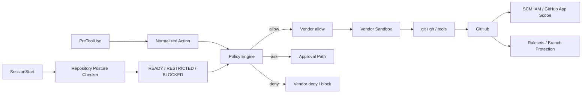

[← 製品マッピング](05-product-mapping.md) | [English](../06-vendor-harnesses.md) | [README →](../../README.ja.md)

# Vendor 別 Harness 実装

このリポジトリには Claude Code、OpenAI Codex、Devin CLI 向けの project-local Harness を実装しています。3 製品とも共通の deny-first Policy Engine、Repository Posture Checker、Deterministic Completion Gate を利用します。



## 実装ファイル

- [`.claude/settings.json`](../../.claude/settings.json) — Claude Code SessionStart / PreToolUse / Stop Hook と Sandbox baseline
- [`.codex/hooks.json`](../../.codex/hooks.json) — Codex SessionStart / PreToolUse / Stop Hook
- [`.devin/hooks.v1.json`](../../.devin/hooks.v1.json) — Devin CLI SessionStart / PreToolUse / Stop Hook
- [`.devin/config.json`](../../.devin/config.json) — Devin CLI static permissions
- [`reference/harness/`](../../reference/harness/) — Vendor Adapter
- [`reference/posture/checker.py`](../../reference/posture/checker.py) — GitHub Repository Security Posture Checker
- [`reference/policies/repository-security.example.json`](../../reference/policies/repository-security.example.json) — Posture Policy 例
- [`reference/policies/policy.example.json`](../../reference/policies/policy.example.json) — Semantic Action Policy
- [`reference/launcher/preflight.py`](../../reference/launcher/preflight.py) — Launcher / CI 向け明示的 Preflight
- [`reference/kubernetes/agent-pod.yaml`](../../reference/kubernetes/agent-pod.yaml) — 1 Pod / 1 Container baseline

## Deployment をシンプルに保つ

Default Architecture は **1 Pod / 1 Agent Container** とします。SCM Broker、Sidecar、`git` shim、`gh` shim は baseline に含めません。これらは socket、process、deployment state、privileged trust boundary を追加し、別の Failure Mode を増やすためです。

Credential Exposure は Sandbox / Policy で低減しますが、Credential Compromise 自体は起こり得る Failure Mode として扱います。Blast Radius は short-lived / repository-scoped credential、least-privilege GitHub App / IAM、GitHub-side Ruleset で独立して制限します。詳細は [DL-011](decisions/DL-011-sandbox-first-credential-isolation.md) を参照してください。

## SessionStart で Repository Posture を確認する

各 Vendor の `SessionStart` で共通 Checker を実行します。Checker は現在の Repository を特定し、read-only の `gh api` で GitHub metadata / ruleset を確認します。各要件は `pass` / `fail` / `unknown` に正規化し、Session State を次の3つに分類します。

- `READY` — 必須 Control を確認済み、または `warn` profile で warning を許容
- `RESTRICTED` — local development は継続可だが remote SCM mutation は deny
- `BLOCKED` — mutation を deny

`.agent-harness/security.json` がない場合は built-in `restricted` default を利用します。明示的な Policy が invalid な場合は `BLOCKED` です。GitHub plan / API capability や metadata permission の制約を confirmed insecure と誤認しないよう、`UNKNOWN` は `FAIL` と区別します。

Posture Result は session 単位で cache します。`git push` や `gh pr create` など trust-boundary crossing operation の前に cache TTL が切れていれば `PreToolUse` で再検証します。詳細は [DL-012](decisions/DL-012-sessionstart-repository-posture.md) を参照してください。

Agent 起動前に fail-fast したい launcher / CI では次を実行できます。

```bash
python reference/launcher/preflight.py --require-ready
```

## Vendor ごとの補足

### Claude Code

Native SessionStart / PreToolUse Hook と Sandbox を利用します。既知の credential file read と unsandboxed fallback は対応範囲で deny します。Native Credential Masking が利用できる deployment では additional hardening として使用しますが、最終 SCM Authority Boundary にはしません。

### Codex

Project Hook と Codex Sandbox / Workspace Control を利用します。現時点では PreToolUse `ask` の runtime enforcement が十分でないため、中央 Policy の `ask` は deny に mapping する既存方針を維持します。Repository Posture と GitHub-side Control はこの Vendor 制約とは独立しています。

### Devin CLI

Lifecycle Hook、Static Permissions、Devin Sandbox を利用します。Broker を標準導入せず native `git` / `gh` を維持します。SessionStart は Posture Context / Cache、PreToolUse は Semantic Action の Enforcement Point とします。

## Worktree 対応

Hook Command は `git rev-parse --show-toplevel` で active repository root を解決します。Control Checkout から task worktree へ session が移動しても absolute path を埋め込む必要がありません。

## Approval / Completion

Central Policy の `ask` は External Approval Class です。Claude Code は native PreToolUse `ask` を利用でき、Codex / Devin は同等の contract が得られない箇所を fail-closed にします。

`Stop` Hook は [`completion_gate.sh`](../../reference/scripts/completion_gate.sh) を実行します。External Orchestrator 側にも retry / time / tool / cost circuit breaker が必要です。

## テスト

```bash
python -m pip install pytest
python -m pytest reference/hooks/tests reference/harness/tests reference/posture/tests -q
python reference/launcher/preflight.py --json
```

---

[← 製品マッピング](05-product-mapping.md) | [English](../06-vendor-harnesses.md) | [README →](../../README.ja.md)
