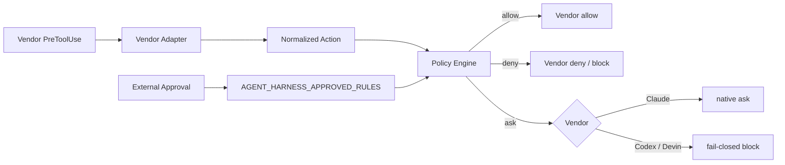
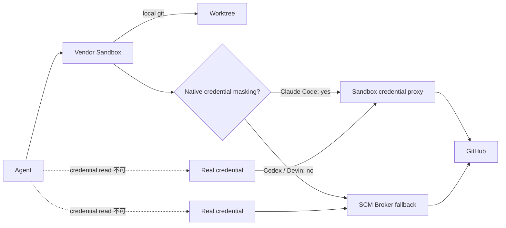

[← 製品マッピング](05-product-mapping.md) | [English](../06-vendor-harnesses.md) | [README →](../../README.ja.md)

# Vendor 別 Harness 実装

このリポジトリには Claude Code、OpenAI Codex、Devin CLI 向けの project-local Harness を実装しています。3 製品とも Tool Call を共通の deny-first Policy Engine に入力し、その判定を各製品固有の Hook Response に変換します。



## 実装ファイル

- [`.claude/settings.json`](../../.claude/settings.json) — Claude Code Hook + strict sandbox baseline
- [`reference/claude/managed-settings.example.json`](../../reference/claude/managed-settings.example.json) — trusted Claude credential masking 例
- [`.codex/hooks.json`](../../.codex/hooks.json) — Codex Hook
- [`reference/codex/config.example.toml`](../../reference/codex/config.example.toml) — spawned-command network を無効化した Codex profile
- [`.devin/hooks.v1.json`](../../.devin/hooks.v1.json) — Devin CLI Hook
- [`.devin/config.json`](../../.devin/config.json) — Credential path deny を含む Devin Permissions
- [`reference/harness/`](../../reference/harness/) — Vendor Adapter
- [`reference/scm_broker/`](../../reference/scm_broker/) — native credential masking が不足する Vendor 向け fallback broker
- [`reference/shims/git`](../../reference/shims/git) / [`reference/shims/gh`](../../reference/shims/gh) — Agent-facing shim
- [`reference/kubernetes/agent-with-scm-broker.yaml`](../../reference/kubernetes/agent-with-scm-broker.yaml) — Broker sidecar 例
- [`policy_engine.py`](../../reference/hooks/policy_engine.py) — 共通 Policy Engine

## Credential Isolation: Sandbox-first

Credential Confidentiality は [DL-011](decisions/DL-011-sandbox-first-credential-isolation.md) に従い、**まず Vendor Sandbox の native mediation を使い、不足する場合だけ Broker を導入**します。



### Claude Code

現行 Claude Code は Sandbox Credential Masking を提供します。Trusted user / managed settings で `GH_TOKEN` / `GITHUB_TOKEN` や `~/.config/gh/hosts.yml` 内 token を sentinel に置き換え、許可した GitHub host への通信時だけ Sandbox Proxy が real value を注入します。Repository-local `.claude/settings.json` は strict sandbox startup を有効化し、unsandboxed fallback を禁止します。

Credential `mask` は repository-local settings ではなく trusted user / managed settings に配置する必要があるため、`reference/claude/managed-settings.example.json` として分離しています。

### Codex

現行 Codex は OS-level workspace / network sandbox を提供しますが、Claude Code と同等の credential masking はありません。そのため Agent Container に GitHub token / credential file を配置せず、spawned-command network を無効化し、GitHub remote operation だけを SCM Broker socket に委譲します。`git status` / `diff` / `add` / `commit` など local Git 操作は通常通り worktree 内で実行します。

### Devin CLI

Devin Sandbox は `Read(...)` deny rule により Credential Path をセッション全体で不可視化できます。ただし Credential File を隠すと native `gh` も利用できず、Claude 型の masking/injection がないため remote operation は Broker fallback を利用します。Sandbox startup の fail-closed 性は Security Invariant の一部です。

### Broker Boundary

Broker は generic shell / generic GitHub API proxy ではありません。公開するのは `git push/fetch/pull/clone` と `gh pr create/view/status/checks` のみです。`gh auth`、generic `gh api`、Git credential operation、arbitrary shell、workspace escape は拒否します。また `.git/config` の remote URL を信用せず、Broker 自身が canonical GitHub repository URL を構築します。

Token は Broker container/process にのみ存在し、Agent container には Token、`gh` credential file、Git credential store、GitHub SSH private key を mount しません。

## Worktree 対応

Hook command は `git rev-parse --show-toplevel` から現在の repository root を解決します。固定 checkout path を持たないため、control checkout から task worktree に session が移動しても同じ Harness を利用できます。

## 外部承認

`ask` に分類された操作は Vendor の permission prompt だけに依存させません。Trusted Orchestrator が特定ルールを承認した場合、`AGENT_HARNESS_APPROVED_RULES` を launcher 側から注入して `allow` に昇格できます。

```bash
AGENT_HARNESS_APPROVED_RULES=scm-merge-release codex
```

Claude Code は native PreToolUse `ask` を利用します。Codex / Devin の中央 `ask` は現在の Vendor capability に合わせて fail-closed mapping を維持します。

## Completion Gate

`Stop` Hook は [`completion_gate.sh`](../../reference/scripts/completion_gate.sh) を実行します。失敗時は completion を block します。retry / time / tool / cost budget は外部 Orchestrator にも持たせます。

## Config 自体を保護する

Project Hook、Vendor Config、Broker、Shim は Security-sensitive artifact です。サンプル Policy では control-plane file の変更を `ask` に分類し、最終的には server-side rules / review で保護します。

## テスト

```bash
python -m pip install pytest
python -m pytest reference/hooks/tests reference/harness/tests reference/scm_broker/tests -q
```

[`harness-tests.yml`](../../.github/workflows/harness-tests.yml) でも Policy / Adapter / Broker test と JSON validation を実行します。

## Production 適用

Broker サンプルは trust boundary を明確にするため `SCM_BROKER_GH_TOKEN` を受け取ります。Production では long-lived PAT ではなく trusted credential provider から発行した repository-scoped / short-lived GitHub App installation token に置き換え、Agent container には絶対に mount しません。

---

[← 製品マッピング](05-product-mapping.md) | [English](../06-vendor-harnesses.md) | [README →](../../README.ja.md)
