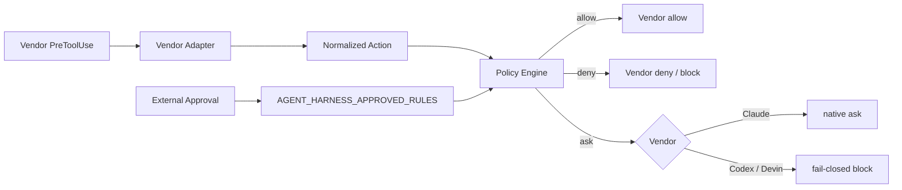

[← 製品マッピング](05-product-mapping.md) | [English](../06-vendor-harnesses.md) | [README →](../../README.ja.md)

# Vendor 別 Harness 実装

このリポジトリには Claude Code、OpenAI Codex、Devin CLI 向けの project-local Harness を実装しています。3 製品とも Tool Call を共通の deny-first Policy Engine に入力し、その判定を各製品固有の Hook Response に変換します。



## 実装ファイル

- [`.claude/settings.json`](../../.claude/settings.json) — Claude Code の PreToolUse / Stop Hook
- [`.codex/hooks.json`](../../.codex/hooks.json) — Codex の PreToolUse / Stop Hook
- [`.devin/hooks.v1.json`](../../.devin/hooks.v1.json) — Devin CLI project hook
- [`.devin/config.json`](../../.devin/config.json) — Devin CLI static permissions
- [`claude.py`](../../reference/harness/claude.py) / [`codex.py`](../../reference/harness/codex.py) / [`devin.py`](../../reference/harness/devin.py) — Vendor Adapter
- [`policy_engine.py`](../../reference/hooks/policy_engine.py) — 共通 Policy Engine
- [`policy.example.json`](../../reference/policies/policy.example.json) — 共通 Policy

## Worktree 対応

Hook command は `git rev-parse --show-toplevel` から現在の repository root を解決します。固定 checkout path を持たないため、control checkout から task worktree に session が移動しても同じ Harness を利用できます。

## 外部承認

`ask` に分類された操作は Vendor の permission prompt だけに依存させません。Trusted Orchestrator が特定ルールを承認した場合、`AGENT_HARNESS_APPROVED_RULES` を launcher 側から注入して `allow` に昇格できます。

```bash
AGENT_HARNESS_APPROVED_RULES=scm-merge-release codex
```

複数ルールはカンマ区切りです。`*` も実装していますが、無人 production session では使用しないでください。Repository 内の設定ファイルへこの値を書き込まず、trusted control plane から注入します。

Claude Code は PreToolUse の native `ask` をサポートするため、未承認の `ask` は interactive approval になります。現行 Codex は `ask` を parse しても PreToolUse の実行制御として未サポートなため、Adapter は未承認 `ask` を `deny` に変換します。Devin は中央 Policy の `ask` を top-level `block` に変換し、必要な interactive prompt は Devin 自身の static permissions と分離します。

## Completion Gate

`Stop` Hook は [`completion_gate.sh`](../../reference/scripts/completion_gate.sh) を実行します。失敗時は completion を block して Agent に理由を返します。Stop Hook の self-repair が無限化しないよう、retry / time / tool / cost budget は外部 Orchestrator 側にも必ず持たせます。

## Config 自体を保護する

Project Hook は実行可能な Policy Code です。`.claude/`、`.codex/`、`.devin/`、`AGENTS.md`、workflow、Harness 実装を security-sensitive artifact として扱います。サンプル Policy ではこれらへの変更を `ask` に分類しています。最終的な保護は server-side rules / review で実施してください。

## テスト

```bash
python -m pip install pytest
python -m pytest reference/hooks/tests reference/harness/tests -q
```

[`harness-tests.yml`](../../.github/workflows/harness-tests.yml) でも Policy / Adapter test と JSON validation を実行します。

## Production 適用

この Harness は OS Sandbox、Kubernetes Isolation、Egress Control、Workload Identity、GitHub Ruleset、Cloud IAM の代替ではありません。Production では repository-scoped short-lived credential を利用し、Hook が故障しても protected branch / production mutation が server-side で不可能な構成にします。

---

[← 製品マッピング](05-product-mapping.md) | [English](../06-vendor-harnesses.md) | [README →](../../README.ja.md)
