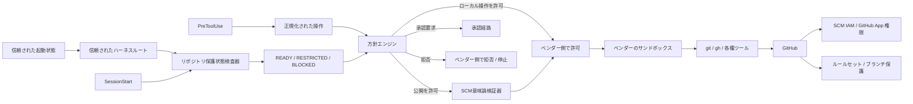

[← 製品マッピング](05-product-mapping.md) | [English](../06-vendor-harnesses.md) | [README →](../../README.ja.md)

# ベンダー別ハーネス実装

このリポジトリには Claude Code、OpenAI Codex、Devin CLI 向けの参照用フック接続を実装している。3製品とも共通の拒否優先方針エンジン、リポジトリ保護状態検査器、SCM意味論検証器、決定的な完了判定を利用する。

本番環境では、実行可能なハーネス本体と規範的方針を、エージェントが変更可能なワークスペースの外にある信頼ルートから解決する。



## 実装ファイル

- [`.claude/settings.json`](../../.claude/settings.json) — Claude CodeのSessionStart / PreToolUse / Stopに対する参照用フック接続とサンドボックス基準
- [`.codex/hooks.json`](../../.codex/hooks.json) — CodexのSessionStart / PreToolUse / Stopに対する参照用フック接続
- [`.devin/hooks.v1.json`](../../.devin/hooks.v1.json) — Devin CLIのSessionStart / PreToolUse / Stopに対する参照用フック接続
- [`.devin/config.json`](../../.devin/config.json) — Devin CLIの静的権限設定
- [`reference/launcher/trusted_hook.py`](../../reference/launcher/trusted_hook.py) — 信頼ルートから起動するフック入口
- [`reference/harness/`](../../reference/harness/) — ベンダーアダプターとSCM意味論検証
- [`reference/posture/checker.py`](../../reference/posture/checker.py) — GitHubリポジトリ保護状態検査器
- [`reference/policies/repository-security.example.json`](../../reference/policies/repository-security.example.json) — 信頼側で用いるリポジトリ保護要件の例
- [`reference/policies/policy.example.json`](../../reference/policies/policy.example.json) — 意味論的操作方針の例
- [`reference/launcher/preflight.py`](../../reference/launcher/preflight.py) — 起動処理 / CI向けの明示的な事前検査
- [`reference/kubernetes/agent-pod.yaml`](../../reference/kubernetes/agent-pod.yaml) — 1 Pod / 1コンテナの基準構成

## 配備を単純に保つ

標準構成は **1 Pod / 1エージェントコンテナ** とする。SCM仲介サービス、サイドカー、`git`差し替え、`gh`差し替えは基準構成に含めない。

認証情報への露出はサンドボックスと方針で低減し、認証情報が侵害された場合の影響範囲は、短寿命・リポジトリ限定の認証情報、最小権限のGitHub App / IAM、GitHub側ルールセットによって独立して制限する。詳細は [DL-011](decisions/DL-011-sandbox-first-credential-isolation.md) を参照する。

## 信頼されたハーネス境界

本番ハーネスの実装は、評価対象であるリポジトリやワークツリーから実行してはならない。信頼された起動処理は次のようなルートを設定する。

```bash
export AGENT_HARNESS_TRUSTED_ROOT=/opt/agent-harness
```

承認済みのハーネス一式は、信頼された配備処理によってこのルートへ組み込み・配置する。Kubernetesの参照構成では `/opt/agent-harness` をコンテナの読み取り専用ルートファイルシステム上に置き、`/workspace` を可変なタスク用ワークスペースとする。

プロジェクト内フックファイルは次を呼び出す。

```text
$AGENT_HARNESS_TRUSTED_ROOT/reference/launcher/trusted_hook.py
```

ラッパーは自身が設定済みの信頼ルートから実行されていることを確認し、同じルートからベンダーアダプター、意味論的方針、リポジトリ保護状態の方針を解決する。そのため `/workspace` 内のGit操作やソース編集だけでは、本番の検証器実装や規範的方針を置き換えられない。

リポジトリ内の `.claude` / `.codex` / `.devin` ファイルは参照・開発用の接続であり、それ自体を独立した本番の権限境界とはみなさない。ベンダーが信頼された管理型登録を提供する場合、フック登録自体もエージェントが書き換え可能なワークスペースの外にある信頼された起動処理や管理設定から配置する。

可変なプロジェクト内登録しか利用できない場合、フックは多層防御の一部に留め、重要な不変条件は能力境界、IAM / SCM認可、サーバー側規則によって独立して強制する。詳細は [DL-015](decisions/DL-015-trusted-harness-boundary.md) を参照する。

## 信頼された起動状態とSessionStart時の保護状態検査

リポジトリ識別は、リポジトリ自身が自己申告する値ではなく、信頼されたタスク状態として扱う。起動処理 / オーケストレーターは次を設定する。

```bash
export AGENT_HARNESS_TRUSTED_ROOT=/opt/agent-harness
export AGENT_HARNESS_EXPECTED_REPOSITORY=owner/repository
export AGENT_HARNESS_MINIMUM_POSTURE_MODE=restricted
```

`AGENT_HARNESS_MINIMUM_POSTURE_MODE` の標準値は `restricted` とする。リポジトリ内の `mode: warn` だけでは無人実行時の最小保護状態を弱められない。対話用途で弱める場合のみ、信頼された起動処理が明示的に `warn` を指定する。

各ベンダーの `SessionStart` で共通の検査器を実行し、`origin` と信頼された期待リポジトリを比較したうえで、GitHubのメタデータと既定ブランチに適用される有効な規則を確認する。各要件は `pass` / `fail` / `unknown` に正規化し、セッション状態を次の3つに分類する。

- `READY` — 信頼された識別情報と必須制御を確認済み、または信頼された `warn` 指定が警告を明示的に許容
- `RESTRICTED` — ローカル開発は継続可能だが、ハーネスからの直接の遠隔SCM変更は拒否
- `BLOCKED` — 観測可能な変更操作を拒否

信頼されたリポジトリ識別が未設定の場合は `UNKNOWN` とし、標準の最小保護状態では `RESTRICTED` のままとする。不一致は常に `BLOCKED` とする。

信頼フック方式では、ラッパーが信頼ルート側のリポジトリ保護状態方針を設定するため、リポジトリ管理下の保護方針が本番環境の規範的方針になることを防ぐ。

保護状態の結果はセッション単位でキャッシュする。有効期限が切れた場合、または現在のリポジトリルートが変わった場合は再検査する。詳細は [DL-012](decisions/DL-012-sessionstart-repository-posture.md) を参照する。

エージェント起動前に早期停止したい起動処理 / CIでは次を実行できる。

```bash
AGENT_HARNESS_EXPECTED_REPOSITORY=owner/repository \
  python reference/launcher/preflight.py --require-ready
```

## 正規形の自律公開

任意のシェル構文やGit参照指定を安全だと推測しない。フック境界で観測できる、エージェントが直接発行する自律的なGit公開は次の2形式だけとする。

```bash
git push
git push --set-upstream origin HEAD
```

PreToolUseで、保護状態が `READY` であること、現在のブランチ、GitHubから取得した既定ブランチ、`origin`、検査済みリポジトリ、上流ブランチを確認する。任意の遠隔リポジトリ、参照指定、タグ、削除、強制、設定上書きは直接の自律公開対象外とする。

単純な `git push` は上流ブランチが `origin/<current-branch>` である必要があり、初回公開は固定の `--set-upstream origin HEAD` を使用する。

`gh pr create` は利用できるが、自律経路では `--repo` / `-R`、`--head` / `-H`、`--base` / `-B` による上書きを禁止する。また `&&`、`||`、`;`、パイプ、リダイレクト、改行、コマンド置換を含む複合シェルは、先頭が読み取り専用に見えても自律許可対象外とする。詳細は [DL-013](decisions/DL-013-canonical-scm-publication.md) を参照する。

## 意味論的方針の仲介範囲

フックが統治するのは、フック境界で観測可能なエージェント直接操作である。例えば `pytest` や `npm test` を許可した場合、その内部で実行されるすべての子プロセス、ネットワーク要求、二次的なSCM操作までフックが完全仲介したとは扱わない。

したがって、正規形の公開規則は「ハーネスが観測して許可した直接のSCM公開操作」に対する決定的な主張である。子プロセスが意味論的方針の可視範囲を迂回しても成立しなければならない重要な外部不変条件は、最小権限のIAM / SCM認証情報、GitHub側のルールセットやブランチ保護、必要に応じたネットワーク制御へ具体化する。

完全仲介を疑似的に実現することだけを目的に、汎用的なプロセス監視、SCM仲介サービス、コマンド差し替えを標準構成へ追加しない。詳細は [DL-016](decisions/DL-016-semantic-policy-is-not-complete-mediation.md) を参照する。

## ベンダーごとの補足

### Claude Code

ネイティブのSessionStart / PreToolUseフックとサンドボックスを利用する。既知の認証情報ファイルの読み取りと、サンドボックスを迂回する実行は対応可能な範囲で拒否する。ベンダー提供の認証情報秘匿機能を利用できる配備では追加防御として使用するが、最終的なSCM権限境界にはしない。

### Codex

フックとCodexのサンドボックス / ワークスペース制御を利用する。現時点ではPreToolUseの `ask` を実行時に確実に強制する契約が十分でないため、中央方針の `ask` は拒否へ変換する既存方針を維持する。リポジトリ保護状態とGitHub側制御は、このベンダー制約とは独立している。

### Devin CLI

ライフサイクルフック、静的権限設定、Devinのサンドボックスを利用する。仲介サービスを標準導入せず、標準の `git` / `gh` を維持する。SessionStartは保護状態の文脈とキャッシュ、PreToolUseは観測可能な直接操作の意味論的制御点とする。

## 信頼フックの起動とワークツリー検出

フックコードは `git rev-parse --show-toplevel` ではなく `AGENT_HARNESS_TRUSTED_ROOT` から解決する。一方、現在のリポジトリ / ワークツリーは、フックイベントの `cwd` とGit状態から実行時入力として検出し、保護状態検査とSCM意味論検証に利用する。

同じリポジトリのワークツリー間移動は継続利用でき、別リポジトリへ移動した場合は保護状態を再検査するが、実行する検証器実装そのものは変わらない。

## 承認と完了判定

中央方針の `ask` は外部承認要求とする。複合シェルや正規形ではない直接の遠隔公開は、先頭部分だけを正規表現で見て安全と推測せず、自律経路から外す。Claude CodeはネイティブのPreToolUse `ask` を利用でき、Codex / Devinは同等の契約を得られない箇所を安全側に倒す。

`Stop` フックは信頼されたハーネスルート側の完了判定を実行する。外部オーケストレーター側にも、再試行回数、時間、ツール呼び出し数、費用の上限が必要である。

## テスト

```bash
python -m pip install pytest
python -m pytest reference/hooks/tests reference/harness/tests reference/posture/tests -q
AGENT_HARNESS_EXPECTED_REPOSITORY=owner/repository \
  python reference/launcher/preflight.py --json
```

回帰テストでは、信頼されたハーネスルート境界、複合シェルによる迂回、任意の直接プッシュ / 参照指定、信頼されたリポジトリ識別の不一致、リポジトリ内 `warn` による最小保護状態の弱体化、既定ブランチへの直接プッシュ、プルリクエスト作成時のリポジトリ / 作業元 / 基準ブランチ上書きを検証する。

---

[← 製品マッピング](05-product-mapping.md) | [English](../06-vendor-harnesses.md) | [README →](../../README.ja.md)
