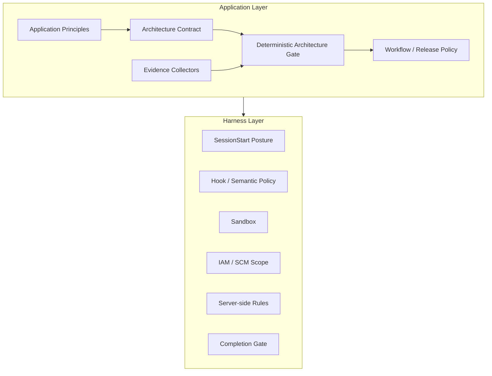
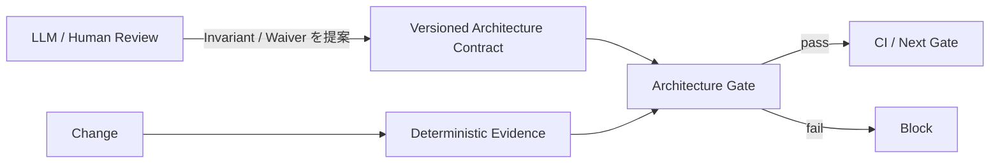
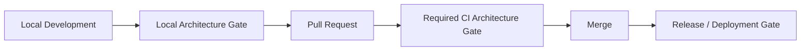

[← Vendor Harness](06-vendor-harnesses.md) | [English](../07-application-architecture.md) | [次: Application Design Principles →](08-application-design-principles.md)

# Application Layer Architecture

## 1. なぜ Application Layer が必要か

Harness は基盤です。Lifecycle Hook、Repository Posture、Semantic Policy、Sandbox、IAM / SCM Containment、Server-side Enforcement、Deterministic Completion、Audit といった再利用可能な Execution Boundary を提供します。

一方、Harness 上で動く Application は、**その Application が Architecture 上妥当であり、merge / release 可能と判断するために何が成立していなければならないか**を定義します。



Application Layer は Harness を利用しますが、Harness の Security Boundary を再定義しません。Harness は「この操作を許可・封じ込めできるか」、Application は「この変更が Application の Architecture / Product Invariant を維持しているか」を判断します。

## 2. Architecture Contract

Application Architecture は version control された Policy-as-Code として定義します。Reference Contract は `.agent-harness/application-architecture.json` です。

Contract には、例えば以下の machine-verifiable invariant を記述します。

- 必須 Architecture Artifact の存在
- Legacy / Bypass Component の不在
- 特定 File に必要な Pattern / 禁止 Pattern
- Deterministic Test / Checker の存在
- 明示的かつ期限付きの Waiver

Contract 自体は Control-plane Artifact であり、`.agent-harness/` の変更を Approval-class とする Harness Policy の保護対象です。

## 3. Agent Review ではなく Deterministic Gate

LLM は Architecture Review、Trade-off 説明、見落とした Invariant の発見、Contract 変更提案には使えます。しかし Invariant の pass / fail を決定する Authority にはしません。

Merge / Release Path では **deterministic architecture gate** を使います。



同じ Repository State と同じ Contract なら、Model、Prompt、Temperature、Conversation History、Reviewer Confidence に依存せず同じ結果を返す必要があります。

## 4. Evidence Model

Gate Input は provenance が明確な Structured Evidence とします。初期 Reference Implementation は意図的に Local Deterministic Evidence に限定します。

- Path の存在 / 不在
- 特定 File 内の Regex Pattern の存在 / 不在

将来は Dependency Graph、API Schema、Generated Architecture Metadata、Test Result、Static Analysis、Signed External Attestation 等を Collector として追加できます。Collector が高度でも、最終 Predicate は deterministic でなければなりません。

Non-deterministic Analysis は **何を検査すべきかを発見する用途**には利用できますが、Check Result そのものにはしません。

## 5. Gate を置く場所

Architecture Validation は必要に応じて複数 Lifecycle Point に置きます。



Authoritative な Merge / Release Gate は CI 等の Trusted Execution Environment で実行します。Local Run は高速 Feedback であり、最終 Authority ではありません。

## 6. Failure Semantics

Architecture Gate の Config Error は fail-closed とします。Unsupported Check Type、Malformed Contract、Path Escape、Expired Waiver、Failed Invariant は non-zero result にします。

Machine-verifiable Evidence に落とせない Application Principle は Advisory と明示します。Deterministic Control であるかのように装いません。

## 7. Waiver

例外は Comment や Prompt ではなく First-class Data とします。Waiver には最低限以下を持たせます。

- Check ID
- Owner
- Reason
- Expiry Date

期限切れ Waiver は自動的に Gate Bypass として機能しなくなります。Waiver 変更も Architecture Contract の変更として同じ Control-plane Review Path を通します。

## 8. Reference Implementation

```bash
python reference/application_gate/gate.py
```

Structured Output:

```bash
python reference/application_gate/gate.py --json
```

Reference Implementation は Standard Library のみで小さく保ちます。目的は最初から Universal Architecture DSL を作ることではなく、Application-layer Contract と Deterministic Enforcement Boundary を先に確立することです。

---

[← Vendor Harness](06-vendor-harnesses.md) | [English](../07-application-architecture.md) | [次: Application Design Principles →](08-application-design-principles.md)
