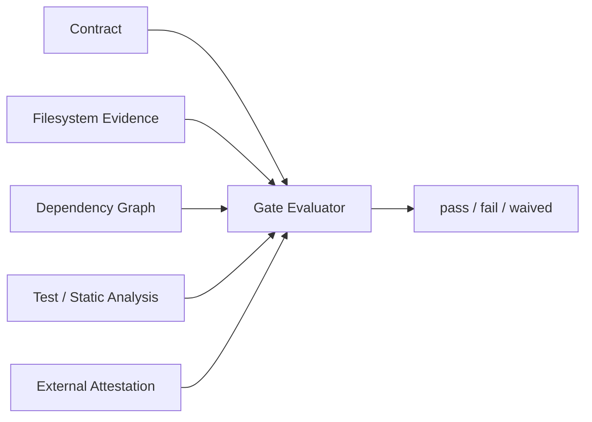
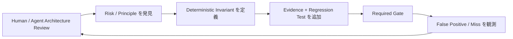

[← Application Architecture](07-application-architecture.md) | [English](../08-application-design-principles.md) | [Decision Log →](decision-log.md)

# Application Layer Design Principles

## 1. Application Invariant と Harness Invariant を分離する

Harness Invariant は Execution / Authority Boundary を保護します。Application Invariant は個別 Application の Architecture、Behavior、Maintainability、Release Quality を保護します。同じ Enforcement Infrastructure を使うからといって Policy Domain を混ぜません。

## 2. Deterministic Evidence がなければ Principle は Gate ではない

Architecture の文章は Guidance です。Gate にするには Reproducible Evidence 上の明示的 Predicate が必要です。まだ Predicate 化できない Principle は Advisory とし、Enforced であるかのように扱いません。

## 3. LLM Review を pass / fail の Authority にしない

LLM Review は Risk 発見、Missing Rule 発見、Violation 説明、Invariant 提案には有効です。しかし Output が Non-deterministic かつ Context-dependent であるため、Architecture Gate の pass / fail Authority にはしません。

## 4. Executable Architecture を優先する

繰り返し重要になる Architecture Rule は Dependency Constraint、Forbidden Edge、Required Boundary、Schema Compatibility、Path Ownership、Static Analysis、Test、Signed Evidence 等の Machine-verifiable Form に落とします。Prose だけの Architecture は Drift します。

## 5. Declaration / Evidence Collection / Evaluation を分離する

Architecture Contract は Invariant を宣言し、Evidence Collector は Repository / System State を観測し、Gate は Evidence を Contract に照らして評価します。この責務分離により Collector を置換可能にし、Decision を Audit 可能にします。

## 6. Gate Infrastructure Error は fail-closed

Malformed Contract、Unsupported Check Type、Required Evidence Read Failure、Path Escape、Evaluator Failure は Gate Failure です。Architecture Control System が壊れた結果 Green になってはいけません。

## 7. Exception は明示的・狭い・Owner 付き・期限付きにする

Waiver は Policy Data です。対象 Invariant、Reason、Owner、Expiry を必須とします。Broad な「Architecture Check を無視」Switch は避け、Expiry は Mechanically に評価します。

## 8. Application を守る Policy 自体を保護する

Architecture Contract、Gate Implementation、CI Wiring、Evidence Collector、Waiver は Control-plane Artifact です。Routine Source Edit と同じ Unreviewed Path から弱体化できないようにします。

## 9. Required CI を Authoritative Merge Gate にする

Local Architecture Check は Feedback Optimization です。Known Revision / Controlled Environment で動く Required CI Check を Authoritative Merge Signal とします。Release / Deployment でより厳しい Gate を追加してもよいですが、Merge-time Invariant を暗黙に弱めてはいけません。

## 10. Real Evidence があるなら Proxy ではなく Invariant 自体を Gate する

Structured Evidence がある場合は Fragile Heuristic を避けます。Import String の Grep より Dependency Graph、Compatibility の LLM 説明より API Schema Diff、Test 成功という文章より Test Result を優先します。

## 11. Contract / Evidence Schema を Versioning する

Architecture Policy は進化します。Contract / Evidence Format に Version、Validation、Migration Rule を持たせ、旧 Gate Semantic と新 Gate Semantic を混同しないようにします。

## 12. Gate を Composable にする

大規模 Application では Layering、API Compatibility、Data Migration、Security、Reliability、Operability、Release Readiness 等の異なる Invariant Class があります。1つの巨大 Checker ではなく Focus した Deterministic Gate を組み合わせて Application Release Decision を構成します。

## 13. Review は Policy を改善し、Gate は Policy を Enforce する

Non-deterministic Reasoning の価値を維持しつつ、Authority Boundary にはしない構造です。

---

[← Application Architecture](07-application-architecture.md) | [English](../08-application-design-principles.md) | [Decision Log →](decision-log.md)
