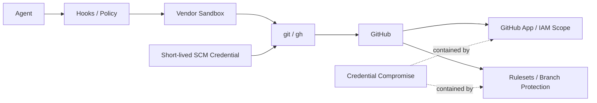

# DL-011 — Sandbox-first Credential Exposure Reduction

- 日付: 2026-09-05
- Status: Accepted / Vendor Update 時に再評価
- 対象: Claude Code / Codex / Devin CLI / SCM 認証

## 判断

Vendor Sandbox と Local Policy は Credential の**露出低減**に使いますが、「Credential が絶対に漏れないこと」を Repository Safety の唯一の Security Invariant にはしません。

Default Architecture は 1 Pod / 1 Agent Container とします。具体的な Threat Model が要求しない限り、GitHub Credential を隠すだけの目的で SCM Broker、Sidecar、追加 Pod を導入しません。

## 責務分離

- **Sandbox**: filesystem / process / network capability を狭め、Vendor が対応する範囲で既知の credential path を不可視化する。
- **Hooks / Policy**: `gh auth token` 等の semantic な credential extraction を deny し、control-plane file と risky SCM operation を分類する。
- **Credential Management**: short-lived、repository-scoped、least-privilege を基本とする。
- **GitHub App / IAM**: Credential が compromise された場合の blast radius を制限する。
- **GitHub Rulesets / Branch Protection**: protected branch、force push、required PR、required checks の authoritative server-side enforcement とする。

## Security Invariant

> Credential compromise は起こり得る Failure Mode とみなし、compromise が unrestricted repository / organization authority を意味しないようにする。

Agent が Credential を絶対に観測できないという強い前提は置きません。Native masking が利用可能なら Defense in Depth として使用しますが、その control が壊れても IAM / SCM policy / GitHub-side protection で被害を限定します。

## 現在の Vendor Mapping

### Claude Code

Native Sandbox を有効化し、既知の credential location への read を deny します。Managed Settings で credential masking を安全に利用できる deployment では追加 hardening として採用しますが、最終 SCM authority boundary にはしません。

### Codex

Sandbox と project / managed control で filesystem / network capability を狭めます。Claude Code 型 masking がないことだけを理由に Broker は追加せず、short-lived GitHub credential、least privilege、server-side protection で補完します。

### Devin CLI

Sandbox と permissions で既知の credential file を可能な範囲で隠します。Native `git` / `gh` 利用を維持し、Credential compromise containment は SCM/IAM scope と GitHub-side protection に持たせます。

## Default から除外した構成

Broker / sidecar 構成は一度 reference implementation として試作しましたが、process、socket、shim、deployment config、privileged component が増え、別の Failure Mode を生むため削除しました。将来、具体的な deployment threat model が stronger isolation を要求する場合のみ optional pattern として再検討します。

## 再評価条件

Vendor が materially stronger な native credential mediation を追加した場合、SCM credential model が変わった場合、または one-container baseline では不足する Threat Model が具体化した場合に再評価します。
