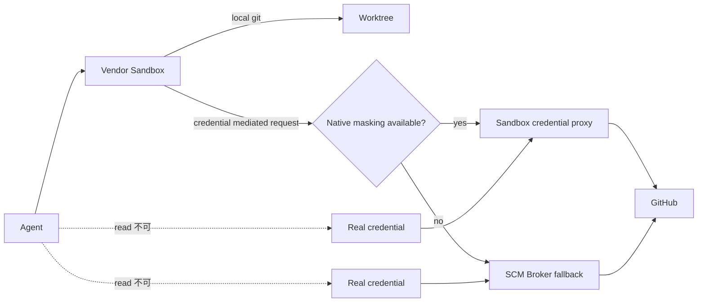

# DL-011 — Sandbox-first Credential Isolation

- 日付: 2026-09-05
- Status: Accepted / Vendor Update 時に再評価
- 対象: Claude Code / Codex / Devin CLI / SCM 認証

## 判断

Credential の秘匿は **Sandbox-first** で実現します。Agent は許可された GitHub 操作を実行できますが、再利用可能な GitHub Credential を通常の readable data として受け取ってはいけません。

優先順位は次の通りです。

1. Vendor Sandbox が real credential を Agent Process に渡さずに mask / mediation できる場合は native 機能を使う。
2. できない場合は Credential を Agent container / process namespace の外に置き、限定された semantic SCM operation のみを SCM Broker に委譲する。
3. Prompt Instruction や Hook deny rule を Credential Confidentiality の最終境界にしない。

## 現在の Vendor Mapping

### Claude Code

Native Sandbox Credential Masking を利用します。`GH_TOKEN` / `GITHUB_TOKEN`、または `~/.config/gh/hosts.yml` の token 部分を sandboxed command からは sentinel に置換し、Sandbox Proxy が明示的に許可された GitHub host 宛ての通信時だけ real credential を注入します。

Repository-local settings では strict sandbox を有効化し、Credential `mask` は trusted user / managed settings で配備します。Claude Code は repository-local settings からの `mask` を意図的に無視するためです。

参照: `reference/claude/managed-settings.example.json`

### Codex

現行 Codex Sandbox は OS-level workspace / network isolation を提供しますが、Claude Code と同等の credential masking は提供していません。そのため Agent Container に GitHub token / credential file を配置せず、spawned-command network を無効化し、GitHub remote operation のみ SCM socket 経由で Broker sidecar に委譲します。

参照: `reference/codex/config.example.toml`, `reference/shims/`, `reference/scm_broker/`

### Devin CLI

Devin Sandbox は `Read(...)` deny 対象 path をセッション全体で不可視化できるため、GitHub Credential File を deny します。ただし、それにより native `gh` 自身も Credential を読めなくなり、現時点では Claude Code 型の masking/injection がないため、remote GitHub operation は Broker fallback を利用します。

## Broker の制約

SCM Broker は generic shell / generic GitHub API proxy にしません。公開するのは狭い semantic allowlist のみです。

- Git remote: `push`, `fetch`, `pull`, `clone`
- GitHub CLI: `pr create`, `pr view`, `pr status`, `pr checks`

`gh api`, `gh auth`, Git credential operation、任意 command、workspace escape は拒否します。Repository identity は Broker が所有し、`.git/config` の remote URL を信用せず Broker 自身が GitHub URL を構築します。

## Security Invariant

> Agent は GitHub capability を持ってよいが、再利用可能な GitHub credential を持ってはいけない。

Agent が filesystem、environment、process inspection、credential helper 直接呼び出し、CLI auth command、Broker response のいずれかから real token を取得できる場合、その deployment は本方針に非準拠です。

## Upgrade Path / 再評価条件

以下の場合に再評価します。

- Codex が Claude Code 相当の native credential masking / injection を追加した場合
- Devin CLI が Sandbox guarantee を保った native credential masking / injection を追加した場合
- Claude Code の masking scope / platform behavior / trusted settings requirement が変わった場合
- Vendor が Credential を Agent Process に露出せず authenticated Git/GitHub operation を実行できる first-class SCM capability を追加した場合

Native mechanism が十分な強度を持つようになった Vendor では、不要になった Broker を残さず削除します。
