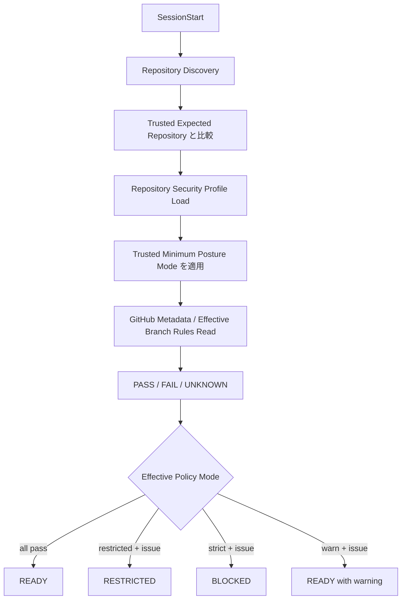

# DL-012 — SessionStart で Repository Security Posture を検証

- 日付: 2026-09-05
- Status: Accepted / Vendor Update 時に再評価
- 対象: Claude Code / Codex / Devin CLI / GitHub Repository Controls

## 判断

`SessionStart` で Repository Security Posture を検証し、正規化した結果を Session State として Cache します。Remote SCM Mutation の直前には、Cache が stale なら再検証します。

Checker は Repository Identity と GitHub-side Control（Required Pull Request、Non-fast-forward Protection、Required Status Checks 等）を確認します。各 Check は `pass` / `fail` / `unknown`、Session Posture は `READY` / `RESTRICTED` / `BLOCKED` の3状態で表現します。



## Trusted Repository Identity

Repository Identity は Repository 自身ではなく Task / Orchestration State として扱います。Trusted Launcher / Orchestrator が次を設定します。

```text
AGENT_HARNESS_EXPECTED_REPOSITORY=owner/repository
```

実際の `origin` Repository はこの値と一致する必要があります。不一致は `BLOCKED`。Trusted 値が未設定の場合は Identity を `UNKNOWN` とし、Default Minimum Mode では `RESTRICTED` のまま Remote Publish を禁止します。

Repository-local `.agent-harness/security.json` に `expected_repository` を追加 Consistency Check として記述できますが、Trusted Launcher Identity の代替・上書きには使いません。両者が矛盾する場合は `BLOCKED` とします。

## Minimum Posture Authority

Repository-local Config だけで unattended execution を弱められないようにします。Trusted Launcher が次を所有します。

```text
AGENT_HARNESS_MINIMUM_POSTURE_MODE=restricted
```

未設定時の Default は `restricted`。Effective Mode は Repository-local Mode と Trusted Minimum のうち、より厳しい方です。そのため Repository-local の `mode: warn` だけでは Default Autonomous Posture を弱められません。Interactive 用に弱めたい場合のみ Trusted Launcher が明示的に Minimum を `warn` へ変更します。

## 設定がない場合

`.agent-harness/security.json` が存在しないことは Parser Failure とは扱いません。Built-in `restricted` Default を使用します。この状態では Read-only Discovery、Local Edit、Test、Local Commit を継続できますが、Trusted Identity と必要な GitHub Control を確認できるまで Remote SCM Mutation は許可しません。

明示的な設定ファイルが Invalid な場合は Control-plane Failure とみなし `BLOCKED` にします。

## External State が確認できない場合

`UNKNOWN` は `FAIL` と区別します。Trusted Task Identity 未設定、GitHub API Permission 不足、Effective Rule API が参照不可、一時的な Metadata Failure 等が該当します。

Effective Mode semantics:

- `strict`: Required Check の `FAIL` または `UNKNOWN` が1つでもあれば `BLOCKED`
- `restricted`: Required Check の `FAIL` または `UNKNOWN` があれば `RESTRICTED`
- `warn`: Warning を Session Context に注入するが `READY` を維持

ただし Trusted Repository 不一致、Trusted Identity と Repository-local Identity の Conflict は Mode に関係なく常に `BLOCKED` です。

## Enforcement

`SessionStart` は Fail-fast / Context Injection の仕組みであり、最終 Security Boundary ではありません。`PreToolUse` でも Cached Posture を参照します。

- `BLOCKED`: Mutation を deny
- `RESTRICTED`: Canonical `git push`、`gh pr create` 等の Remote SCM Mutation を deny。Local Development は継続可
- `READY`: 通常の Central Policy と SCM Semantic Validation に従う

Posture Cache には TTL を持たせ、Trust-boundary Crossing Operation の前に stale なら再検証します。また Active Repository Root と Cached Root が異なる場合も再検証します。

## 責務分離

Checker の責務は Repository / Control Configuration Drift の検出です。Trusted Launch State が Task Identity を確立し、Rulesets / Branch Protection を Authoritative Server-side Enforcement、IAM を Credential Compromise Containment、Sandbox を Local Capability Boundary、Hooks を Semantic Operation Policy とします。

## 再評価条件

Vendor の SessionStart Control Semantics が強化された場合、GitHub Protection Metadata がより一貫して Read 可能になった場合、または Organization-level Policy / Task Service が Authoritative Posture を供給できるようになった場合に再評価します。
